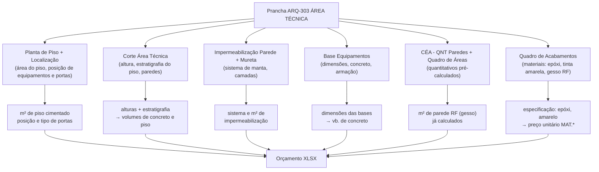

# Estudo: Prancha ARQ-303 (ÁREA TÉCNICA) → Orçamento CELMAR BLN

## O que a prancha 303 contém

A prancha 303 documenta a **área técnica externa** da loja — o espaço no teto/cobertura onde ficam os equipamentos de ar condicionado, o transformador/subestação e demais sistemas MEP. É um ambiente fora do fluxo de clientes, com requisitos construtivos específicos (impermeabilização, piso cimentado, bases de concreto, portas especiais).

| Elemento | Descrição |
|---|---|
| 303 - Área Técnica (elevação) | Vista frontal da área técnica com cobertura e acesso por escada |
| 363 - Planta de Piso Área Técnica | Planta baixa com layout de equipamentos e posição de elementos |
| Corte Área Técnica | Seção transversal mostrando estratigrafia do piso, paredes e cobertura |
| 363 - Localização Áreas Técnicas | Planta geral da loja com marcação das zonas técnicas |
| Axonométrica Área Técnica | Vista 3D completa da área técnica com escada e estrutura |
| Impermeabilização Parede | Detalhe em corte da impermeabilização das paredes |
| Impermeabilização Mureta | Detalhe em corte da impermeabilização das muretas/rufos |
| Base Equipamentos | Vista lateral, corte e planta da base de concreto para equipamentos |
| CÉA - QNT Paredes | Tabela de quantitativos de paredes da área técnica por tipo |
| CÉA - Quadro de Áreas (obra) | Tabela de áreas totais (piso, parede, forro) da área técnica |
| Quadro de Acabamentos | Seção da área técnica no quadro master de materiais |

---

## Mapeamento: Fonte na imagem → Linha no XLSX

---

## Fontes de informação e o que cada uma gera

### 1. Planta de Piso + Localização Áreas Técnicas

- A **Planta de Piso** mostra o layout interno da área técnica: posição de cada equipamento (unidades de AC, transformador, gerador), escada de acesso, portas.
- A **Planta de Localização** contextualiza a área técnica dentro da loja — útil para identificar quais paredes são compartilhadas com o salão de vendas (e precisam de gesso RF).
- Gera: m² de piso cimentado (`9.2`, zerado) e posição/tipo das portas especiais (ferro, corta-fogo).

### 2. Corte Área Técnica

- Seção transversal com cotas verticais: altura do pé-direito, espessura do piso, altura da mureta de contenção.
- Identifica a estratigrafia do piso: regularização + cimentado 5cm + pintura epóxi.
- Gera: volumes para bases de concreto e espessura do piso cimentado.

### 3. Impermeabilização Parede + Impermeabilização Mureta

- Dois detalhes em corte mostrando os sistemas de impermeabilização:
  - **Parede**: primer betuminoso + manta butílica + argamassa de proteção
  - **Mureta**: primer + manta líquida + arremate de rufo
- Estes detalhes definem os sistemas que geram os itens `10.1` e `10.2`, com o m² vindo da planta.

### 4. Base Equipamentos (vista lateral + corte + planta baixa)

- Detalhe construtivo das bases de concreto para fixação dos equipamentos de AC, gerador e transformador.
- Mostra dimensões (largura, comprimento, altura) e armação.
- Gera: `9.4` Bases em concreto para equipamentos — orçado como verba global (1 vb = R$ 2.849).

### 5. CÉA - QNT Paredes + Quadro de Áreas

- **CÉA - QNT Paredes**: tabela com m² de paredes por tipo especificamente da área técnica:
  - Parede gesso RF 1 face → `12.5` (3 m²)
  - Parede gesso RF 2 faces → `12.6` (15 m²)
- **CÉA - Quadro de Áreas (obra)**: tabela com áreas totais do ambiente por componente (piso, paredes, forro/cobertura).

### 6. Quadro de Acabamentos — seção Área Técnica

- Especifica os materiais exclusivos desta zona:
  - Piso: epóxi sobre cimentado → `18.1` (39,61 m²)
  - Paredes/bases: tinta esmalte amarela → `18.2` (vb)
  - Paredes: gesso RF (resistente ao fogo) → `12.5`/`12.6`

---

## Itens do XLSX gerados por esta prancha

### Seção 8 — Serralheria (portas especiais)

| Item | Descrição | UN | QDE | MAT | M.O. | Total R$ |
|---|---|---|---|---|---|---|
| `8.13` | Porta de ferro — Gerador | unid | — | — | — | 0 (zerado) |
| `8.14` | Porta de ferro — Casa de Máquinas | unid | 1 | 2.790 | 480 | **3.270** |
| `8.15` | Porta corta-fogo — Docas | unid | 1 | 3.760 | 650 | **4.410** |
| `8.16` | Esquadria metálica c/ tela | unid | — | — | — | zerado |

> Estas portas são contadas no **Quadro de Portas** da prancha 301, mas sua especificação (ferro, corta-fogo) vem diretamente desta prancha 303.

### Seção 9 — Base de piso + estrutura

| Item | Descrição | UN | QDE | MAT | M.O. | Total R$ |
|---|---|---|---|---|---|---|
| `9.2` | Piso cimentado para áreas técnicas 5cm | m² | — | — | — | 0 (zerado) |
| `9.4` | Bases em concreto para equipamentos (AC, gerador, transformador) | vb | 1 | 1.879 | 970 | **2.849** |
| `9.8` | Laje pré-moldada com capa de concreto | m² | — | — | — | 0 (zerado) |
| `9.9` | Execução área técnica | m² | — | — | — | 0 (zerado) |

### Seção 10 — Impermeabilização (compartilhada com prancha 301)

| Item | Descrição | UN | QDE | MAT | M.O. | Total R$ |
|---|---|---|---|---|---|---|
| `10.1` | Impermeabilização manta butílica (inclui área técnica) | m² | 43,7 | 177,36 | 120,68 | **13.024** |

### Seção 12 — Paredes de gesso RF (resistente ao fogo)

| Item | Descrição | UN | QDE | MAT | M.O. | Total R$ |
|---|---|---|---|---|---|---|
| `12.5` | Parede gesso RF 1 face — área técnica | m² | 3 | 90,20 | 58,45 | **445** |
| `12.6` | Parede gesso RF 2 faces — área técnica | m² | 15 | 104,20 | 58,45 | **2.439** |

### Seção 18 — Pintura (acabamentos específicos da área técnica)

| Item | Descrição | UN | QDE | MAT | M.O. | Total R$ |
|---|---|---|---|---|---|---|
| `18.1` | Epóxi sobre cimentado — áreas técnicas | m² | 39,61 | 67,20 | 38,20 | **4.174** |
| `18.2` | Pintura esmalte cor amarela — bases casa de máquinas | vb | 1 | 1.250 | 750 | **2.000** |
| `18.13` | Pintura látex branco — áreas técnicas | m² | — | — | — | zerado |

---

## Itens zerados: por que existem sem valor

| Item zerado | Razão provável |
|---|---|
| `9.2` Piso cimentado | Metragem depende do projeto de AC/elétrico — ainda não fechado na época desta proposta |
| `9.8` Laje pré-moldada | Condicionada ao projeto estrutural do shopping — responsabilidade pode ser do shopping |
| `9.9` Execução área técnica | Verba genérica zerada — substituída pelos itens específicos (9.4, 18.1, 18.2) |
| `8.13` Porta de ferro gerador | Gerador pode não estar no escopo desta loja ou posição ainda indefinida |
| `18.13` Pintura látex áreas técnicas | Acabamento substituído pelo epóxi (`18.1`) — não se aplica nesta configuração |

---

## Particularidade desta prancha: escopo limitado mas especializado

A prancha 303 é focada em um único ambiente, mas com **requisitos técnicos únicos no projeto**:

1. **Gesso RF obrigatório** — as paredes da área técnica precisam de placa de gesso com resistência ao fogo (RF), diferente do salão de vendas (STD) e ADM (RU). A classificação vem desta prancha e determina o tipo de material na linha do XLSX.

2. **Piso epóxi** — único ambiente da loja com piso epóxi. O m² de 39,61 m² vem diretamente da planta de piso desta prancha.

3. **Pintura amarela nas bases** — sinalização de segurança para equipamentos, exigência normativa. O vb de R$ 2.000 vem desta especificação.

4. **Portas especiais** — porta corta-fogo (norma de segurança) e porta de ferro: são os únicos tipos de esquadria não listados no Quadro de Portas da prancha 301 como madeira. A especificação é exclusiva desta prancha.

---

## Estratégia de extração automática

| Componente | Técnica | Ferramenta | Confiança |
|---|---|---|---|
| CÉA - QNT Paredes (tabela) | OCR tabular — m² por tipo de gesso RF | Tesseract / GPT-4o Vision | Alta |
| CÉA - Quadro de Áreas | OCR tabular — áreas totais por componente | Tesseract | Alta |
| m² de piso epóxi (planta) | OCR cotas + cálculo de área | PaddleOCR + Python | Média-Alta |
| Bases de concreto (det.) | OCR dimensões + classificação como vb | GPT-4o Vision | Alta |
| Tipo de porta (ferro / corta-fogo) | OCR nos labels da planta e legenda | Tesseract | Alta |
| Sistema de impermeabilização | OCR nos detalhes + identificação do sistema | GPT-4o Vision | Alta |
| Quadro de Acabamentos (seção área técnica) | OCR tabular na coluna correta | GPT-4o Vision | Alta |

---

*Referências: Prancha CEA-254-BLN-ARQ_R02-303 - AREA TÉCNICA.png · 1ª Proposta CELMAR BLN.xlsx · Loja 254 Shopping Norte Blumenau*
