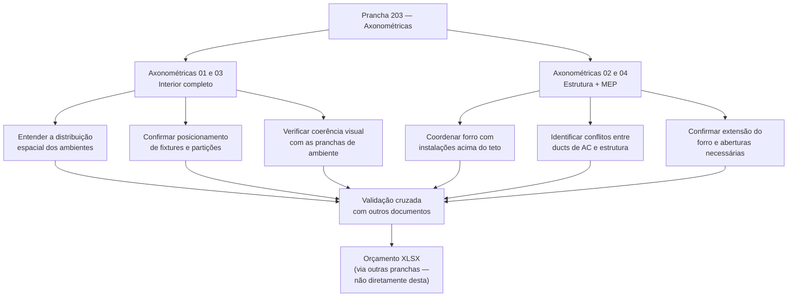

# Estudo: Prancha INT-203 (AXONOMÉTRICAS) → Orçamento CELMAR BLN

## O que a prancha 203 contém

A prancha apresenta **4 vistas axonométricas** da loja inteira, divididas em dois pares com propósitos distintos:

| Vista | Foco | Escala |
|---|---|---|
| Axonométrica 01 | Interior completo — layout de fixtures, gôndolas, provadores, ADM | NTS (sem escala) |
| Axonométrica 02 | Estrutura e instalações — forro, dutos de AC, MEP acima do teto | NTS |
| Axonométrica 03 | Interior completo — ângulo oposto ao 01 | NTS |
| Axonométrica 04 | Estrutura e instalações — ângulo oposto ao 02, mais detalhe MEP | NTS |

---

## Natureza desta prancha: documento de coordenação, não de medição

Esta é a única prancha do conjunto que **não gera itens de orçamento diretamente**. Não há cotas, não há quadros de quantitativos, não há tabelas de material. Ela existe para um propósito diferente:

---

## O que cada par de axonométricas revela

### Axonométricas 01 e 03 — Interior

Mostram o interior da loja com todos os elementos montados:
- **Salão de vendas**: layout de gôndolas, araras e displays (elementos em azul)
- **Provadores**: cabines alinhadas ao fundo da loja
- **Área administrativa**: escritórios, copa, sanitários no bloco separado
- **Fachada/entrada**: posição da porta de enrolar e vitrines

**Utilidade para o orçamento:** estas vistas permitem confirmar se a **contagem de elementos** das pranchas específicas está coerente com a realidade 3D. Exemplo: se o Quadro de Painéis da prancha de vendas indica 40 módulos de gôndola, a axonométrica permite verificar visualmente se a distribuição faz sentido.

### Axonométricas 02 e 04 — Estrutura e MEP

Mostram a loja "com o forro removido", expondo:
- **Malha do forro de gesso**: grade estrutural que cobre toda a área de vendas (visível em preto) — confirma a extensão dos 1.457,44 m² do item `12.9`
- **Dutos de ar condicionado**: elementos em verde e azul acima do forro
- **Infraestruturas MEP**: tubulações e eletrocalhas percorrendo o plenum (espaço entre o forro e a laje)
- **Estrutura do mezanino/estoque**: visível no fundo

**Utilidade para o orçamento:**
- Confirma o número de aberturas no forro para grelhas de AC e luminárias → item `12.12` (176 aberturas)
- Revela a complexidade das instalações sobre o forro → justifica o item `12.13` (reforço para placas de AC e trilhos)
- Sinaliza zonas onde o contrapiso ou laje tem furação necessária → item `9.12`

---

## Por que esta prancha não gera itens diretamente

| Razão | Implicação |
|---|---|
| Sem cotas | Impossível medir áreas, comprimentos ou quantidades |
| Escala NTS | As proporções visuais não são conversíveis em metros |
| Sem legenda de materiais | Não especifica materiais — apenas mostra geometria |
| Sem quadros de quantitativos | Todos os quantitativos estão nas pranchas específicas |

---

## Valor real desta prancha no processo de orçamento

Apesar de não gerar itens diretamente, a 203 tem papel importante em **dois momentos** do processo:

### 1. Validação antes de lançar o orçamento
Antes de consolidar os números, o orçamentista usa as axonométricas para:
- Verificar se não esqueceu nenhum ambiente ou sistema
- Checar se a distribuição de elementos (ex: pilares, provadores) está coerente com o que foi orçado nas pranchas individuais
- Identificar regiões de interface entre disciplinas (civil × MEP) que podem gerar custos extras não óbvios nas plantas bidimensionais

### 2. Detecção de interferências
As axonométricas 02 e 04 são a principal ferramenta para ver **onde instalações colidem com estrutura**. Conflitos detectados aqui geram custos adicionais de coordenação:
- Reposicionamento de dutos → impacta seção elétrica/AC (planilhas separadas)
- Reforço estrutural localizado → pode gerar aditivo na seção `9.12` (furação) ou `12.13` (reforço)

---

## Como usar esta prancha em um sistema de extração automática

Por não ter cotas nem quantitativos, esta prancha **não deve ser processada pelo pipeline de OCR/medição**. Seu uso correto em automação seria:

| Uso | Técnica |
|---|---|
| Verificação de completude | Segmentação semântica das zonas visíveis → comparar com lista de ambientes esperados |
| Detecção de conflitos MEP × forro | Análise de sobreposição visual entre elementos azuis/verdes e a grade preta do forro |
| Validação de contagem de fixtures | Contagem de objetos (gôndolas, araras) por visão computacional → comparar com quantitativo das pranchas de painéis |

> **Conclusão:** a prancha 203 é um documento de **revisão e coordenação**, não de levantamento. Em um workflow automatizado, ela entra na etapa de validação — após todos os quantitativos terem sido extraídos das pranchas específicas (301, 304, 341, etc.).

---

*Referências: Prancha CEA-254-BLN-ARQ_R02-203 - INT AXONOMETRICAS.png · 1ª Proposta CELMAR BLN.xlsx · Loja 254 Shopping Norte Blumenau*
