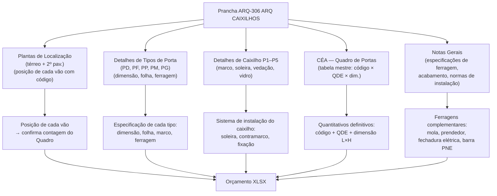

# Estudo: Prancha ARQ-306 (ARQ CAIXILHOS) → Orçamento CELMAR BLN

## O que a prancha 306 contém

A prancha 306 é o **documento mestre de todas as portas e esquadrias** da loja. Reúne em um único lugar a localização, o detalhamento construtivo e o quantitativo de cada tipo de porta — da porta de madeira simples da ADM até a porta corta-fogo das docas. É a prancha que alimenta diretamente a seção 20 (Portas em Madeira), parte da seção 8 (Serralheria), e as portas das seções 21 (Vendas) e 22 (Provadores).

| Elemento | Descrição |
|---|---|
| 306 - Localização Portas Térreo | Planta do térreo com marcação de todos os vãos de porta por código |
| Planta Baixa 2º Pavimento — ADM | Planta da ADM com código de cada porta |
| PD 030, PD 031, PD 032, PD 034 | Tipos de porta PD — detalhes de folha, marco e ferragem |
| PF 017 | Tipo de porta PF — possivelmente porta com folha especial |
| PP 025 | Tipo de porta PP — porta vai-vem ou sanfonada |
| PM 071, PM 903, PM 006, PM 014, PM 029, PM 040 | Tipos de porta PM — portas de madeira com variações |
| PG 040 | Tipo de porta PG — porta de grande porte / vidro |
| Detalhe P1 — Porta Monde | Detalhe de soleira, marco, folha e ferragem de porta tipo Monde |
| Detalhes "P" Caixilhos (P2 a P5) | Detalhes construtivos de caixilho: espessura de marco, fixação, vedação, vidro |
| CÉA — Quadro de Portas | Tabela mestre: código, descrição, dimensão (L×H), quantidade, marca |
| Notas Gerais + Notas-Gerais | Especificações de ferragem, acabamento, instalação e normas |

---

## Mapeamento: Fonte na imagem → Linha no XLSX



---

## Lógica do Quadro de Portas → XLSX

O **CÉA — Quadro de Portas** é a peça central desta prancha. Ele agrupa cada porta por código, informa a quantidade e a dimensão, e é o documento que o orçamentista usa diretamente para lançar as linhas da seção 20.

A lógica de conversão é:

| Código no Quadro | Dimensão | Tipo | Linha no XLSX |
|---|---|---|---|
| PD / PM tipo simples 0,62m | 0,62×2,10 | Madeira folhada | `20.1` — zerada (não se aplica neste projeto) |
| PD / PM tipo 0,72m | 0,72×2,10 | Madeira folhada | `20.2` — 2 unid (R$ 3.722) |
| PD / PM tipo 0,82m | 0,82×2,10 | Madeira folhada | `20.3` — 6 unid (R$ 12.366) |
| PM com visor (cantina) | 0,92×2,10 | Madeira + visor vidro | `20.4` — 1 unid (R$ 2.161) |
| PM com painel vidro (copa) | 0,92×2,10 | Madeira + painel vidro | `20.5` — zerada |
| PM com visor (sala CFTV) | 0,92×2,10 | Madeira + visor | `20.5` — 1 unid (R$ 2.395) |
| PF (ferro — circulação) | — | Ferro | `8.12` — zerada |
| PF (ferro — casa de máquinas) | — | Ferro | `8.14` — 1 unid (R$ 3.270) |
| PF corta-fogo (docas) | — | Corta-fogo | `8.15` — 1 unid (R$ 4.410) |
| Esquadria metálica c/ tela | — | Metálica | `8.16` — zerada |
| Visor back office | — | Visor vidro | `8.18` — 1 unid (R$ 1.000) |
| Visor gerência | — | Visor vidro | `8.19` — 1 unid (R$ 1.000) |
| Portinhola alumínio cantina | — | Alumínio | `8.17` — zerada |
| Passa documentos | — | Metálico | `8.20` — zerado |

---

## Fontes de informação e o que cada uma gera

### 1. Plantas de Localização (Térreo + 2º Pav.)

- Cada vão de porta está marcado com seu código (ex: PM 071, PD 032).
- Permite **verificar cruzado** a contagem do Quadro de Portas — se o Quadro diz 6 unidades de PM 082, deve haver 6 marcações nas plantas.
- Identifica a zona de cada porta (ADM, vendas, técnica) → determina em qual seção do XLSX ela entra.

### 2. Detalhes de Tipos de Porta (PD, PF, PP, PM, PG)

Cada código de tipo tem seu desenho com:
- Planta, elevação e corte do conjunto porta + marco
- Dimensões da folha (L×H)
- Ferragem padrão (dobradiças, maçaneta, fechadura)
- Material da folha e acabamento

Esses detalhes confirmam o **preço unitário MAT.*** de cada linha: uma PM 082 tem preço diferente de uma PM com visor, que tem preço diferente de uma PF de ferro.

### 3. Detalhes de Caixilho P1 a P5

- **Detalhe P1 — Porta Monde**: detalhe completo de soleira, marco, folha, batente e ferragem para a porta principal tipo "Monde" (entrada da área ADM).
- **Detalhes P2 a P5**: variações de caixilho — caixilho com vidro, caixilho fixo, caixilho com marco duplo, caixilho de correr.
- Estes detalhes não geram novos itens no XLSX — confirmam a especificação técnica e o tipo de ferragem.
- O detalhe de vidro no caixilho confirma que o item `19.3` ou `19.4` pode ser necessário para preenchimento de vidro em portas (como visores).

### 4. CÉA — Quadro de Portas (fonte primária de quantitativos)

Esta tabela, localizada no canto superior direito da prancha, é a única fonte que **deve ser lida antes de qualquer outra coisa**. Ela contém:
- **Código** do tipo de porta
- **Descrição** completa
- **QDE** (quantidade total na loja)
- **Dimensão** L×H
- **Marca/referência**

É o equivalente ao QNT Paredes da prancha 301 — o projetista já calculou os quantitativos; o orçamentista só precisa transcrever para o XLSX.

### 5. Notas Gerais

- Especificam ferragens não listadas nos tipos: molas hidráulicas (`20.6`), prendedores de porta (`20.8`), barra de apoio PNE (`20.8` zerada), fechadura elétrica back office (`20.9` zerada).
- Determinam qual porta leva qual ferragem complementar — nem toda porta leva mola, e as Notas definem isso.

---

## Itens do XLSX gerados por esta prancha

### Seção 8 — Portas especiais (Serralheria)

| Item | Descrição | UN | QDE | MAT | M.O. | Total R$ |
|---|---|---|---|---|---|---|
| `8.12` | Porta de ferro — Circulação | unid | — | 3.700 | 700 | 0 (zerada) |
| `8.13` | Porta de ferro — Gerador | unid | — | — | — | 0 (zerada) |
| `8.14` | Porta de ferro — Casa de Máquinas | unid | 1 | 2.790 | 480 | **3.270** |
| `8.15` | Porta corta-fogo — Docas | unid | 1 | 3.760 | 650 | **4.410** |
| `8.16` | Esquadria metálica c/ tela | unid | — | — | — | zerada |
| `8.17` | Portinhola alumínio sob bancada cantina | unid | — | — | — | 0 (zerada) |
| `8.18` | Visor back office com vidro | unid | 1 | 600 | 400 | **1.000** |
| `8.19` | Visor gerência com vidro | unid | 1 | 600 | 400 | **1.000** |
| `8.20` | Passa documentos | unid | — | — | — | 0 (zerado) |

### Seção 20 — Portas em Madeira e Acessórios

| Item | Descrição | UN | QDE | MAT | M.O. | Total R$ |
|---|---|---|---|---|---|---|
| `20.1` | Porta madeira 0,62×2,10m folhada | unid | — | — | — | 0 (zerada) |
| `20.2` | Porta madeira 0,72×2,10m folhada | unid | 2 | 1.576 | 285 | **3.722** |
| `20.3` | Porta madeira 0,82×2,10m folhada | unid | 6 | 1.776 | 285 | **12.366** |
| `20.4` | Porta madeira 0,92×2,10m c/ visor — cantina | unid | 1 | 1.876 | 285 | **2.161** |
| `20.5` | Porta madeira 0,92×2,10m c/ painel vidro — copa | unid | — | — | — | 0 (zerada) |
| `20.5` | Porta madeira 0,92×2,10m c/ visor — sala CFTV | unid | 1 | 2.110 | 285 | **2.395** |
| `20.6` | Mola para porta | unid | 2 | 325,60 | 95,40 | **842** |
| `20.8` | Prendedor de porta | unid | 4 | 100 | 80 | **720** |
| `20.8` | Barra de apoio — sanitário PNE | unid | — | — | — | 0 (zerada) |
| `20.9` | Fechadura elétrica — porta back office | unid | — | — | — | 0 (zerada) |

**Total seção 20:** R$ 22.640

### Portas em outras seções (referenciadas nesta prancha)

| Item | Seção | Descrição | QDE | Total R$ |
|---|---|---|---|---|
| `13.2` | 13 | Porta cela sanitária Eucatex 0,60×1,65 | 10 | 12.127 |
| `13.3` | 13 | Porta divisória Eucatex alavanca | 3 | 4.844 |
| `21.10` | 21 | Porta simples Ártico TX 0,80m — Vendas | 1 | 853 |
| `21.11` | 21 | Porta simples Ártico TX 1,00m — Vendas | 2 | 1.906 |
| `21.12` | 21 | Porta dupla 1,20m Ártico TX — Vendas | 1 | 1.053 |
| `21.13` | 21 | Porta vai-vem Ártico TX — Vendas | 1 | 3.050 |
| `22.20–22.26` | 22 | Portas de provadores (21 unid + PNE + família + correr) | 25 | ~27.725 |

---

## Particularidades desta prancha

### 1. Única prancha que centraliza TODAS as portas do projeto
Enquanto a prancha 301 (Civil) tem o Quadro de Portas embutido, a prancha 306 vai além: mostra o **detalhe construtivo** de cada tipo, permitindo especificar não só a quantidade mas o sistema completo (marco, folha, ferragem, acabamento). É aqui que se decide se uma porta leva mola hidráulica ou não.

### 2. O Quadro de Portas elimina a necessidade de contar nas plantas
Assim como o QNT Paredes da prancha 301, o **CÉA — Quadro de Portas** já traz todos os quantitativos calculados. O orçamentista não precisa contar porta por porta nas plantas — usa a tabela diretamente. As plantas de localização servem apenas para verificação cruzada.

### 3. Itens zerados por inaplicabilidade ou decisão de projeto
Muitas portas têm QDE zerada nesta proposta:
- **Copa** (20.5 com painel vidro): copa não recebeu esta porta neste projeto
- **Circulação** (8.12 de ferro): não se aplica à configuração desta loja
- **Barra PNE** (20.8): pode ser fornecimento do shopping ou por negociar
- **Fechadura elétrica back office** (20.9): sistema de acesso ainda não definido

### 4. Portas de provadores têm prancha própria (seção 22)
As portas dos provadores (22.20 a 22.26, total ~25 unidades) são detalhadas na prancha de provadores, não aqui. O Quadro de Portas da 306 as lista para referência de localização, mas a especificação técnica e o preço unitário vêm da prancha de painéis/provadores.

---

## Estratégia de extração automática

| Componente | Técnica | Ferramenta | Confiança |
|---|---|---|---|
| CÉA — Quadro de Portas (tabela principal) | OCR tabular — código, QDE, dimensão, marca | GPT-4o Vision | Alta |
| Código de porta nas plantas (localização) | OCR nos labels sobrepostos às plantas | Tesseract / GPT-4o Vision | Média-Alta |
| Dimensão L×H por tipo (detalhes) | OCR nas cotas dos detalhes de porta | Tesseract | Alta |
| Ferragens complementares (Notas Gerais) | OCR + NLP para extrair associação porta → ferragem | GPT-4o | Média-Alta |
| Tipo de caixilho (P1–P5) | Classificação visual do detalhe + OCR do título | GPT-4o Vision | Média |

### Pipeline recomendado

```
1. OCR no CÉA — Quadro de Portas (prioridade máxima)
   → código + QDE + dimensão → alimenta direto seção 20 e 8

2. OCR nos detalhes de tipo (PD, PF, PM, PP, PG)
   → confirmar dimensão e especificação de ferragem por tipo

3. OCR nas Notas Gerais
   → extrair ferragens complementares (mola, prendedor, barra PNE, fechadura elétrica)
   → extrair condições de zeragem (ex: "barra PNE conforme norma do shopping")

4. Verificação cruzada nas plantas de localização
   → contar marcações de código por zona (ADM, técnica, vendas)
   → confirmar que total bate com o Quadro de Portas
```

---

*Referências: Prancha CEA-254-BLN-ARQ_R02-306 - ARQ CAIXILHOS.png · 1ª Proposta CELMAR BLN.xlsx · Loja 254 Shopping Norte Blumenau*
