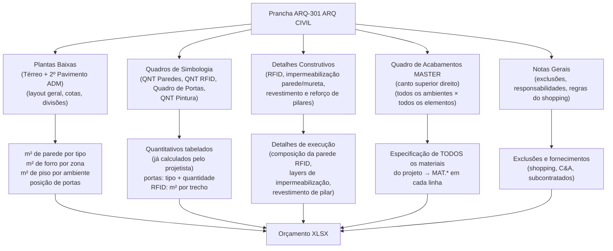

# Estudo: Prancha ARQ-301 (ARQ CIVIL) → Orçamento CELMAR BLN

## O que a prancha 301 contém

A prancha 301 é o **documento civil mestre** do projeto — a única que cobre simultaneamente todos os ambientes da loja (térreo e 2º pavimento). Diferente das pranchas 304 (COPA) e 341 (FACHADAS), que são documentos de ambiente específico, a 301 gera os maiores volumes do orçamento, incluindo o maior item individual de todo o XLSX: o forro de gesso (R$ 92.547).

Ela carrega **5 tipos de fontes de informação**:



---

## Mapeamento direto: Fonte na imagem → Linha no XLSX

### 1. Plantas Baixas (Térreo + 2º Pavimento)

As duas plantas cobrem todo o pavimento térreo e a área administrativa do 2º pavimento. São a fonte primária de **todos os quantitativos de área** da loja.

| Elemento lido na planta | Cálculo | Itens gerados no XLSX |
|---|---|---|
| Paredes de alvenaria (áreas ADM e técnicas) | comprimento × altura de pé-direito | `9.5` Alvenaria tijolo/bloco — 230 m² (R$ 25.300) |
| Reboco das paredes de alvenaria | m² de alvenaria × 2 faces | `9.7` Chapisco e emboço — 460 m² (R$ 18.386) |
| Paredes de gesso no salão de vendas | perímetro dos cômodos × altura | `12.1` Gesso STD 1 face — 672 m² · `12.2` 2 faces — 274 m² |
| Paredes de gesso na ADM | idem para zona ADM | `12.3` Gesso RU 1 face — 40,84 m² · `12.4` RU 2 faces — 98 m² |
| Paredes de gesso em áreas técnicas | idem para zona técnica | `12.5` Gesso RF 1 face — 3 m² · `12.6` RF 2 faces — 15 m² |
| Área total do forro | área da planta térreo | `12.9` Forro gesso Gypsum liso — **1.457,44 m²** (R$ 92.547) |
| Furos na laje para instalações | levantamento por planta | `9.12` Furação mecânica de lajes — vb (R$ 5.440) |
| Posição e área de áreas molhadas (mureta) | marcação na planta | `10.1` e `10.2` Impermeabilização |

### 2. Quadros de Simbologia (4 tabelas na parte central)

Esta prancha é única: o projetista já **pré-calculou os quantitativos** em tabelas embutidas na própria prancha. Isso elimina grande parte do trabalho de extração.

#### CÉA - QNT Paredes RFID
- Tabela listando cada trecho de parede com proteção RFID, com comprimento e altura → calcula m² de manta aluminizada.
- Gera: `25.1` Proteção eletromagnética manta aluminizada — **158 m²** (R$ 18.960)

#### CÉA - QNT Paredes
- Tabela com quantitativo de paredes por tipo (STD 1f / STD 2f / RU 1f / RU 2f / RF 1f / RF 2f), por ambiente.
- Gera diretamente as quantidades das linhas `12.1` a `12.6` — **não é necessário medir as plantas manualmente**.

#### CÉA - Quadro de Portas
- Tabela com tipo de porta, dimensão (L×H), quantidade e zona.
- Gera todas as linhas da seção 20 (portas de madeira) e seção 13 (divisórias com porta).
- Exemplo: "Porta 0.82×2.10 folhada Curupixa" × 6 unid → `20.3` (R$ 12.366)

#### CÉA - QNT Pintura
- Tabela com m² de pintura por ambiente e tipo de tinta.
- Gera as linhas `18.5`, `18.8`, `18.11`, `18.12` com os m² corretos por zona.

### 3. Detalhes Construtivos

| Detalhe na prancha | O que fornece | Item gerado no XLSX |
|---|---|---|
| Det. Paredes RFID (items 01, 03) | Composição em camadas da parede: gesso + manta aluminizada + gesso. Espessura e fixação. | `25.1` Proteção eletromagnética manta aluminizada — m² da tabela QNT RFID |
| Vista Típica Reforço Paredes | Tipo e posição do reforço estrutural em cedrinho | `12.7` Reforço em cedrinho para paredes — 1 vb (R$ 8.300) |
| Impermeabilização Parede (corte) | Sistema de manta butílica: primer + manta + proteção | `10.1` Impermeabilização manta butílica — 43,7 m² (R$ 13.024) |
| Impermeabilização Mureta (corte) | Sistema de manta líquida: primer + manta + argamassa | `10.2` Impermeabilização manta líquida sanitários — 28,87 m² (R$ 4.030) |
| Vista Esquemática Revestimento Pilares | Tipo de revestimento (ACM ou MDF) e dimensões dos pilares | Contribui para seção 21 (marcenaria / painéis pilares) |
| Det. Pilares Salão de Vendas (item 04) | Quantidade e posição de todos os pilares | Contagem de pilares para orçar revestimento por unidade |

### 4. Quadro de Acabamentos MASTER (canto superior direito)

Esta é a versão **completa e definitiva** do quadro que nas pranchas de ambiente aparece apenas parcialmente. Cobre:

- **Salão de Vendas**: piso, parede, forro
- **Provadores**: piso, parede, forro, espelhos
- **ADM/Copa/Refeitório**: piso, parede, forro
- **Sanitários/Vestiários**: piso, parede, forro, louças
- **Áreas Técnicas**: piso, parede, forro

É a **fonte definitiva de preços unitários de material (MAT.*)** para todas as linhas do orçamento. Qualquer prancha de ambiente (como a 304-COPA) extrai apenas o trecho pertinente a seu ambiente deste quadro master.

### 5. Notas Gerais

- Especificam itens a verificar com o shopping (ex: requisitos de impermeabilização, normas de forro)
- Identificam o que é responsabilidade do shopping vs. da Celmar
- Alertam para diferenças de cota e necessidade de verificação in loco antes do início das obras

---

## Fluxo de extração: o que ler e em que ordem


**Diferencial desta prancha:** os Quadros de Simbologia já entregam parte dos quantitativos prontos — reduzindo o esforço de medição das plantas. O extrator deve **priorizar a leitura das tabelas** (etapa 2) e usar a planta apenas para completar o que não foi tabelado.

---

## Itens gerados no XLSX por esta prancha

### Seção 9 — Adaptação de Shell / Paredes / Bases

| Item | Descrição | UN | QDE | MAT (unit) | M.O. (unit) | Total R$ |
|---|---|---|---|---|---|---|
| 9.3 | Sóculos para bancadas | vb | 1 | 840 | 510 | **1.350** |
| 9.4 | Bases em concreto para equipamentos (AC, gerador) | vb | 1 | 1.879 | 970 | **2.849** |
| 9.5 | Alvenaria em tijolo/bloco de concreto | m² | 230 | 76 | 34 | **25.300** |
| 9.6 | Alvenaria em bloco sical | m² | — | — | — | 0 |
| 9.7 | Chapisco e emboço | m² | 460 | 25,32 | 14,65 | **18.386** |
| 9.12 | Furação mecânica de lajes | vb | 1 | 4.150 | 1.290 | **5.440** |
| 9.13 | Arremates gerais | vb | 1 | 4.130 | 2.260 | **6.390** |

### Seção 10 — Impermeabilização

| Item | Descrição | UN | QDE | MAT (unit) | M.O. (unit) | Total R$ |
|---|---|---|---|---|---|---|
| 10.1 | Impermeabilização manta butílica (áreas molhadas) | m² | 43,7 | 177,36 | 120,68 | **13.024** |
| 10.2 | Impermeabilização manta líquida (sanitários) | m² | 28,87 | 87,20 | 52,40 | **4.030** |

### Seção 12 — Paredes e Forros em Gesso

| Item | Descrição | UN | QDE | MAT (unit) | M.O. (unit) | Total R$ |
|---|---|---|---|---|---|---|
| 12.1 | Parede gesso STD 1 face — salão de vendas | m² | 672 | 75,80 | 45,70 | **81.648** |
| 12.2 | Parede gesso STD 2 faces — salão de vendas | m² | 274 | 75,80 | 56,70 | **36.305** |
| 12.3 | Parede gesso RU 1 face — ADM | m² | 40,84 | 90,20 | 58,45 | **6.070** |
| 12.4 | Parede gesso RU 2 faces — ADM | m² | 98 | 90,20 | 58,45 | **14.567** |
| 12.5 | Parede gesso RF 1 face — área técnica | m² | 3 | 90,20 | 58,45 | **445** |
| 12.6 | Parede gesso RF 2 faces — área técnica | m² | 15 | 104,20 | 58,45 | **2.439** |
| 12.7 | Reforço em cedrinho para paredes | vb | 1 | 5.770 | 2.530 | **8.300** |
| 12.9 | Forro gesso Gypsum liso tabicado (toda a loja) | m² | **1.457,44** | 25,50 | 38,00 | **92.547** |
| 12.11 | Alçapão no forro | unid | 15 | 153 | 64 | **3.255** |
| 12.12 | Abertura forro para luminárias/spots/grelhas | und | 176 | — | 35 | **6.160** |
| 12.13 | Reforço para placas de AC, trilhos vitrine | vb | 1 | 2.489 | 1.300 | **3.789** |

**Total seção 12:** R$ 255.528 ← maior seção do XLSX

### Seção 13 — Divisórias

| Item | Descrição | UN | QDE | MAT (unit) | M.O. (unit) | Total R$ |
|---|---|---|---|---|---|---|
| 13.1 | Divisória Divilux 35 Eucatex (compartimentos) | m² | 30 | 118,20 | 87,00 | **6.156** |
| 13.2 | Porta sanit. 0,60×1,65 Eucatex cela — abrir | unid | 10 | 1.068,40 | 144,30 | **12.127** |
| 13.3 | Porta divisória Eucatex alavanca — abrir | unid | 3 | 1.382,30 | 232,45 | **4.844** |
| 13.5 | Porta e ferragens vidro/alum. box chuveiro | unid | 2 | 989,20 | 165,00 | **2.308** |

### Seção 25 — Omissos (RFID)

| Item | Descrição | UN | QDE | MAT (unit) | M.O. (unit) | Total R$ |
|---|---|---|---|---|---|---|
| 25.1 | Proteção eletromagnética manta aluminizada (RFID) | m² | 158 | 70,00 | 50,00 | **18.960** |
| 25.2 | Alvenaria em bloco celular | m² | 10 | 66,30 | 28,50 | **948** |

> **Total CC 810030 (alvenaria/paredes):** R$ 70.471
> **Total CC 810230 (gesso/forro):** R$ 368.106 — maior centro de custo do projeto

---

## Particularidades desta prancha vs. COPA e FACHADA

### 1. Quadros de simbologia eliminam parte da medição manual
A prancha 304 (COPA) e a 341 (FACHADAS) não têm tabelas de quantitativo — tudo precisa ser medido nas plantas e elevações. A 301 inclui o **QNT Paredes**, **QNT RFID** e o **Quadro de Portas** já com os totais calculados. O extrator pode ler esses valores diretamente — não precisa medir parede por parede.

### 2. Tipos de parede de gesso classificados por zona
O código do tipo de gesso varia por ambiente:
- **STD** (Standard) → salão de vendas (ambiente seco, sem exigência especial)
- **RU** (Resistente à Umidade) → ADM, copa, sanitários
- **RF** (Resistente ao Fogo) → áreas técnicas, casa de máquinas

A classificação vem do **QNT Paredes** e é mapeada para as linhas `12.1` a `12.6`. O extrator precisa identificar a zona de cada parede para aplicar o tipo correto.

### 3. Forro de gesso cobre toda a loja
O item `12.9` (1.457,44 m²) é o **maior item individual de todo o orçamento**. O m² vem diretamente da soma das áreas de planta de todos os ambientes que levam forro. O detalhe de abertura do forro (`12.12`, 176 aberturas) vem do plano de iluminação (prancha 341).

### 4. RFID é um sistema multicamada
O Det. Paredes RFID mostra que a proteção eletromagnética é uma **camada interna na parede de gesso** — não é um item separado colado na superfície. O m² orçado (158 m²) vem da tabela QNT RFID, e o detalhe construtivo é necessário apenas para entender a composição e confirmar a especificação (manta aluminizada, não blocos ou telas).

---

## Estratégia de extração automática

| Componente | Técnica | Ferramenta | Confiança |
|---|---|---|---|
| Quadro de Acabamentos MASTER | OCR estruturado — tabela grande com mesclagem | GPT-4o Vision | Alta |
| QNT Paredes (tabela já calculada) | OCR tabular — valores numéricos por tipo/ambiente | Tesseract / GPT-4o Vision | Alta |
| Quadro de Portas | OCR tabular — tipo, dimensão, quantidade | GPT-4o Vision | Alta |
| QNT RFID | OCR tabular — m² por trecho | Tesseract | Alta |
| QNT Pintura | OCR tabular — m² por tinta/ambiente | Tesseract | Alta |
| Área total do forro | Soma das áreas de planta (não tabelada) | OCR cotas + cálculo Python | Média |
| Área de impermeabilização | Marcação específica na planta (mureta/molhadas) | OCR + reconhecimento de zona | Média |
| Tipo de gesso por zona | Leitura do QNT Paredes + cor/hachura da planta | OCR + legenda de cores | Média-Alta |

### Pipeline completo recomendado

```
1. OCR das 4 tabelas de simbologia (prioridade máxima)
   QNT Paredes → m² por tipo de gesso
   QNT RFID → m² de manta aluminizada por trecho
   Quadro de Portas → tipo + quantidade de cada porta
   QNT Pintura → m² por tinta e ambiente
   (estas tabelas já entregam ≈ 60% dos quantitativos da prancha)

2. OCR do Quadro de Acabamentos MASTER
   → extrair especificação completa de materiais por ambiente × elemento
   → base de preços unitários para todo o projeto

3. Medição nas plantas (apenas o que não foi tabelado)
   → área total do forro (soma das plantas térreo + 2º pav.)
   → área de impermeabilização (marcações de área molhada)
   → verificação cruzada com tabelas para validação

4. Leitura dos detalhes construtivos
   → confirmar composição de sistemas (RFID, impermeabilização)
   → não geram novos quantitativos — apenas validam especificação

5. Leitura das Notas Gerais
   → identificar condicionantes do shopping e responsabilidades
   → registrar itens que dependem de visita técnica ao local
```

---

*Referências: Prancha CEA-254-BLN-ARQ_R03-301-ARQ CIVIL.png · 1ª Proposta CELMAR BLN.xlsx · Loja 254 Shopping Norte Blumenau*
