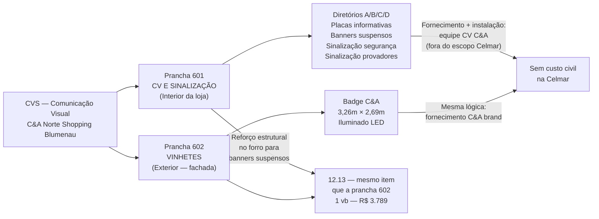
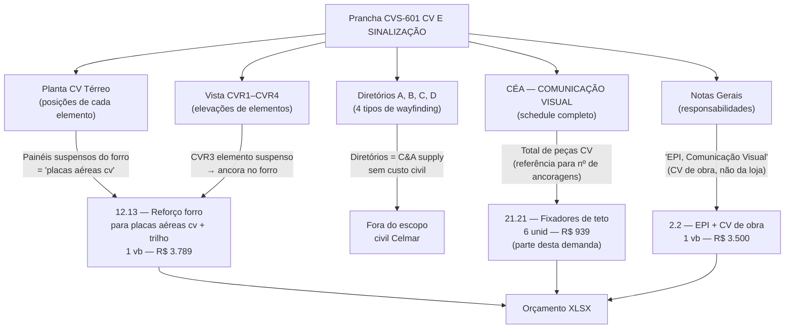
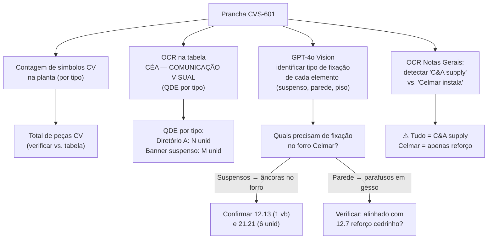

# Estudo: Prancha CVS-601 (CVS COMUNICAÇÃO VISUAL E SINALIZAÇÃO) → Orçamento CELMAR BLN

## O que a prancha 601 contém

A prancha 601 é o documento de **Comunicação Visual e Sinalização interna** — o par complementar da prancha 602 (CVS VINHETES, que documenta o elemento externo). Enquanto a 602 trata do badge C&A na fachada, a 601 mapeia toda a sinalização dentro da loja: diretórios, placas informativas, painéis suspensos do forro e sinalização de segurança.

| Elemento | Descrição |
|---|---|
| 601 — CV Térreo (planta) | Planta do térreo com posição de cada elemento de CV marcado — zonas coloridas (rosa = SV, azul = provadores/estoque, amarelo = ADM) com símbolos e tags de cada peça de sinalização |
| Provadores Mezanino (planta parcial) | Detalhe do CV na zona de provadores do mezanino — sinalização de cabines, saída, gênero |
| Planta Baixa 2º Pavimento | Mapa de CV do segundo pavimento |
| Diretório A, B, C, D (4 vistas) | Quatro tipos de peças de diretório/wayfinding com barra laranja C&A — diferentes configurações (totens, painéis de parede, sinalizações suspensas) |
| Vista CVR1 | Elevação: faixa horizontal longa (bar sign) — possivelmente acima do corredor |
| Vista CVR2 | Elevação: painel de parede com sinalização departamental |
| Vista CVR3 | Elevação: elemento suspenso/pendente com indicador direcional |
| Vista CVR4 | Elevação: elemento de sinalização de piso ou esquina |
| CÉA — COMUNICAÇÃO VISUAL (tabela) | Schedule completo de todos os elementos de CV: ITEM, DESCRIÇÃO, QDE |
| Notas Gerais | Requisitos de instalação, responsabilidades CV vs. civil, aprovação shopping |

---

## Prancha 601 vs. prancha 602: os dois lados do sistema CVS

---

## Mapeamento: Fonte na imagem → Linha no XLSX

---

## Itens do XLSX vinculados a esta prancha

| Item | Zona | Descrição | Un | QDE | Total (R$) | Vínculo com CV-601 |
|---|---|---|---|---|---|---|
| `12.13` | — | Reforço: **placas aéreas cv** + trilho vitrine | vb | **1** | **3.789** | Reforço estrutural no forro para banners suspensos |
| `21.21` | vendas | Fixadores de teto | unid | **6** | **939** | Parte dos fixadores para elementos CV e de merchandising |
| `2.2` | — | EPI + comunicação visual (de obra) | vb | **1** | **3.500** | CV de canteiro (placa de obra, sinalizações de segurança) — não é a CV da loja |

### Itens fora do XLSX civil

| Categoria | Responsável | Observação |
|---|---|---|
| Diretórios A, B, C, D | C&A Brand / empresa de CV | Fabricação + instalação pela equipe especializada |
| Banners/painéis suspensos | C&A Brand | Pendurados nos pontos de fixação reforçados pelo `12.13` |
| Placas informativas (gênero, saída, caixa) | C&A Brand | Coladas/parafusadas nas paredes — sem obra civil |
| Sinalização de emergência/incêndio | Instaladora elétrica | Exigência normativa (NBR) — no orçamento elétrico |
| Sinalização dos provadores | C&A Brand | Incluso no escopo da equipe de CV/montagem |

---

## Particularidades desta prancha

### 1. O sistema de diretórios: 4 tipologias para um único espaço
Os quatro tipos de diretório (A, B, C, D) respondem a necessidades diferentes de wayfinding:
- **A e B**: provavelmente posicionados na entrada e nas principais encruzilhadas do salão
- **C**: versão reduzida para zonas de menor tráfego
- **D**: possivelmente para a zona de provadores ou checkout

Todos têm a barra laranja característica do C&A (elemento de identidade visual) e diferem em altura, número de linhas de texto e tipo de suporte (totem, parede, suspenso).

### 2. O item `12.13` é compartilhado com três pranchas
O item `12.13` ("Prever reforço para: placas aéreas cv, trilho vitrine") aparece associado a três documentos:
- **Prancha 601**: os banners/painéis suspensos do interior (CVR3 e similares)
- **Prancha 602**: o vinhete externo e seus pendurais
- **Prancha 201**: os trilhos de iluminação sobre o forro

Um único item vb de R$3.789 cobre o reforço estrutural para todos esses sistemas — o que pode ser uma sub-estimativa se o número de ancoragens for maior que o planejado.

### 3. A sinalização dos provadores: conteúdo mais específico desta prancha
A planta "Provadores Mezanino" e o detalhe CVR3 documentam como os sinalizadores de gênero (Feminino/Masculino), numeração de cabine e seta direcional são posicionados na área de provadores. Esta é a sinalização mais densa em m² do projeto (muitos elementos num espaço pequeno) e está dentro do escopo da equipe de montagem dos provadores (seção 22), não da Celmar.

### 4. CVR1 — a faixa horizontal: sinalização da entrada e do salão
A Vista CVR1 mostra uma longa faixa horizontal com a barra laranja e texto — possivelmente a sinalização acima dos corredores principais ou na entrada (zona de descompressão). Esta peça é possivelmente o elemento que requer o maior ponto de fixação no forro e é a mais relacionada ao `12.13`.

### 5. `2.2` "EPI, comunicação visual" ≠ CV da loja
O item `2.2` inclui "comunicação visual" no nome, mas se refere à **CV do canteiro de obras** — placa de obra na fachada, sinalização de EPI obrigatório, demarcação de áreas de risco. Não tem relação com os diretórios e banners da loja em operação.

---

## Estratégia de extração automática

| Componente | Técnica | Ferramenta | Confiança |
|---|---|---|---|
| QDE por tipo de CV element | OCR tabela CÉA — COMUNICAÇÃO VISUAL | PaddleOCR | **Muito alta** |
| Contagem de posições na planta | Template matching / blob detection | OpenCV | Alta |
| Classificar: suspenso vs. parede vs. piso | GPT-4o Vision nas Vistas CVR1–CVR4 | GPT-4o Vision | Alta |
| Detectar "C&A supply" nas notas | OCR + NLP keyword matching | GPT-4o Vision | Alta |
| Validar âncoras no forro (12.13) | Contagem de elementos suspensos | Cálculo | Média |

---

## Relação com a prancha 602

| Aspecto | Prancha 601 | Prancha 602 |
|---|---|---|
| Localização | Interior da loja | Exterior — fachada |
| Elementos | Diretórios, banners, placas | Badge/vinhete C&A |
| Iluminação | Alguns elementos iluminados (CVR) | LED interno obrigatório |
| Item XLSX civil compartilhado | `12.13` | `12.13` + `23.4` |
| Escopo Celmar | Apenas reforço no forro | Substrato ACM + reforço |

---

*Referências: Prancha CEA-254-BLN-ARQ_R03-601 - CVS COMUNICAÇÃO VISUAL E SINALIZAÇÃO.png · 1ª Proposta CELMAR BLN.xlsx · Loja 254 Shopping Norte Blumenau*
