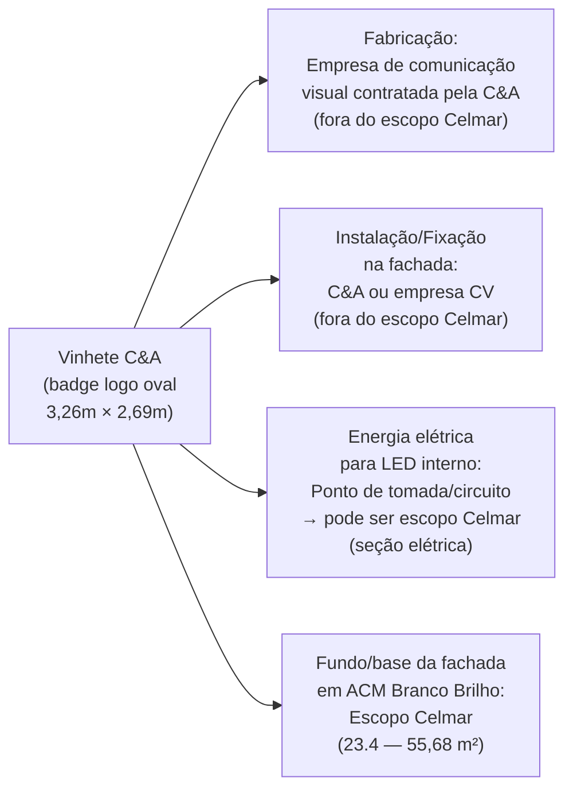
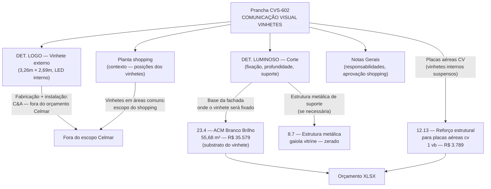
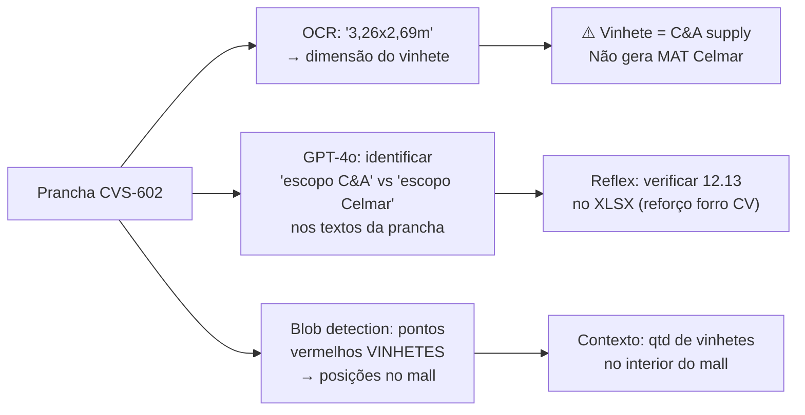

# Estudo: Prancha CVS-602 (CVS COMUNICAÇÃO VISUAL / VINHETES) → Orçamento CELMAR BLN

## O que a prancha 602 contém

A prancha 602 é a única do conjunto que trata de **Comunicação Visual (CV)** — especificamente os "vinhetes", que são os elementos de identidade de marca C&A montados na fachada e no interior da loja. É uma prancha de briefing e especificação, não de construção civil — ela documenta o que será instalado, não quem instala nem como cobrar.

| Elemento | Descrição |
|---|---|
| Planta geral do shopping (topo) | Planta do mall inteiro com todas as lojas identificadas por logo — contexto de localização da C&A; pontos vermelhos "VINHETES" marcam posições |
| DET. LOGO — Vista Frontal (1:1) | Detalhe frontal do badge C&A — forma oval irregular, preto/branco, dimensão 3,26m × 2,69m — **Fachada Externa** |
| DET. LOGO — Vista Interna — Iluminação | Vista interna com estrutura de iluminação LED (contorno dourado/amarelo C&A visível) |
| DET. LUMINOSO — Corte | Corte transversal do luminoso mostrando profundidade da caixa de luz, suporte e fixação |
| Vista Frontal / Vista Frontal Interna / Corte (canto direito) | Detalhes adicionais do vinhete: montagem, dimensões e especificação do material da caixa |
| Foto de referência | Foto real de outra loja C&A com o vinhete/badge externo instalado na fachada |
| Notas Gerais (coluna direita) | Instruções de instalação, responsabilidades e requisitos do shopping |

---

## O vinhete C&A: o que é e quem fornece

O vinhete é um **luminoso tipo caixa com LED interno** — visível na foto real e no corte: a estrutura tem profundidade (forma uma "caixa"), o logo C&A fica recortado e iluminado por dentro. O material é acrílico/plástico com estrutura metálica interna.

---

## Planta do shopping: o que os pontos "VINHETES" indicam

A planta do shopping no topo da prancha com pontos vermelhos mostra a **distribuição de vinhetes no interior do mall** (não apenas no exterior da loja). Os pontos marcam locais onde o badge C&A aparece em áreas comuns do shopping — corredores, praça de alimentação, acesso. Isso é relevante porque:
- Vinhetes internos ao mall são **escopo do condomínio/shopping** — instalados pela administração do mall, não pela Celmar
- Vinhetes na **fachada da loja** são escopo C&A (fornecimento e instalação do brand)
- A Celmar fornece o **substrato** (ACM, estrutura metálica) sobre o qual o vinhete será fixado

---

## Mapeamento: Fonte na imagem → Linha no XLSX

---

## Itens do XLSX vinculados a esta prancha

| Item | Zona | Descrição | Un | QDE | Total (R$) | Vínculo com CV |
|---|---|---|---|---|---|---|
| `12.13` | — | Prever reforço para: **placas aéreas cv**, trilho vitrine | vb | 1 | **3.789** | Reforço no forro de gesso para fixar os vinhetes internos suspensos |
| `23.4` | fachada | Revestimento em ACM Branco Brilho | m² | 55,68 | **35.579** | Substrato da fachada onde o vinhete externo é fixado |
| `8.7` | fachada | Estrutura metálica gaiola para base e sustentação de vitrine | vb | — | **0** | Possível suporte do vinhete — zerado |

### Item fora do XLSX civil (escopo elétrico separado)
O vinhete tem LED interno — o circuito elétrico (ponto de energia, disjuntor, cabeamento até o luminoso) deve estar na seção elétrica do orçamento, não na planilha civil. Esta prancha documenta a especificação para que o eletricista preveja o ponto.

---

## Particularidades desta prancha

### 1. A prancha mais "brand" do conjunto — quase nenhum item civil
A prancha 602 é a que menos gera itens no orçamento Celmar. Ela serve principalmente para:
- Informar o construtor sobre o que será instalado na fachada (para preservar o substrato)
- Especificar o reforço estrutural necessário no forro para os vinhetes internos suspensos
- Documentar a aprovação prévia do shopping (exigência do manual técnico)

### 2. O `12.13` é o elo mais importante com o orçamento
O item `12.13` — "Prever reforço para: placas aéreas cv, trilho vitrine" (R$ 3.789) — está na seção de gesso (seção 12) porque o reforço é feito **dentro da estrutura do forro de gesso**: inserção de perfis metálicos adicionais ou chumbadores para suportar o peso dos vinhetes suspensos. O CVS-602 é a prancha que justifica a existência deste item.

### 3. A planta do shopping é contexto — não gera itens
O grande mapa do shopping no topo da prancha (com logos de Renner, Rchlo, Burger King, Magalu, Cinépolis, Pittol etc.) é puramente contextual — mostra onde a loja C&A está e como os vinhetes se relacionam com o fluxo do mall. Não há nenhum item de orçamento derivado deste mapa.

### 4. O ACM é o substrato, não o vinhete
O vinhete se apoia sobre o ACM Branco Brilho (`23.4` — 55,68 m²) que reveste a fachada. Celmar instala o ACM; depois a equipe de CV da C&A fixa o vinhete sobre ele. Esta dependência de sequência construtiva é relevante para o cronograma: o ACM precisa estar instalado e aprovado antes da fixação do vinhete.

### 5. Aprovação do shopping como condicionante
As Notas Gerais desta prancha provavelmente incluem a exigência de aprovação prévia do manual técnico do shopping para instalação de quaisquer elementos de CV na fachada. Isso é uma restrição operacional que afeta o cronograma, não o custo direto da Celmar.

---

## Estratégia de extração automática

| Componente | Técnica | Ferramenta | Confiança |
|---|---|---|---|
| Dimensões do vinhete (3,26m × 2,69m) | OCR no label "FACHADA EXTERNA — DETALHE LOGO EXTERNO" | Tesseract | Alta |
| Identificação como escopo C&A (não Celmar) | GPT-4o Vision nas notas + label "fornecimento C&A" | GPT-4o Vision | Alta |
| Posições de vinhetes internos (planta shopping) | Detecção de pontos vermelhos no mapa | OpenCV blob detection | Alta |
| Reforço estrutural no forro (12.13) | Cruzamento: CVS-602 → seção 12 do XLSX | Keyword match ("placas aéreas cv") | Alta |
| Substrato ACM (23.4) | Cruzamento: CVS-602 + ARQ-341 fachadas | Área fachada — OCR nas cotas | Média |
| Circuito elétrico do luminoso | GPT-4o Vision no corte + notas ("LED", "ponto de energia") | GPT-4o Vision | Média |

---

*Referências: Prancha CEA-254-BLN-ARQ_R02-602 - CVS COMUNICAÇÃO VISUAL_VINHETES.png · 1ª Proposta CELMAR BLN.xlsx · Loja 254 Shopping Norte Blumenau*
