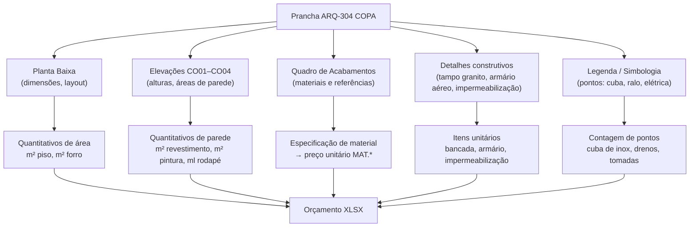
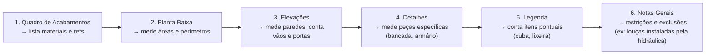

# Estudo: Prancha ARQ-304 (COPA) → Orçamento CELMAR BLN

## O que a prancha 304 contém

A imagem é uma prancha técnica completa do ambiente COPA. Ela carrega **5 tipos de fontes de informação**, cada uma gerando categorias distintas de itens no orçamento:



---

## Mapeamento direto: Fonte na imagem → Linha no XLSX

### 1. Planta Baixa (layout + cotas)

- Fornece: área do ambiente em m², posição das paredes, localização da bancada e equipamentos.
- Gera no XLSX:
  - `14.11` — Piso cerâmico área ADM → m² extraídos da planta
  - `14.12` — Piso vinílico → m²
  - `14.13/14.14` — Rodapé de madeira → ml (perímetro da planta)
  - `18.5` — Emassamento e pintura acrílica → m² (paredes calculadas pela altura × comprimento)

### 2. Elevações CO01–CO04 (4 vistas de parede)

- Fornece: altura do pé-direito, área exata de cada parede, posição de armários suspensos, cota do azulejo (altura do revestimento cerâmico).
- Gera no XLSX:
  - `15.1` — Azulejo branco junta a prumo → m² (lido direto das elevações, excluindo vãos de porta)
  - `15.2` — Perfil de alumínio branco meia altura → ml
  - `18.11` — Pintura látex branco neve forro → m² (área do forro = área da planta)
  - `20.5` — Porta de madeira copa 0,92×2,10m com painel de vidro → unid contada nas elevações (QDE = None = zerada neste projeto)

### 3. Quadro de Acabamentos (tabela no canto superior direito)

- É a fonte de **especificação de material**. Cada linha especifica: ambiente → elemento (piso/parede/forro) → referência do produto → fabricante.
- **Esta é a chave que conecta o desenho ao preço**: a referência determina o `MAT.*` (preço unitário de material) no XLSX.
- Exemplo: o quadro especifica "Cerâmica 45×45 Cargo Plus White Eliane" → linha `14.11` usa esse preço unitário.
- Também especifica a cor de pintura ("Diário de Menina" para paredes) → linha `18.8` no XLSX.

### 4. Detalhes construtivos

| Detalhe na prancha | Item gerado no XLSX |
|---|---|
| Det. Tampo Granito (cota de espessura e largura) | `16.1` Bancada em granito cantina → m² calculado da área do tampo |
| Det. Armário Aéreo (dimensões H×L×P) | `24.2` Bancada/armário da copa → 1 unid (R$ 3.110) |
| Impermeabilização Áreas Molhadas (detalhe de manta) | `10.1` Impermeabilização manta butílica → m² (área abaixo da cuba) |

### 5. Legenda / Simbologia

- Cada símbolo na planta representa um item contável:
  - Símbolo de cuba de inox → `17.1` Cuba de inox - copa → 1 unid (R$ 1.150)
  - Símbolo de ralo → insumo da hidráulica (não está neste orçamento, vai para instaladora)
  - Símbolo de tomada/ponto elétrico → vai para planilha elétrica separada

---

## Fluxo de extração: o que ler e em que ordem



**Por que essa ordem:** o Quadro de Acabamentos define quais materiais precisam ser orçados antes de qualquer medição; depois as medições (planta → elevações → detalhes) fornecem as quantidades; por fim a legenda fecha os itens unitários e as Notas Gerais registram o que está fora do escopo.

---

## Itens da COPA identificados no XLSX

| Item | Descrição | UN | QDE | Total R$ |
|---|---|---|---|---|
| 10.1 | Impermeabilização manta butílica (abaixo da cuba) | m² | 43,7 | 13.024 |
| 10.2 | Impermeabilização manta líquida (áreas molhadas) | m² | 28,87 | 4.030 |
| 15.1 | Azulejo branco junta a prumo | m² | 81 | 10.246 |
| 15.2 | Perfil de alumínio branco 1/2" meia altura | ml | 23 | 1.108 |
| 16.1 | Bancada em granito cantina (Cinza Andorinha) | m² | 1,47 | 4.432 |
| 17.1 | Cuba de inox - copa | unid | 1 | 1.150 |
| 20.5 | Porta madeira copa 0,92×2,10m c/ painel de vidro | unid | — | 0 (excluída) |
| 24.2 | Bancada / armário da copa | unid | 1 | 3.110 |
| 24.10 | Porta e tampa de alumínio para lixeira copa | unid | 2 | 1.840 |

> **Nota:** os itens de pintura (`18.5`, `18.11`) e rodapé (`14.13/14.14`) são compartilhados com toda a área ADM — a copa contribui com parte do m² total de forma proporcional.

---

## Estratégia de extração automática

Dado que a imagem é uma prancha de CAD exportada como PNG de alta resolução:

| Componente | Técnica | Ferramenta recomendada | Confiança |
|---|---|---|---|
| Quadro de Acabamentos | OCR em região delimitada (tabela estruturada) | GPT-4o Vision / Google Vision API | Alta |
| Cotas dimensionais | OCR próximo às linhas de cota | Tesseract / PaddleOCR com bounding boxes | Média-Alta |
| Áreas e perímetros | Cálculo pós-OCR: comprimento × largura, soma de ml | Python (lógica de cálculo) | Alta |
| Símbolos (cuba, ralo) | Detecção e contagem de ícones padronizados | OpenCV template matching / CLIP | Média |
| Mapeamento para XLSX | Combinação material + unidade + ambiente → linha | Tabela de referência + fuzzy matching | Alta |

### Pipeline completo recomendado

```
1. Segmentação
   Dividir a prancha em regiões: planta, elevações, detalhes, quadro, legenda
   (por bounding boxes fixos ou detecção de texto-âncora)

2. OCR por região
   - Quadro de Acabamentos → GPT-4o Vision (tabela complexa)
   - Cotas numéricas → Tesseract (texto simples, alta precisão)

3. Cálculo geométrico
   Python: multiplicar cotas → m²/ml, descontar vãos nas elevações,
   converter escala da prancha para metro real

4. Montagem do orçamento
   Mapear (material + unidade + ambiente) → linha do XLSX
   via tabela de referência consolidada da C&A/Celmar
```

> **Limitação principal:** áreas compartilhadas entre ambientes (pintura, rodapé) só podem ser atribuídas à COPA após consolidar todas as pranchas e calcular a proporção de m² de cada ambiente sobre o total da área ADM.

---

*Referências: Prancha CEA-254-BLN-ARQ_R03-304-ARQ COPA.png · 1ª Proposta CELMAR BLN.xlsx · Loja 254 Shopping Norte Blumenau*
