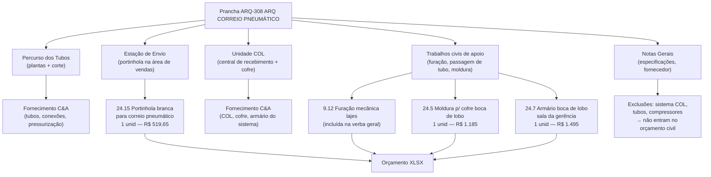

# Estudo: Prancha ARQ-308 (ARQ CORREIO PNEUMÁTICO) → Orçamento CELMAR BLN

## O que a prancha 308 contém

A prancha 308 documenta o **sistema de correio pneumático** — os tubos pressurizados que conectam os caixas do salão de vendas à gerência no 2º pavimento, usado para envio seguro de dinheiro e documentos. É uma prancha de sistema especializado, onde a maior parte do equipamento é **fornecimento C&A** e o escopo civil é intencionalmente pequeno.

| Elemento | Descrição |
|---|---|
| 308 - Térreo (planta geral) | Planta do térreo com percurso do tubo pneumático marcado |
| Planta Baixa 2º Pav. — ADM (2 versões) | Planta da ADM com ponto de chegada do tubo e posição do COL |
| Vista Cofres COL | Elevação da unidade COL (central de recebimento/cofre pneumático) |
| Corte Correio Pneumático | Corte vertical mostrando o percurso do tubo entre os dois pavimentos |
| Detalhes COL | Elevação, corte, planta tampa e planta armário do sistema COL |
| Notas Gerais | Especificações técnicas do sistema, fabricante, requisitos de instalação civil |

---

## Natureza desta prancha: sistema de equipamento C&A com escopo civil mínimo

Diferentemente de pranchas como a 301 (Civil) ou 305 (Sanitários), a prancha 308 documenta principalmente um **equipamento instalado**, não uma construção. A divisão de responsabilidades é clara:

---

## Mapeamento: Fonte na imagem → Linha no XLSX

### 1. Plantas (Térreo + 2º Pav.)

- Mostram o **percurso completo do tubo** desde o ponto de envio (salão de vendas) até o ponto de recebimento (gerência no 2º pav.).
- O tubo passa por paredes e lajes — cada penetração gera um serviço de furação mecânica, absorvido no item genérico `9.12` (furação de lajes — R$ 5.440 vb).
- A posição da portinhola no salão de vendas define onde o item `24.15` é instalado.
- A posição do COL na gerência define onde o item `24.7` (armário boca de lobo) é instalado.

### 2. Vista Cofres COL + Detalhes COL

- Mostram o equipamento receptor — unidade COL com cofre integrado, armário do sistema e tampa de bolsão.
- O **equipamento em si (COL) é fornecimento C&A** — não aparece no orçamento civil.
- O que entra no XLSX é apenas o **encaixe civil**: moldura de acabamento (`24.5`) e o armário embutido de madeira para abrigar o sistema (`24.7`).

### 3. Corte Correio Pneumático

- Seção vertical mostrando os dois pavimentos e o tubo passando entre eles.
- O tubo está em amarelo; os outros serviços (elétrica, hidráulica) em outras cores.
- Fornece a referência de altura e posição do tubo para coordenação com a equipe de instalações.
- Não gera itens de orçamento adicionais além do que já está nas plantas.

### 4. Notas Gerais

- Especificam o fabricante/fornecedor do sistema pneumático.
- Confirmam que o sistema (tubos, compressor, estação de envio eletrônica) é **fornecimento C&A**.
- Determinam os requisitos civis mínimos: folga mínima de passagem, tipo de selagem das penetrações.

---

## Itens do XLSX gerados por esta prancha

| Item | Descrição | UN | QDE | MAT | M.O. | Total R$ | Origem na prancha |
|---|---|---|---|---|---|---|---|
| `24.15` | Portinhola branca para correio pneumático | unid | 1 | 436,00 | 83,65 | **519,65** | Estação de envio — salão de vendas |
| `24.5` | Moldura para cofre — boca de lobo | unid | 1 | 925,00 | 260,00 | **1.185** | Encaixe civil do COL na gerência |
| `24.7` | Armário boca de lobo — sala da gerência | unid | 1 | 1.315,00 | 180,00 | **1.495** | Gabinete do sistema COL |
| `9.12` | Furação mecânica de lajes (inclui penetrações do tubo) | vb | 1 | 4.150,00 | 1.290,00 | **5.440** | Passagens de laje — verba geral |

**Total de itens específicos desta prancha:** R$ 3.199,65
(furação está diluída na verba geral `9.12` junto com outras necessidades)

### Itens C&A (não entram no orçamento civil)

| Componente | Fornecimento |
|---|---|
| Tubos pneumáticos (percurso completo) | C&A |
| Unidade COL com cofre integrado | C&A |
| Compressor/sistema de pressurização | C&A |
| Estação eletrônica de envio | C&A |
| Instalação do sistema (técnico especializado) | C&A / fornecedor do sistema |

---

## Itens relacionados na área de gerência (mesma zona, prancha 308 como referência)

A posição do COL e do armário indica a **sala da gerência** como ponto focal. Esta zona também gera:

| Item | Descrição | Total R$ |
|---|---|---|
| `24.3` | Armário suspenso e bancada — sala da gerência | 3.120 |
| `24.6` | Estante sala de rack | 1.580 |
| `20.5` | Porta madeira c/ visor — sala CFTV (adjacente) | 2.395 |

---

## Particularidades desta prancha

### 1. Menor impacto orçamentário do conjunto de pranchas
A prancha 308 gera apenas R$ 3.199 de itens identificáveis diretamente — o menor valor entre todas as pranchas do projeto (excluindo a 203 - Axonométricas, que não gera nada). O grosso do sistema é C&A.

### 2. As plantas térreo e 2º pav. são de localização, não de medição
Ao contrário de pranchas como a 301 ou 305, as plantas da 308 não têm cotas para medir — seu propósito é mostrar o percurso do tubo e coordenar com as equipes de civil e instalações. Não geram m² nem ml.

### 3. Furação de lajes é verba compartilhada
As penetrações do tubo pneumático nas lajes são executadas junto com todas as outras furações de instalações (hidráulica, elétrica, AC) no item `9.12`. Não há item dedicado de furação para o correio pneumático — está diluído na verba geral.

### 4. Nomenclatura "boca de lobo"
Os itens `24.5` (moldura) e `24.7` (armário) usam o termo "boca de lobo" — denominação padrão C&A para o conjunto de encaixe civil que recebe a unidade COL. A portinhola (`24.15`) é o outro elemento civil, instalado no caixa do salão de vendas.

---

## Estratégia de extração automática

| Componente | Técnica | Ferramenta | Confiança |
|---|---|---|---|
| Posição da portinhola (planta térreo) | OCR do label próximo ao símbolo de portinhola | GPT-4o Vision | Alta |
| Posição do COL/armário (planta 2º pav.) | OCR do label + símbolo COL | GPT-4o Vision | Alta |
| Percurso do tubo (plantas) | Detecção de linha de tubo (traço colorido) | Detecção de linha (OpenCV) | Média |
| Exclusões C&A (Notas Gerais) | OCR + NLP para identificar "fornecimento C&A" | GPT-4o | Alta |
| Dimensões do armário COL (Detalhes COL) | OCR nas cotas do detalhe | Tesseract | Alta |

> **Nota para automação:** esta prancha deve ser processada principalmente pelas **Notas Gerais** (para identificar e excluir os itens C&A) e pelos **labels de posição** nas plantas (para confirmar a existência e localização dos 3 itens civis). O Corte e os Detalhes COL têm função de coordenação e especificação técnica, não de geração de quantitativos novos.

---

*Referências: Prancha CEA-254-BLN-ARQ_R02-308 - ARQ CORREIO PNEUMATICO.png · 1ª Proposta CELMAR BLN.xlsx · Loja 254 Shopping Norte Blumenau*
