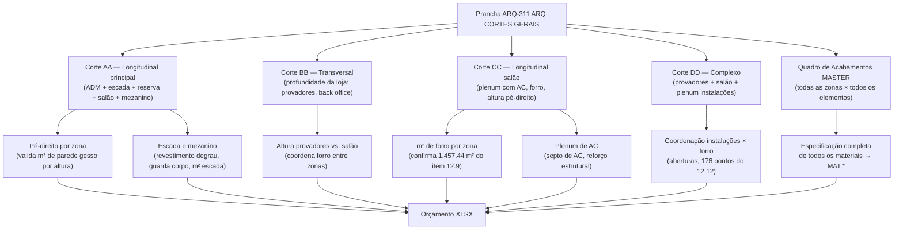

# Estudo: Prancha ARQ-311 (ARQ CORTES GERAIS) → Orçamento CELMAR BLN

## O que a prancha 311 contém

A prancha 311 é a prancha de **cortes longitudinais e transversais** da loja inteira — 4 seções (AA, BB, CC, DD) que mostram o edifício "cortado" em diferentes direções, mais o Quadro de Acabamentos mais completo do projeto. É o único documento que mostra todos os níveis verticais da loja simultaneamente (salão de vendas, mezanino, área técnica, forro e plenum).

| Elemento | Descrição |
|---|---|
| Localização Cortes (planta esquemática) | Indica onde os planos de corte AA, BB, CC, DD cortam a loja |
| Corte AA | Corte longitudinal principal — mostra ADM, escada, reserva, salão de vendas e mezanino |
| Corte BB | Corte transversal — mostra a profundidade da loja com provadores e back office |
| Corte CC | Corte longitudinal secundário — mostra o salão de vendas com o plenum de AC |
| Corte DD | Corte mais complexo — mostra provadores, back office, salão e instalações no plenum |
| Quadro de Acabamentos MASTER completo | A versão mais completa do quadro — cobre TODAS as zonas da loja |
| Notas Gerais | Especificações gerais de acabamento e requisitos de coordenação |

---

## Papel desta prancha: validação vertical de quantitativos

Diferentemente das pranchas de ambiente (304, 305, 303) que geram quantitativos de um único espaço, e da prancha 301 que gera quantitativos em planta, a 311 acrescenta a **dimensão vertical** ao projeto:



---

## O que cada corte revela e gera no XLSX

### Corte AA — Longitudinal principal

O mais informativo dos cortes: mostra a loja de ponta a ponta na direção longitudinal, revelando:

| O que o corte mostra | Item gerado / validado no XLSX |
|---|---|
| Altura do pé-direito do salão de vendas | Valida m² de parede gesso STD (`12.1`, `12.2`) — altura × comprimento das elevações P01–P06 |
| Pé-direito diferente na zona ADM/Reserva | Valida m² de parede gesso RU/RF (`12.3`–`12.6`) com sua altura específica |
| Degraus da escada ADM (ardósia) | Confirma `14.16` Revestimento escada ADM — ardósia (vb, R$ 16.210) |
| Guarda-corpo da escada e mezanino | Confirma `8.5` Guarda-corpo ferro — 19 ml (R$ 7.708) |
| Mezanino metálico | `8.1` Mezanino metálico — contratação direta C&A (sem valor civil) |
| Nível do piso nos diferentes ambientes | Valida soleiras de granito entre ambientes (`14.19` — 5,88 ml, R$ 5.696) |
| Forro do salão vs. forro ADM | Separa o m² de forro gesso (`12.9`) entre salão e ADM para pintura diferenciada |

### Corte BB — Transversal

Corte perpendicular ao AA, mostrando a profundidade da loja:

| O que o corte mostra | Item gerado / validado no XLSX |
|---|---|
| Profundidade e pé-direito dos provadores | Confirma a altura das cabines dos provadores → m² de laminado nas seções 22.1–22.5 |
| Back office / reserva acima dos provadores | Confirma existência do mezanino sobre os provadores |
| Forro em alturas diferentes entre provadores e corredor | Aberturas de forro (`12.12`) nas zonas de transição |
| Largura do corredor de provadores | Valida ml de espelho de corredor (`22.17`, `21.9`) |

### Corte CC — Longitudinal salão (mais simples)

Corte que atravessa apenas o salão de vendas na direção do comprimento:

| O que o corte mostra | Item gerado / validado no XLSX |
|---|---|
| Altura uniforme do forro no salão | Confirma pé-direito líquido → altura real de parede para `12.1`/`12.2` |
| Plenum com instalações de AC | Confirma `8.8` Estrutura metálica septo de AC — vb (R$ 9.980) |
| Distribuição de dutos de AC acima do forro | Confirma `12.13` Reforço para placas de AC e trilhos — vb (R$ 3.789) |
| Forro gesso liso tabicado em toda extensão | Confirma os 1.044 m² de pintura de forro salão de vendas (`18.10`, R$ 47.585) |

### Corte DD — Complexo (provadores + salão + instalações)

O corte mais rico em informação de coordenação:

| O que o corte mostra | Item gerado / validado no XLSX |
|---|---|
| Bloco de provadores com cabines, forro e instalações | Coordena forro de gesso do salão com o forro dos provadores |
| Aberturas de forro para grelhas, spots e difusores de AC | `12.12` Abertura forro — **176 unid** (R$ 6.160) — os 176 pontos são contados neste corte |
| Instalações acima do forro (elétrica, hidráulica, AC) | Referência para `12.13` reforços e `9.12` furação de lajes |
| Diferentes alturas de forro entre zonas | Confirma a divisão do m² de forro por zona para pintura (`18.10` salão × `18.11` ADM) |

---

## O Quadro de Acabamentos MASTER desta prancha

O quadro de acabamentos no lado direito da prancha 311 é o **mais completo e definitivo** de todo o projeto — superior até ao da prancha 301. Cobre todas as zonas:

| Zona | Elementos especificados |
|---|---|
| Fachadas / Entrada | Piso, parede, forro, vitrine |
| Área de Vendas | Piso, parede, forro, pilares, espelho |
| Reservas | Piso, parede, forro, piso cimentado |
| Provadores | Piso, parede, forro, laminado (5 cores), espelho |
| ADM / Back Office | Piso, parede, forro, revestimento |
| Copa | Piso, parede, forro, bancada |
| Sanitários | Piso, parede, forro, granito, espelho |
| Área Técnica | Piso epóxi, parede gesso RF, forro |

Este quadro é a **fonte de verdade** para os preços unitários MAT.* de **todas** as linhas de material do XLSX. Qualquer divergência entre o quadro de uma prancha de ambiente (ex: 304-COPA) e este quadro da 311 deve ser resolvida em favor deste.

---

## Itens do XLSX diretamente validados pelos cortes

### Forro — Seção 12 (maior item do projeto)

| Item | Descrição | QDE | Total R$ | Validado por |
|---|---|---|---|---|
| `12.9` | Forro gesso Gypsum liso tabicado — toda a loja | **1.457,44 m²** | **92.547** | Área de forro lida em planta + altura confirmada pelos cortes |
| `12.12` | Abertura forro para luminárias/spots/grelhas | **176 und** | 6.160 | Contagem de pontos no Corte DD + plano de iluminação (prancha 341) |
| `12.13` | Reforço para placas de AC e trilhos de vitrine | 1 vb | 3.789 | Instalações no plenum visíveis nos Cortes CC e DD |

### Escada e mezanino — Seções 8 e 14

| Item | Descrição | QDE | Total R$ | Validado por |
|---|---|---|---|---|
| `8.5` | Guarda-corpo ferro escada e mezanino | 19 ml | 7.708 | Corte AA — dimensão da escada longitudinal |
| `8.8` | Estrutura metálica septo de AC — sobre o forro | 1 vb | 9.980 | Corte CC — septo visível no plenum |
| `14.16` | Revestimento escada ADM em ardósia | 1 vb | 16.210 | Corte AA — degraus da escada ADM |
| `14.17` | Piso tátil e fita antiderrapante escada | 1 cj | 2.960 | Corte AA — escada ADM |
| `14.19` | Soleira em granito Cinza Andorinha | 5,88 ml | 5.696 | Corte AA — transições de nível |

### Pintura de forro — Seção 18

| Item | Descrição | QDE | Total R$ | Validado por |
|---|---|---|---|---|
| `18.10` | Pintura látex PVA branco neve — forro área vendas | 1.044 m² | 47.585 | Corte CC — área do forro do salão |
| `18.11` | Pintura látex branco neve — laje ADM/reservas | 408 m² | 18.596 | Corte AA — área do forro ADM (sem forro gesso) |
| `18.12` | Pintura látex Diário de Menina — forro ADM | 8,6 m² | 366 | Corte AA — zona específica de cor |

---

## Particularidades desta prancha

### 1. Única fonte que mostra a altura real de cada zona
Nenhuma planta baixa informa o pé-direito — apenas os cortes. As alturas de pé-direito são **essenciais para validar os m² de parede** de todas as outras pranchas:
- Se o corte mostra pé-direito de 4,50 m no salão, os 12.1/12.2 (672 m² + 274 m² de gesso STD) ficam corretos apenas se as plantas tiverem os comprimentos certos multiplicados por 4,50 m
- Qualquer erro de pé-direito nas outras pranchas é detectável aqui

### 2. Separação clara de forro por zona e tipo de pintura
Os cortes mostram que **nem todo o forro é igual**:
- Salão de vendas: forro gesso liso (`12.9`, 1.457,44 m²) + pintura `18.10` (1.044 m²)
- ADM/reservas: sem forro gesso separado — laje aparente pintada (`18.11`, 408 m²)
- A diferença entre 1.457,44 m² (forro gesso) e 1.044 m² (pintura forro salão) significa que ~413 m² de forro ficam na zona ADM — é a laje vista pintada no `18.11`

### 3. Quadro de Acabamentos mais completo do projeto
O quadro nesta prancha é mais detalhado que o da 301 — inclui zonas que nem sempre aparecem no quadro das pranchas de ambiente (ex: Reservas, que não têm prancha própria). É o documento de referência final para resolução de conflitos de especificação.

### 4. As 176 aberturas no forro vêm do cruzamento de dois documentos
O item `12.12` (176 aberturas) não pode ser contado apenas pela prancha 311 — ele requer o cruzamento do Corte DD (que mostra a lógica de distribuição) com o plano de iluminação da prancha 341 (que tem os 176 pontos físicos marcados). Esta é a única interdependência direta de quantitativo entre pranchas.

---

## Estratégia de extração automática

| Componente | Técnica | Ferramenta | Confiança |
|---|---|---|---|
| Pé-direito por zona (cortes) | OCR nas cotas verticais de cada corte | Tesseract / PaddleOCR | Alta |
| Dimensões de escada (Corte AA) | OCR cotas + contagem de degraus | GPT-4o Vision | Média-Alta |
| Separação de forro por zona | Segmentação visual + OCR nos labels de zona | GPT-4o Vision | Média-Alta |
| m² de forro por zona | Pé-direito (corte) × comprimento (planta) | Python | Alta |
| Quadro de Acabamentos MASTER | OCR tabular completo — todas as zonas | GPT-4o Vision | Alta |
| Aberturas no forro (Corte DD) | Cruzamento com plano iluminação prancha 341 | Dois documentos | Alta (com ambas as pranchas) |
| Instalações no plenum | Detecção visual de elementos acima do forro | GPT-4o Vision | Média |

### Papel no pipeline geral

```
Esta prancha não é processada isoladamente — ela serve como:

1. VALIDAÇÃO: confirmar que os m² de parede calculados nas plantas
   estão corretos multiplicando pelo pé-direito correto

2. COMPLETUDE: o Quadro de Acabamentos MASTER é lido aqui
   para preencher especificações que podem estar ausentes nas
   pranchas de ambiente

3. COORDENAÇÃO: o item 12.12 (176 aberturas) só pode ser
   confirmado cruzando esta prancha com a prancha 341 (iluminação)

4. ESCADA / MEZANINO: únicos documentos que informam dimensões
   verticais da escada e do mezanino — itens que não aparecem
   em planta de forma clara
```

---

*Referências: Prancha CEA-254-BLN-ARQ_R02-311 - ARQ CORTES GERAIS.png · 1ª Proposta CELMAR BLN.xlsx · Loja 254 Shopping Norte Blumenau*
