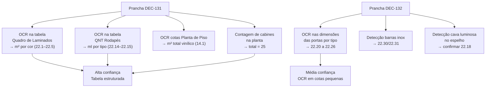

# Estudo: Pranchas DEC-131 + DEC-132 (DEC PROVADORES) → Orçamento CELMAR BLN

> **Pranchas complementares** — 131 e 132 cobrem a mesma área (provadores) com divisão de conteúdo por espaço: 131 traz as plantas, elevações gerais e tabelas-chave; 132 continua com as elevações detalhadas de cada tipo de cabine (Comum, Família, PCD) e a Parede Distribuição.

---

## O que as duas pranchas contêm

### Prancha DEC-131 — Plantas, Elevações Gerais e Tabelas

| Elemento | Descrição |
|---|---|
| Planta de Piso Provadores Térreo | Layout do piso com material vinílico, rodapés e cotas |
| Planta de Forro Provadores Térreo | Forro: luminárias, difusores AC, aberturas e dimensões |
| Planta de Piso Térreo (geral) | Planta geral do salão de vendas + provadores no contexto |
| Planta de Piso Provadores Mezanino | Piso no pavimento superior (provadores feminino superior) |
| Planta de Forro Provadores Superior | Forro no 2º pavimento |
| Planta Baixa 2º Pavimento ADM | Contexto ADM com localização dos provadores superiores |
| PV01 — Provador Masculino (elevação) | Vista interna da cabine masculina |
| PV02 — Provador Masculino (elevação) | Segunda face da cabine masculina |
| PV03 — Provador Feminino (elevação) | Vista interna da cabine feminina |
| PV04 — Provador Feminino (elevação) | Segunda face da cabine feminina |
| PV06 — Provador PCD (elevação) | Vista interna do provador acessível |
| PV07/PV08 — Provador Feminino Superior | Cabines do 2º pavimento |
| PV08 — Provador Família (elevação) | Vista cabine família |
| Limite Área Vendas / Provador (detalhe) | Detalhe da transição de piso e rodapé na soleira |
| PD-020, PD-021, PM-245 | Detalhes de fixadores e perfis de acabamento |
| Provadores — Fixação de Painel | Detalhe construtivo de como os painéis são fixados à estrutura |
| DET Mobiliário Distribuição Armário Cabideiro | Detalhe do armário/cabideiro na zona de distribuição |
| CÉA — QNT Rodapés | Quantitativo de rodapés por trecho (ml por tipo) |
| CÉA — Quadro de Laminados Provador | m² de cada cor de laminado por tipo de cabine → fonte direta para 22.1–22.5 |
| Quadro de Acabamentos — Provadores | Finish schedule específico dos provadores |
| Notas Gerais + Simbologia | Requisitos construtivos e legenda |

### Prancha DEC-132 — Elevações Detalhadas por Tipo de Cabine

| Elemento | Tipo de Cabine |
|---|---|
| 131 — Provador Comum + 05 a 08 (4 elevações) | Comum |
| 131 — Provador Família + 09 a 12 (4 elevações) | Família |
| 131 — Provador PCD + 13 a 16 (4 elevações) | PCD |
| 131 — Distribuição + 17 a 20 (4 elevações) | Parede Distribuição |
| Quadro de Acabamentos (continuação) | Todos os tipos |
| Notas + Simbologia + Fotos referência | Todos |

---

## A maior seção do orçamento: R$ 453.244

A seção 22 (PROVADORES) é a **maior seção individual do XLSX**, superando até vendas e fachada. Todos os seus itens são originados nestas duas pranchas.

```mermaid
flowchart TD
    P131["Prancha DEC-131"]
    P132["Prancha DEC-132"]

    P131 --> PLANTAS["Plantas de Piso\n(m² vinílico, ml rodapé)"]
    P131 --> ELEV_GERAL["Elevações PV01–PV08\n(laminados, espelhos, portas)"]
    P131 --> QUAD_LAM["CÉA — Quadro de Laminados\n(m² por cor por tipo de cabine)"]
    P131 --> DET_FIX["Fixação de Painel + Detalhes\n(sistema estrutural da cabine)"]
    P131 --> DET_MOB["DET Distribuição Armário\n(cabideiro, móvel de apoio)"]

    P132 --> ELEV_TIPO["Elevações 05–16\n(Comum, Família, PCD — 4 faces cada)"]
    P132 --> ELEV_DIST["Elevações 17–20\n(Parede Distribuição)"]

    PLANTAS --> V1["14.1 Vinílico 1.024,98 m²"]
    PLANTAS --> V2["14.2 Autonivelante 1.024,98 m²"]
    PLANTAS --> V3["14.5 Rodapé Primer Tarket 130,84 ml"]

    QUAD_LAM --> L1["22.1 Ártico L166 TX — 42 m²"]
    QUAD_LAM --> L2["22.2 Gelo L106 TX — 25 m²"]
    QUAD_LAM --> L3["22.3 Branco L120TX — 243 m²"]
    QUAD_LAM --> L4["22.4 Cobalto L118 TX — 9 m²"]
    QUAD_LAM --> L5["22.5 Prattan L151 TX — 30 m²"]

    DET_FIX --> S1["22.9 Coluna simples — 40 unid"]
    DET_FIX --> S2["22.10 Régua união painéis — 30 unid"]
    DET_FIX --> S3["22.11 Travessa — 30 unid"]
    DET_FIX --> S4["22.12 Frontal — 30 unid"]
    DET_FIX --> S5["22.13 Suporte L — 50 unid"]

    ELEV_GERAL --> E1["22.17 Espelho corredor — 3 unid"]
    ELEV_GERAL --> E2["22.18 Espelho c/ cava luminosa — 25 unid"]
    ELEV_GERAL --> E3["22.19 Chassis espelho — 25 unid"]

    ELEV_TIPO --> P1["22.21 Porta 70cm — 21 unid"]
    ELEV_TIPO --> P2["22.24 Porta PNE — 1 unid"]
    ELEV_TIPO --> P3["22.25 Porta família — 2 unid"]
    ELEV_TIPO --> P4["22.26 Porta de correr — 1 unid"]
    ELEV_TIPO --> P5["22.29 Cabideiro cromado — 23 unid"]
    ELEV_TIPO --> P6["22.30/31 Tubo inox PCD — 1+2 unid"]

    L1 --> ORC["Orçamento XLSX\nSeção 22 — R$ 453.244"]
    V1 --> ORC
    S1 --> ORC
    E1 --> ORC
    P1 --> ORC
```

---

## Tabela completa dos itens do XLSX

### Piso (gerado pelas Plantas de Piso — Prancha 131)

| Item | Zona | Descrição | Un | QDE | Total (R$) |
|---|---|---|---|---|---|
| `14.1` | vendas | Piso vinílico vendas/provadores — M.O. (mat. C&A) | m² | **1.024,98** | **41.152** |
| `14.2` | vendas | Autonivelante vendas/provadores — M.O. (mat. C&A) | m² | **1.024,98** | **14.554** |
| `14.5` | vendas | Rodapé Primer Tarket 10cm — SV | ml | **130,84** | **6.960** |

### Laminados — revestimento das cabines (gerado pelo Quadro de Laminados — Prancha 131)

| Item | Laminado (Fórmica) | m² | Total (R$) |
|---|---|---|---|
| `22.1` | Ártico L166 TX | **42** | **26.254** |
| `22.2` | Gelo L106 TX | **25** | **15.627** |
| `22.3` | Branco L120TX | **243** | **151.899** |
| `22.4` | Cobalto L118 TX | **9** | **6.075** |
| `22.5` | Prattan L151 TX | **30** | **22.353** |

### Sistema estrutural da cabine (gerado pelos Detalhes de Fixação — Prancha 131)

| Item | Descrição | Un | QDE | Total (R$) |
|---|---|---|---|---|
| `22.7` | Lateral de provador branca | unid | **24** | **6.308** |
| `22.8` | Painel liso laminado branco | unid | **9** | **2.365** |
| `22.9` | Coluna simples (upright) | unid | **40** | **82.800** |
| `22.10` | Régua para união de painéis | unid | **30** | **5.094** |
| `22.11` | Travessa | unid | **30** | **8.562** |
| `22.12` | Frontal (frame de porta) | unid | **30** | **25.387** |
| `22.13` | Suporte L para lateral | unid | **50** | **6.665** |

### Rodapés e rodateto (gerado pelo CÉA — QNT Rodapés — Prancha 131)

| Item | Descrição | Un | QDE | Total (R$) |
|---|---|---|---|---|
| `22.14` | Rodapé MDF branco 5cm (Tarket) | m | **99,3** | **12.844** |
| `22.15` | Rodapé fórmica Prattan 10cm | m | **43,7** | **5.543** |
| `22.16` | Rodapé/rodateto MDF branco 10cm | m | — | **0** |

### Espelhos (gerado pelas Elevações — Pranchas 131 e 132)

| Item | Descrição | Un | QDE | Total (R$) |
|---|---|---|---|---|
| `22.17` | Espelho Guardian 4mm — corredor | unid | **3** | **2.224** |
| `22.18` | Espelho c/ cava luminosa — cabine | unid | **25** | **19.809** |
| `22.19` | Chassis para espelhos — cabine | unid | **25** | **19.648** |

### Portas (gerado pelas Elevações por tipo — Prancha 132)

| Item | Descrição | Un | QDE | Total (R$) | Tipo de cabine |
|---|---|---|---|---|---|
| `22.20` | Porta 60cm × 180cm | unid | — | **0** | — |
| `22.21` | Porta 70cm × 180cm | unid | **21** | **22.125** | Comum (masc + fem) |
| `22.22` | Porta 80cm × 180cm | unid | — | **0** | — |
| `22.23` | Porta 90cm × 180cm | unid | — | **0** | — |
| `22.24` | Porta PNE | unid | **1** | **1.140** | PCD |
| `22.25` | Porta família | unid | **2** | **2.480** | Família |
| `22.26` | Porta de correr | unid | **1** | **1.980** | Especial/lounge |

### Serralheria e acessórios (gerado pelas Elevações — Pranchas 131 e 132)

| Item | Descrição | Un | QDE | Total (R$) |
|---|---|---|---|---|
| `22.28` | Cantoneira alumínio (arremates) | unid | **12** | **1.887** |
| `22.29` | Cabideiro cromado | unid | **23** | **1.669** |
| `22.30` | Tubo inox PCD 160cm | unid | **1** | **1.127** |
| `22.31` | Tubo inox PCD 80cm | unid | **2** | **1.370** |
| `22.32` | Fixadores de teto | unid | — | **0** |
| `22.33` | Perfil metálico 30×30mm c/ acrílico U | m | — | **0** |
| `22.34` | Perfil metálico 30×30mm — corredor | m | — | **0** |

---

## O número 25 como âncora de contagem

O item `22.18` (25 espelhos com cava luminosa) e `22.19` (25 chassis) confirmam **25 cabines de provador** no total. Cruzando com as portas:

| Tipo | Portas | Cabines |
|---|---|---|
| Comum | 21 × 70cm | 21 |
| Família | 2 × família | 2 |
| PCD | 1 × PNE | 1 |
| Especial/correr | 1 × correr | 1 |
| **Total** | | **25** |

Esta equação fecha com os 25 espelhos — o número é verificável contando cabines nas plantas da prancha 131.

---

## Particularidades destas pranchas

### 1. O Quadro de Laminados é a fonte mais precisa do orçamento
A tabela `CÉA — Quadro de Laminados Provador` na prancha 131 especifica m² de cada cor de laminado (Ártico, Gelo, Branco, Cobalto, Prattan) para cada tipo de cabine. Isso mapeia diretamente para os itens `22.1`–`22.5` com altíssima confiabilidade — é uma das melhores fontes de extração automática de QDE do projeto inteiro.

### 2. O Branco L120TX domina: 243 m² = 61% de todo o laminado
Com 243 m² de fórmica branca, o item `22.3` sozinho responde por R$151.899 — o maior item individual da seção 22 e um dos maiores de todo o orçamento. A predominância do branco vem do fato de que a maioria das paredes internas das cabines são brancas (somente as paredes de destaque usam as outras cores).

### 3. Sistema de cabine modular — 40 colunas para 25 cabines
O item `22.9` (40 colunas simples, R$82.800) é o backbone estrutural do sistema. A proporção coluna:cabine (40:25 ≈ 1,6) indica que cada separação entre cabines usa colunas compartilhadas — uma coluna pode servir dois compartimentos adjacentes. Os 30 frontais (`22.12`) confirmam que nem todas as cabines têm frente completa (algumas são abertas ou com meias-paredes).

### 4. Espelho com cava luminosa: iluminação embutida na cabine
O `22.18` (espelho com "cava para iluminação") é um espelho com recesso atrás para passagem de fio de LED — a iluminação embutida no frame do espelho. O `22.19` (chassis) é o suporte estrutural que fixa o espelho na parede laminada. A visibilidade deste elemento nas elevações da prancha 132 (eleva ções 05–08) permite confirmar a posição e dimensão.

### 5. Itens zerados revelam mudanças de escopo entre propostas
- `22.16` rodapé 10cm — zerado: tamanho de rodapé não confirmado para todos os trechos
- `22.32` fixadores de teto — zerado: sistema de fixação superior pode ter mudado
- `22.33/22.34` perfis metálicos acrílico/corredor — zerados: possível substituição por outro sistema de acabamento de borda
- `22.20/22.22/22.23` portas 60/80/90cm — zeradas: apenas a porta de 70cm foi usada (padrão)

### 6. Prancha 132 é essencial para as portas PCD e família
As elevações 13–16 (PCD) e 09–12 (Família) na prancha 132 mostram dimensões especiais:
- PCD: porta mais larga, barras de apoio inox (`22.30/22.31`), área de manobra visível no piso
- Família: porta mais alta ou dupla, possível porta de correr (`22.26`)

Sem a prancha 132, seria impossível distinguir quais portas correspondem a quais tipos de cabine.

---

## Estratégia de extração automática

| Componente | Técnica | Ferramenta | Confiança |
|---|---|---|---|
| m² por cor de laminado (22.1–22.5) | OCR estruturado na tabela Quadro de Laminados | PaddleOCR | **Muito alta** |
| ml de rodapé por tipo (22.14–22.15) | OCR na tabela QNT Rodapés | PaddleOCR | **Muito alta** |
| m² piso vinílico (14.1/14.2) | OCR cotas + cálculo área planta | Tesseract + cálculo | Alta |
| Nº total de cabines (= 25) | Contagem de cabines na planta | OpenCV contagem | Alta |
| Tipo e largura de porta por cabine | OCR dimensões em elevações (132) | GPT-4o Vision | Média |
| Espelho com cava / chassis (22.18/22.19) | Detecção visual do elemento nas elevações | GPT-4o Vision | Alta |
| Itens zerados (22.16, 22.32, etc.) | Cruzamento XLSX + ausência no desenho | GPT-4o Vision | Alta |

---

*Referências: Pranchas CEA-254-BLN-ARQ_R03-131 e R03-132 - DEC PROVADORES.png · 1ª Proposta CELMAR BLN.xlsx · Loja 254 Shopping Norte Blumenau*
