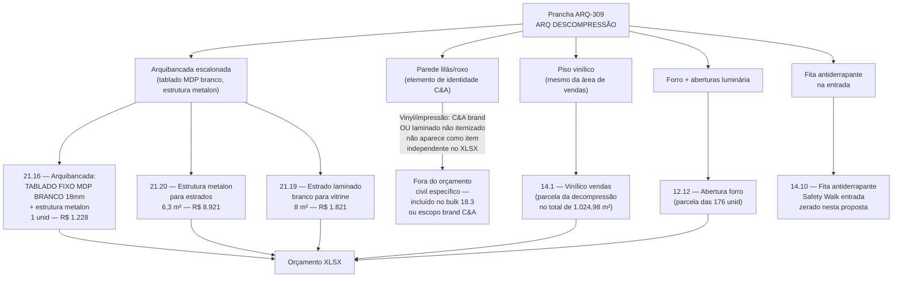
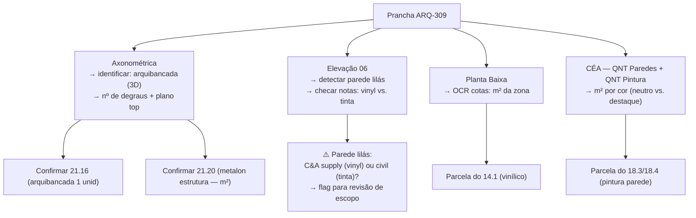

# Estudo: Prancha ARQ-309 (ARQ DESCOMPRESSÃO) → Orçamento CELMAR BLN

## O que a prancha 309 contém

A prancha 309 documenta a **Zona de Descompressão** — o ambiente de transição entre a entrada da loja e o salão de vendas. Em design de varejo, essa zona é um recurso intencional (baseado em comportamento do consumidor): o cliente precisa de alguns passos para "desacelerar" ao entrar, e a área não deve conter mercadoria principal — recebe elementos visuais de forte identidade da marca.

| Elemento | Descrição |
|---|---|
| Planta Baixa — Descompressão | Layout da zona com cotas, posição da arquibancada/tablado escalonado e indicação de acabamentos por parede (bordas coloridas: rosa, verde, laranja) |
| Planta de Piso — Descompressão | Material do piso (vinílico) e direção de assentamento |
| Planta de Forro — Descompressão | Luminários e aberturas no forro |
| 04 — Elevação Descompressão | Parede com elemento de marcenaria — painel ou tablado lateral |
| 05 — Elevação Descompressão | Parede com bancada ou display horizontal |
| 06 — Elevação Descompressão | **Parede de destaque em roxo/lilás** com dois painéis emoldurados — o elemento mais marcante da zona |
| 07 — Elevação Descompressão | Quarta face — sistema de display ou prateleiras |
| Axonométrica Descompressão | Vista 3D: arquibancada escalonada em MDP branco + parede lilás ao fundo — confirma a composição volumétrica |
| CÉA — QNT Paredes | m² de parede por tipo (base para pintura e laminado) |
| CÉA — QNT Pintura | m² de pintura por cor |
| Legenda | Código de cores por elemento |
| Simbologia | Legenda de símbolos construtivos |
| Quadro de Acabamentos | Finish schedule completo da zona |
| Notas Gerais | Requisitos de montagem e responsabilidades |

---

## A zona de descompressão no orçamento: poucos itens, alta especificidade

---

## Itens do XLSX vinculados a esta prancha

### Estrutura da arquibancada / display

| Item | Zona | Descrição | Un | QDE | Total (R$) | Status |
|---|---|---|---|---|---|---|
| `21.16` | adm* | Arquibancada: TABLADO FIXO EM MDP BRANCO 18mm + metalon | unid | **1** | **1.228** | Ativo — M.O. apenas (MAT em branco) |
| `21.19` | vendas | Estrado c/ laminado branco para vitrine | m² | **8** | **1.821** | Ativo |
| `21.20` | vendas | Estrutura metálica metalon para estrados | m² | **6,3** | **8.921** | Ativo |

> *`21.16` está tagueado como `adm` no XLSX — provável erro de zona. Pela descrição e pelo desenho, pertence à área de vendas (descompressão).

### Piso e anti-slip

| Item | Zona | Descrição | Un | QDE | Total (R$) | Status |
|---|---|---|---|---|---|---|
| `14.1` | vendas | Piso vinílico vendas (M.O.) — parcela da decompressão | m² | proporcional | proporcional | Ativo (agrupado) |
| `14.10` | vendas | Fita antiderrapante Safety Walk 50mm — entrada da loja | vb | — | **0** | Zerado nesta proposta |

### Paredes e pintura

| Item | Zona | Descrição | Conexão com a descompressão |
|---|---|---|---|
| `18.3` | vendas | Pintura acrílica branco gelo vendas — 1.153 m² | Paredes neutras da descompressão incluídas no total |
| `18.4` | vendas | Pintura acrílica branco neve vendas — 60 m² | Paredes de destaque (2ª cor neutra) |

### Forro

| Item | Zona | Descrição | Conexão |
|---|---|---|---|
| `12.12` | — | Abertura forro luminários (176 unid total) | Aberturas dos spots da zona de descompressão |

---

## Particularidades desta prancha

### 1. A Arquibancada: o elemento mais impactante visualmente que gera um único item no XLSX
A "arquibancada" visível na axonométrica — a plataforma escalonada em MDP branco com 2–3 degraus de display — está no XLSX como `21.16` com custo de apenas **R$1.228** (somente M.O., sem material). Isso indica que o MDP branco (material) provavelmente é fornecimento C&A, e a Celmar cobra apenas a mão de obra de montagem da estrutura. A estrutura interna de metalon é o item `21.20` (estrutura para estrados — R$8.921), que faz o suporte físico da plataforma.

### 2. A parede lilás/roxo: o elemento mais marcante sem item próprio
A **parede de destaque em roxo/lilás** (elevação 06) é o elemento de identidade visual mais forte da descompressão. Contudo, **não aparece como item independente** no XLSX civil por uma de duas razões:
- É uma aplicação de **vinyl/impressão digital** (fornecimento C&A Brand, instalação pela equipe de CV) — similar ao vinhete da prancha 602
- Ou o custo da tinta lilás foi agrupado no bulk de pintura (`18.3`/`18.4`) sem item separado
A distinção entre as duas hipóteses requer leitura das Notas Gerais da prancha: se disser "fornecimento C&A", é vinyl; se especificar cor de tinta, é pintura civil.

### 3. Dois "tablados" no XLSX — decompressão vs. vitrine
Há dois itens parecidos na seção 21:
- `21.16` **Arquibancada** (1 unid) — plataforma escalonada da descompressão
- `23.2` **Vitrines: Tablado Fixo em MDP Branco** (1 unid, R$2.770) — tablado da vitrine de fachada
Ambos usam a mesma técnica (MDP branco + metalon), mas servem a funções diferentes. A prancha 309 é a fonte do `21.16`; a prancha 341 (Fachadas e Vitrines) é a fonte do `23.2`.

### 4. A entrada da loja: item zerado por razão estratégica
`14.10` "Fita antiderrapante Safety Walk 50mm para entrada da loja" — zerado. Este item aparece nesta prancha porque a zona de descompressão começa na entrada. O zero indica que a solução de anti-slip ainda não estava definida (ou está embutida no material do piso vinílico C&A, que vem com tratamento antiderrapante incluído).

### 5. A descompressão não tem marcenaria própria além da arquibancada
Ao contrário de outros ambientes (copa, sala de reuniões), a descompressão tem propositalmente poucos elementos fixos — a riqueza visual vem da arquibancada e da parede lilás, não de armários ou bancadas. Isso se reflete no orçamento: apenas 3 itens de marcenaria na seção 21 para toda esta zona.

---

## Estratégia de extração automática

| Componente | Técnica | Ferramenta | Confiança |
|---|---|---|---|
| Identificação da arquibancada (3D) | GPT-4o Vision na axonométrica | GPT-4o Vision | Alta |
| m² do tablado (planta) | OCR nas cotas + cálculo L×A | Tesseract | Alta |
| Parede lilás: vinyl vs. tinta | GPT-4o Vision nas Notas Gerais | GPT-4o Vision | Média |
| m² de parede por cor (CÉA QNT Pintura) | OCR estruturado na tabela | PaddleOCR | Alta |
| m² de piso (planta de piso) | OCR cotas | Tesseract | Alta |
| Flag: item 21.16 MAT em branco | Cruzamento XLSX + notas C&A supply | NLP simples | Alta |

---

*Referências: Prancha CEA-254-BLN-ARQ_R03-309 - ARQ DESCOMPRESSÃO.png · 1ª Proposta CELMAR BLN.xlsx · Loja 254 Shopping Norte Blumenau*
