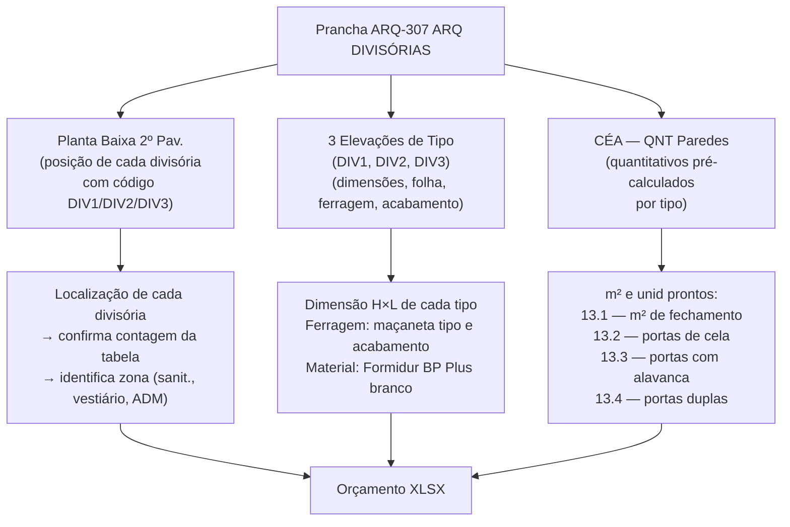

# Estudo: Prancha ARQ-307 (ARQ DIVISÓRIAS) → Orçamento CELMAR BLN

## O que a prancha 307 contém

A prancha 307 é o documento dedicado ao **sistema de divisórias sanitárias Eucatex/Divilux** da área administrativa. É uma das pranchas mais enxutas do projeto: uma planta baixa do 2º pavimento mostrando a posição de todas as divisórias, três elevações dos tipos existentes, e a tabela de quantitativos pré-calculados.

| Elemento | Descrição |
|---|---|
| Planta Baixa 2º Pav. — Divisórias | Planta da área ADM com posição e tipo de cada divisória marcados |
| 01 — Elevação DIV1 | Elevação do tipo DIV1 — divisória com duas folhas (porta dupla) |
| 02 — Elevação DIV2 | Elevação do tipo DIV2 — divisória com uma folha (porta simples) |
| 02 — Elevação DIV3 | Elevação do tipo DIV3 — painel sem porta (apenas fechamento) |
| CÉA — QNT Paredes | Tabela de quantitativos pré-calculados por tipo de divisória |

---

## Mapeamento: Fonte na imagem → Linha no XLSX



---

## Fontes de informação e o que cada uma gera

### 1. Planta Baixa 2º Pavimento — Divisórias

A planta mostra a configuração completa do 2º pavimento (mezzanino ADM), com as divisórias destacadas em linhas coloridas (azul para um tipo, roxo para outro) sobre o layout existente de paredes e ambientes.

- Identifica **onde** está cada divisória: sanitários masculino/feminino, vestiários, compartimentos ADM.
- Cada divisória tem um código (DIV1, DIV2, DIV3) que remete às elevações de detalhe.
- Os provadores (área cinza à direita) aparecem na planta como contexto, mas não são objeto desta prancha — têm prancha própria.

### 2. Elevações DIV1, DIV2, DIV3

Cada elevação mostra o tipo de divisória em vista frontal cotada:

| Tipo | Descrição | Ferragem | Gera no XLSX |
|---|---|---|---|
| **DIV1** | Divisória com porta dupla 1,20m (2 folhas de 0,60m) | 2 maçanetas + 2 dobradiças | `13.4` Porta dupla 1,20m — zerada neste projeto |
| **DIV2** | Divisória com porta simples para cela sanitária 0,60×1,65 | Maçaneta cela + dobradiça | `13.2` Porta cela sanit. — 10 unid (R$ 12.127) |
| **DIV3** | Divisória com porta simples alavanca 0,60–0,80m | Maçaneta alavanca + dobradiça | `13.3` Porta divisória alavanca — 3 unid (R$ 4.844) |

O **painel sem porta** (fechamento simples) não tem elevação própria — é representado como painel na planta e quantificado em m² no item `13.1`.

### 3. CÉA — QNT Paredes (tabela pré-calculada)

A tabela no canto superior direito lista os totais por tipo de divisória e painel, com m² e unidades já calculados pelo projetista. É a fonte direta dos quantitativos da seção 13 do XLSX.

Principais linhas da tabela → itens do XLSX:
- Fechamento de compartimentos (painéis) → `13.1` — **30 m²**
- Portas de cela sanitária 0,60×1,65 → `13.2` — **10 unid**
- Portas com maçaneta alavanca → `13.3` — **3 unid**
- Portas duplas 1,20m → `13.4` — **zerada** (não aplicada neste projeto)

---

## Itens do XLSX gerados por esta prancha

### Seção 13 — Divisórias

| Item | Descrição | UN | QDE | MAT (unit) | M.O. (unit) | Total R$ |
|---|---|---|---|---|---|---|
| `13.1` | Fechamento compartimentos — Divilux 35, Formidur BP Plus branco, montantes NTR branco, Eucatex | m² | **30** | 118,20 | 87,00 | **6.156** |
| `13.2` | Porta cela sanitária 0,60×1,65 — Eucatex c/ maçaneta — abrir 1F | unid | **10** | 1.068,40 | 144,30 | **12.127** |
| `13.3` | Porta divisória Eucatex c/ maçaneta tipo alavanca — abrir 1F | unid | **3** | 1.382,30 | 232,45 | **4.844** |
| `13.4` | Porta divisória dupla 1,20m | unid | **—** | — | — | 0 (zerada) |

**Total seção 13 (divisórias Eucatex):** R$ 23.127
**Total seção 13 incluindo box chuveiro (13.5):** R$ 25.435

> O item `13.5` (porta e ferragens vidro/alumínio para box chuveiro — 2 unid, R$ 2.308) é referenciado na prancha 305 (Sanitários) e não nesta. O sistema de box chuveiro é diferente do sistema Eucatex/Divilux.

---

## Especificação do sistema Divilux (origem: elevações + QNT)

O sistema de divisória especificado nesta prancha é o **Divilux 35** da Eucatex, composto por:

| Componente | Especificação |
|---|---|
| Painel | Formidur BP Plus cor branco |
| Montantes | NTR branco (perfil de alumínio) |
| Portas de cela | Folha 0,60×1,65m, abrir, 1 face — maçaneta para cela |
| Portas de ambiente | Folha 0,60–0,80m, abrir, 1 face — maçaneta alavanca |
| Fabricante | Eucatex |

Esta especificação, lida nas elevações e confirmada na tabela QNT, determina o **preço unitário MAT.*  = R$ 118,20/m²** para o painel e preços unitários individuais para cada tipo de porta.

---

## Particularidades desta prancha

### 1. Prancha mais focada e menos densa do projeto
A 307 é uma das mais simples: uma planta, três elevações, uma tabela. Não há detalhes construtivos elaborados, notas extensas ou múltiplos sub-sistemas. O sistema Divilux é pré-fabricado e padronizado, então o detalhe fica nas elevações de tipo e na especificação de ferragem.

### 2. Os 30 m² de painel são a base de cálculo para o preço global
O item `13.1` (30 m², R$ 6.156) representa os painéis de fechamento — trechos de divisória sem porta. O m² vem diretamente da tabela QNT desta prancha, não de medição manual das plantas. O projetista já somou todos os trechos.

### 3. Porta dupla 1,20m zerada — diferença de projeto vs. orçamento padrão
O item `13.4` (porta dupla 1,20m) está zerado nesta proposta. O tipo DIV1 existe na prancha (tem sua elevação), mas nenhuma unidade foi aplicada nesta configuração de loja. Isso ilustra como o orçamento padrão da C&A contempla variações que nem sempre se concretizam em cada projeto.

### 4. Provadores na planta são apenas contexto
A área de provadores aparece em cinza na planta da 307, mas as divisórias dos provadores (cabines, portas de 0,70×1,80m, etc.) são objeto da prancha de painéis/provadores, não desta. O extrator deve ignorar os elementos da área cinza nesta prancha.

---

## Estratégia de extração automática

| Componente | Técnica | Ferramenta | Confiança |
|---|---|---|---|
| CÉA — QNT Paredes (tabela) | OCR tabular — tipo, m², unid | Tesseract / GPT-4o Vision | Alta |
| Tipo de divisória na planta (código DIV1/2/3) | OCR nos labels sobrepostos às linhas de divisória | GPT-4o Vision | Média-Alta |
| Dimensão de cada tipo (elevações) | OCR nas cotas das elevações | Tesseract | Alta |
| Ferragem por tipo (elevações) | OCR na legenda de ferragem das elevações | GPT-4o Vision | Alta |
| Separação área sanitários vs. ADM | Reconhecimento de zona por cor/hachura na planta | Segmentação semântica | Média |

### Pipeline recomendado

```
1. OCR na CÉA — QNT Paredes (prioridade)
   → tipo + m²/unid prontos → alimenta itens 13.1 a 13.4 diretamente

2. OCR nas elevações DIV1/DIV2/DIV3
   → confirmar dimensão e tipo de ferragem por código
   → mapear código → linha XLSX (DIV2 → 13.2, DIV3 → 13.3, etc.)

3. Verificação cruzada na planta
   → contar ocorrências de cada código
   → confirmar que bate com a tabela QNT

4. Ignorar área de provadores (cinza) nesta prancha
   → divisórias de provadores estão na prancha de painéis/provadores
```

---

*Referências: Prancha CEA-254-BLN-ARQ_R02-307 - ARQ DIVISORIAS.png · 1ª Proposta CELMAR BLN.xlsx · Loja 254 Shopping Norte Blumenau*
