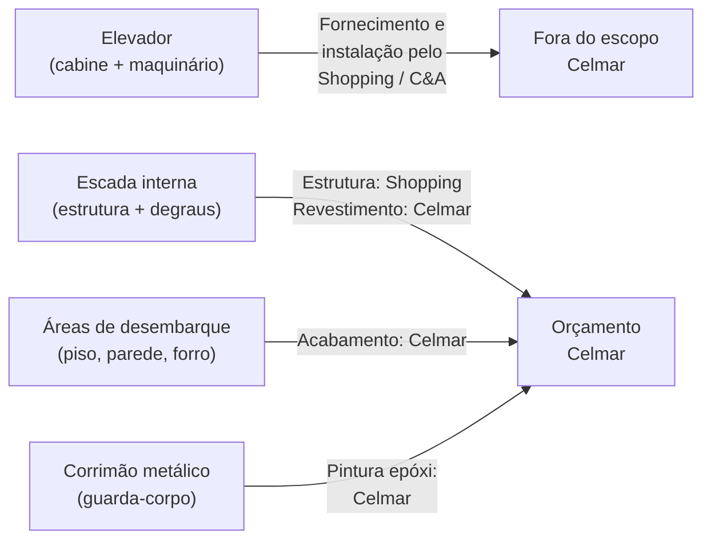
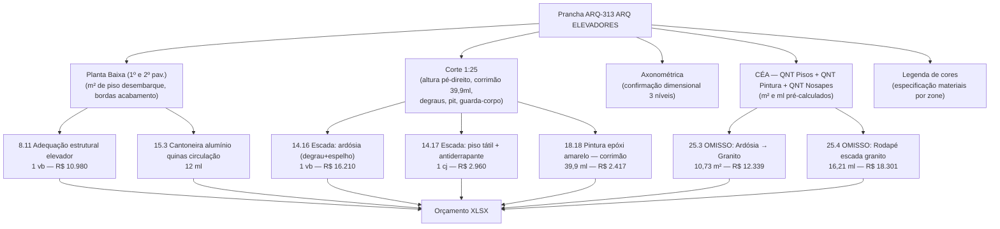
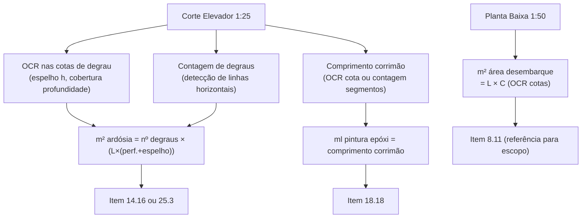

# Estudo: Prancha ARQ-313 (ARQ ELEVADORES) → Orçamento CELMAR BLN

## O que a prancha 313 contém

A prancha 313 documenta o núcleo vertical da loja — o **elevador** e a **escada de acesso entre os pavimentos**. É uma prancha de dupla escala (plantas gerais + corte detalhado em 1:25) e inclui uma axonométrica estrutural do poço. Ao contrário das pranchas de ambiente (sala de reuniões, sanitários), aqui a distinção **escopo C&A vs. escopo shopping vs. escopo Celmar** é crítica para entender por que o principal elemento representado (a cabine do elevador) não aparece no orçamento.

| Elemento | Descrição |
|---|---|
| 314 — Planta Baixa Elevador (1º pav.) | Planta do entorno do poço no nível do salão de vendas — cotas, bordas coloridas por acabamento, área de desembarque |
| Planta Baixa 2º Pavimento — ADM | Planta do entorno do poço no nível ADM — desembarque superior |
| Axonométrica Elevador | Vista 3D do poço em estrutura metálica — mostra 3 níveis, parede do poço e cabine |
| Corte Elevador (1:25) | Corte vertical com todos os pavimentos: pit, nível 1, nível 2, cobertura; mostra guia, estrutura, guarda-corpo (corrimão amarelo) e revestimentos |
| Legenda de cores | Código de cores por acabamento (mesma lógica das outras pranchas) |
| CÉA — QNT Pintura | m² de pintura por cor (áreas de desembarque e circulação vertical) |
| CÉA — QNT Pisos | m² de piso por área (plataformas, degraus, tátil) |
| CÉA — QNT Nosapes | Especificação de rodapés/soleiras da circulação |

---

## O paradoxo desta prancha: muita imagem, pouco orçamento Celmar

O elevador em si — cabine, maquinário, guias, portas automáticas — **não está no orçamento da Celmar**. A Celmar é responsável por:
1. Adaptar a estrutura do poço (serviço civil de adequação)
2. Acabar as áreas de desembarque em cada pavimento
3. Revestir a escada lateral (degraus em ardósia ou granito)
4. Pintar o corrimão metálico

---

## Mapeamento: Fonte na imagem → Linha no XLSX

---

## Itens do XLSX vinculados a esta prancha

| Item | Zona | Descrição | Un | QDE | Total (R$) | Origem no desenho |
|---|---|---|---|---|---|---|
| `8.11` | vendas | Adequação estrutural para elevador | vb | 1 | **10.980** | Planta baixa — delimitação do poço |
| `8.11` | vendas | Adequação estrutural para escada rolante | vb | — | **0** | Zerado (sem escada rolante) |
| `14.16` | adm | Revestimento escada — degrau+espelho em Ardósia | vb | 1 | **16.210** | Corte: nº de degraus × dimensões |
| `14.17` | adm | ESCADA: piso tátil e fita antiderrapante | cj | 1 | **2.960** | Planta de piso: local tátil |
| `14.18` | adm | ESCADA: Revestimento degrau em Ardósia | m² | — | **0** | Zerado (absorvido pelo 14.16 vb) |
| `15.3` | adm | Cantoneira alumínio quinas circulação h=1,70m | m | 12 | **607** | Elevações: quinas expostas |
| `18.18` | adm | Pintura epóxi amarelo — corrimão metálico | ml | 39,9 | **2.417** | Corte: comprimento total corrimão |
| `8.12` | adm | Porta de ferro — Circulação | unid | — | **0** | Zerado (porta ainda não cotada) |
| `8.5` | estoque | Guarda-corpo ferro+pintura escada/mezanino | m | 19 | **7.708** | Corte: guarda-corpo lateral |

### Itens OMISSOS (mudança de acabamento detectada pós-proposta)

| Item | Descrição | Un | QDE | Total (R$) | Nota |
|---|---|---|---|---|---|
| `25.3` | Escada — Granito Branco Cearense (degrau+espelho) | m² | 10,73 | **12.339** | Substitui ardósia do 14.16 |
| `25.4` | Rodapé escada — Granito Branco Cearense | ml | 16,21 | **18.301** | Complementar ao 25.3 |

---

## Particularidades desta prancha

### 1. A cabine do elevador é escopo do Shopping ou C&A — não da Celmar
O maior elemento da prancha não gera nenhum item no orçamento da Celmar. O elevador (modelo comercial de dois pavimentos, visível na axonométrica) é fornecido e instalado pela administração do shopping ou contratado diretamente pela C&A. A Celmar entra apenas com a **adequação estrutural do poço** (`8.11` — R$10.980), que cobre serviços de alvenaria, nivelamento do pit e eventuais aberturas/fechamentos necessários para encaixar o elevador existente ou novo.

### 2. Ardósia vs. Granito — conflito de acabamento registrado nos OMISSOS
A escada lateral recebe dois tratamentos conflitantes na proposta:
- **14.16**: ardósia, cobrado como `1 vb` (global) — R$ 16.210 → **ativo na proposta**
- **14.18**: ardósia por m² — **zerado** (absorvido pelo vb acima)
- **25.3 + 25.4**: granito branco Cearense (m² + rodapé) — **OMISSOS** → R$ 30.640

Isso indica que houve uma mudança de especificação **depois da proposta inicial**: a ardósia foi substituída por granito, gerando os dois itens omissos. Para quantificação correta, o `Corte Elevador` (1:25) fornece:
- Número de degraus e espelhos
- Largura da escada
- Comprimento total do corrimão (=39,9 ml do item 18.18)

### 3. O corrimão amarelo é o item mais fácil de quantificar nesta prancha
O corrimão metálico (cor amarela, visível no corte) é o único elemento com comprimento diretamente legível do desenho. O valor de **39,9 ml** do item `18.18` vem da soma do comprimento do corrimão em todos os lances da escada — confirmável contando os segmentos cotados no corte.

### 4. Escada rolante: zerada (equipamento não incluído)
O item `8.11` "Adequação estrutural para escada rolante" está zerado. Aparentemente a loja não tem escada rolante entre os pisos (apenas o elevador), ou a escada rolante é do shopping e não requer adequação pela Celmar.

### 5. Piso tátil na base da escada
O item `14.17` (piso tátil + fita antiderrapante, R$ 2.960) é visível na planta de piso como uma faixa de largura da escada na chegada de cada pavimento. É requisito de acessibilidade (NBR 9050) e surge da planta de piso, não do corte.

---

## Fluxo de extração automática

| Componente | Técnica | Ferramenta | Confiança |
|---|---|---|---|
| Nº de degraus | Detecção de linhas horizontais no corte | OpenCV Hough Transform | Alta |
| Comprimento corrimão (ml) | OCR na cota do corte + soma de segmentos | Tesseract + cálculo | Alta |
| m² ardósia/granito | nº degraus × (profundidade + espelho) × largura | Cálculo geométrico | Alta |
| m² área desembarque (piso tátil) | OCR cotas planta | PaddleOCR | Média |
| Identificação "elevador fora de escopo" | GPT-4o Vision na legenda + nota "Shopping/C&A" | GPT-4o Vision | Alta |

---

*Referências: Prancha CEA-254-BLN-ARQ_R02-313 - ARQ ELEVADORES.png · 1ª Proposta CELMAR BLN.xlsx · Loja 254 Shopping Norte Blumenau*
