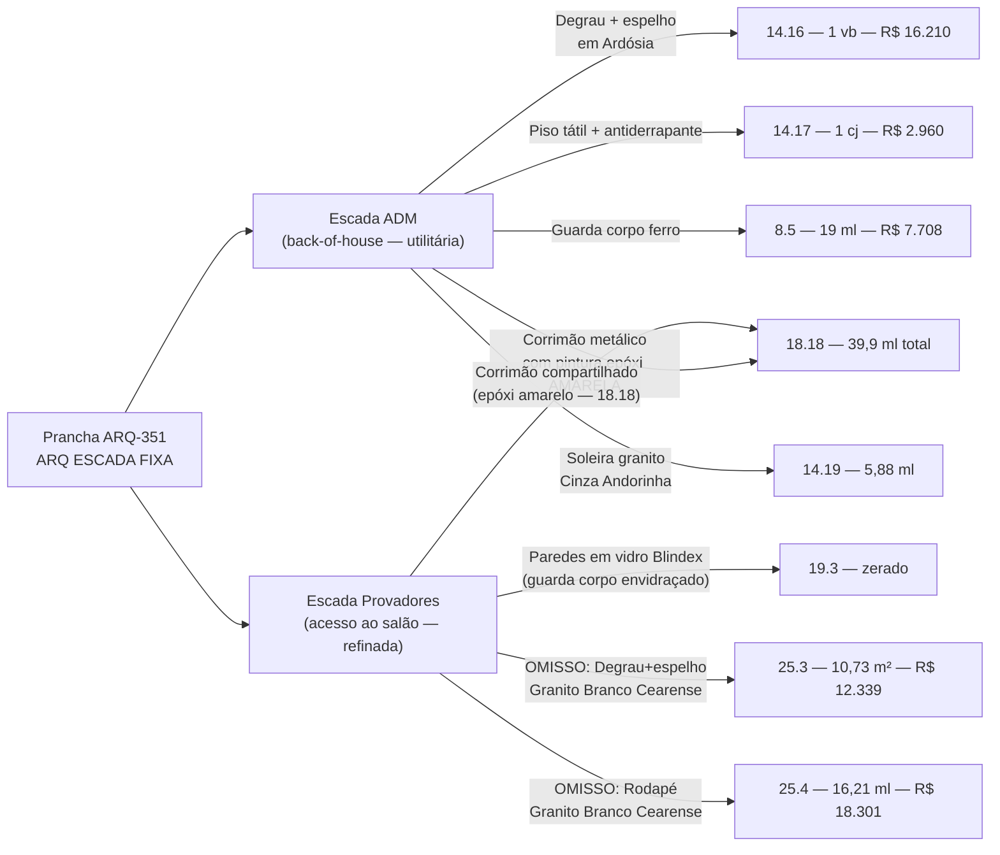
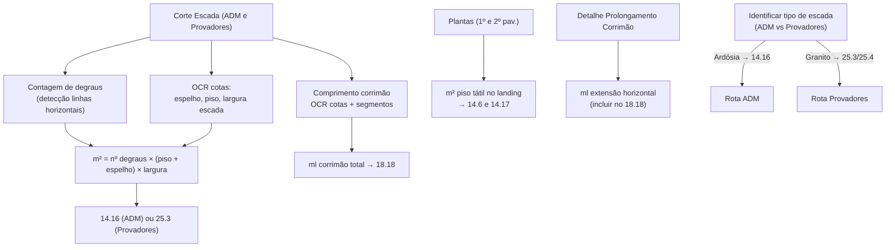

# Estudo: Prancha ARQ-351 (ARQ ESCADA FIXA) → Orçamento CELMAR BLN

## O que a prancha 351 contém

A prancha 351 é a mais rica do conjunto em quantidade de vistas e detalhes de um mesmo elemento. Ela documenta **duas escadas fixas distintas** dentro da loja — cada uma com corte, planta (dois pavimentos), axonométrica e detalhes construtivos próprios. A diferença entre elas não é só funcional: são escadas com **padrão de acabamento completamente diferente**, o que gera dois grupos distintos de itens no XLSX.

| Elemento | Escada |
|---|---|
| 351 — Térreo Escada ADM (planta) | ADM |
| Planta Baixa 2º Pavimento — ADM (escada ADM) | ADM |
| Corte Escada ADM | ADM |
| Axonométrica Escada ADM | ADM |
| Prolongamento Corrimão (detalhe) | ADM |
| Faixa de Sinalização — Retaguarda (detalhe) | ADM |
| 321 — Escada Provadores (planta) | Provadores |
| Planta Baixa 2º Pavimento — ADM (escada provadores) | Provadores |
| Corte Escada Provadores | Provadores |
| Axonométrica Escada Provadores | Provadores |
| Corrimão Provadores (detalhe) | Provadores |
| Degraus Provadores (detalhe de tread) | Provadores |
| Escada para Acessados / Degraus (detalhes) | Ambas |
| Corrimão de Ferro (detalhe seção transversal) | Ambas |
| CÉA — Quadro Piso Podotátil | Ambas |
| Notas Gerais (coluna direita) | Ambas |

---

## As duas escadas — perfis opostos

---

## Mapeamento detalhado: Fonte → Linha XLSX

```mermaid
flowchart TD
    PRANCHA["Prancha ARQ-351 ARQ ESCADA FIXA"]

    PRANCHA --> CORTE_ADM["Corte Escada ADM\n(nº degraus, altura, profundidade,\ncomprimento corrimão)"]
    PRANCHA --> PLAN_ADM["Plantas ADM\n(largura, perímetro, piso tátil landing)"]
    PRANCHA --> AXON_ADM["Axonométrica ADM\n(visual do sistema de corrimão amarelo)"]

    PRANCHA --> CORTE_PR["Corte Escada Provadores\n(nº degraus, vidro lateral,\nporta topo)"]
    PRANCHA --> PLAN_PR["Plantas Provadores\n(m² de piso, blindex lateral)"]
    PRANCHA --> AXON_PR["Axonométrica Provadores\n(caixa de vidro — blindex)"]

    PRANCHA --> DET["Detalhes construtivos\n(Prolongamento corrimão,\nDegraus, Corrimão de Ferro)"]
    PRANCHA --> QPOD["CÉA — Quadro Piso Podotátil\n(m² e ml tátil por escada)"]

    CORTE_ADM --> I1["14.16 — Ardósia degrau+espelho\n1 vb — R$ 16.210"]
    CORTE_ADM --> I2["18.18 — Epóxi amarelo corrimão\n39,9 ml total (ADM + provadores)"]
    PLAN_ADM --> I3["14.17 — Piso tátil + antiderrapante\n1 cj — R$ 2.960"]
    PLAN_ADM --> I4["14.19 — Soleira granito Cinza Andorinha\n5,88 ml"]
    AXON_ADM --> I5["8.5 — Guarda corpo ferro\n19 ml — R$ 7.708"]

    CORTE_PR --> I6["25.3 OMISSO — Granito Branco Cearense\n10,73 m² — R$ 12.339"]
    CORTE_PR --> I7["25.4 OMISSO — Rodapé granito\n16,21 ml — R$ 18.301"]
    PLAN_PR --> I8["19.3 — Vidro Blindex guarda corpo\nm² — zerado"]

    QPOD --> I3
    QPOD --> I9["14.6 — Piso tátil (escada fixa)\n16 vb — R$ 5.920"]

    I1 --> ORC["Orçamento XLSX"]
    I2 --> ORC
    I3 --> ORC
    I4 --> ORC
    I5 --> ORC
    I6 --> ORC
    I7 --> ORC
    I8 --> ORC
    I9 --> ORC
```

---

## Tabela completa de itens XLSX desta prancha

### Escada ADM — acabamento utilitário (ardósia + ferro amarelo)

| Item | Zona | Descrição | Un | QDE | Total (R$) | Status |
|---|---|---|---|---|---|---|
| `8.5` | estoque | Guarda corpo de ferro com pintura — escada ADM | m | **19** | **7.708** | Ativo |
| `14.16` | adm | Revestimento escada — degrau+espelho em Ardósia | vb | **1** | **16.210** | Ativo |
| `14.17` | adm | ESCADA: Piso tátil + fita antiderrapante | cj | **1** | **2.960** | Ativo |
| `14.18` | adm | ESCADA: Revestimento degrau em Ardósia (m²) | m² | — | **0** | Zerado — absorvido pelo 14.16 vb |
| `14.19` | adm | Soleira granito Cinza Andorinha | ml | **5,88** | **5.696** | Ativo |
| `14.6` | vendas | Piso tátil escada fixa | vb | **16** | **5.920** | Ativo (inclui escada provadores) |
| `18.18` | adm | Pintura epóxi amarelo — corrimão metálico | ml | **39,9** | **2.417** | Ativo (total das 2 escadas) |

### Escada Provadores — acabamento refinado (granito + blindex)

| Item | Zona | Descrição | Un | QDE | Total (R$) | Status |
|---|---|---|---|---|---|---|
| `19.3` | vendas | Vidro Blindex 10mm guarda corpo | m² | — | **0** | Zerado — C&A fornece? |
| `25.3` | OMISSO | Granito Branco Cearense — degrau+espelho | m² | **10,73** | **12.339** | OMISSO — mudança de spec |
| `25.4` | OMISSO | Rodapé escada provadores — granito | ml | **16,21** | **18.301** | OMISSO — mudança de spec |
| `8.10` | vendas | Guarda corpo inox — salão de vendas | ml | — | **0** | Zerado |

---

## Particularidades desta prancha

### 1. Duas escadas, dois padrões de acabamento — uma só prancha
A separação visual entre a Escada ADM (topo da prancha) e a Escada Provadores (base) reflete uma separação funcional clara:

- **ADM**: back-of-house, acabamento funcional — ardósia nos degraus, ferro com epóxi amarelo no corrimão, piso tátil simples
- **Provadores**: acesso ao salão de clientes — caixa envidraçada (blindex), granito branco Cearense nos degraus, acabamento cuidadoso

Este contraste é visível na comparação das axonométricas: a ADM tem corrimão tubular amarelo exposto; a Provadores tem paredes de vidro e aparência de vitrine.

### 2. O corrimão amarelo conecta as duas escadas: 39,9 ml
O item `18.18` (pintura epóxi amarelo) tem 39,9 ml, que cobre o corrimão de **ambas as escadas**. O `Corte Escada ADM` e o `Corte Escada Provadores` fornecem o comprimento por lance, e o `Prolongamento Corrimão` detalha a extensão horizontal obrigatória (NBR 9050) nas chegadas. A soma de todos os lances + extensões = 39,9 ml.

### 3. Mudança de especificação registrada nos OMISSOS: ardósia → granito
O `25.3` diz explicitamente "Revestimento da Escada (Degrau e espelho) em **Granito Branco Cearense**" e o `25.4` diz "**Rodapé escada dos provadores** em granito branco cearense". Isso indica que:
- A proposta inicial especificou ardósia para a Escada Provadores (similar à ADM)
- Depois houve revisão: a escada dos provadores ganhou granito (mais nobre e compatível com o acabamento do salão)
- O item `14.16` (ardósia vb — R$16.210) ficou para a Escada ADM
- Os itens `25.3` e `25.4` (OMISSOS) cobrem a Escada Provadores no acabamento revisado

### 4. Blindex zerado — vidro do guarda corpo pendente
O `19.3` (vidro blindex 10mm guarda corpo — m²) está zerado. A caixa envidraçada da Escada Provadores, visível na axonométrica, exige vidro temperado. O zero pode indicar:
- Vidro será fornecido pela C&A e instalado pela Celmar (similar a outros itens "material C&A")
- Ou o item ainda estava pendente de medição/aprovação do shopping (já que vidro em áreas de circulação requer aprovação do manual técnico)

### 5. CÉA — Quadro Piso Podotátil como fonte direta de QDE
A tabela `CÉA - Quadro Piso Podotátil` na prancha fornece a área e comprimento de piso tátil em cada landing das duas escadas, diretamente vinculada ao item `14.6` (16 unidades, R$5.920). É um dos raros casos onde a QDE do XLSX pode ser verificada diretamente contra uma tabela na prancha.

### 6. Detalhes construtivos: faixa de sinalização e extensão do corrimão
O detalhe `Prolongamento Corrimão` mostra a extensão horizontal do corrimão além do último degrau — exigência de NBR 9050 para acessibilidade. A `Faixa de Sinalização — Retaguarda` mostra a faixa tátil no piso junto à base da escada ADM (área de retaguarda/estoque).

---

## Estratégia de extração automática

| Componente | Técnica | Ferramenta | Confiança |
|---|---|---|---|
| Número de degraus (por escada) | Hough Lines no corte | OpenCV | Alta |
| m² ardósia (ADM) / granito (Provadores) | nº degraus × dimensões cotadas | Cálculo geométrico | Alta |
| Comprimento corrimão (39,9 ml total) | OCR cotas + soma de segmentos | Tesseract + cálculo | Alta |
| m² Blindex guarda corpo | Altura × largura escada provadores | OCR + cálculo | Média |
| m² tátil nas llegadas | OCR tabela QNT Podotátil | PaddleOCR | Alta |
| Distinguir ADM vs Provadores | OCR no label da planta/corte | GPT-4o Vision | Alta |

---

*Referências: Prancha CEA-254-BLN-ARQ_R02-351 - ARQ ESCADA FIXA.png · 1ª Proposta CELMAR BLN.xlsx · Loja 254 Shopping Norte Blumenau*
