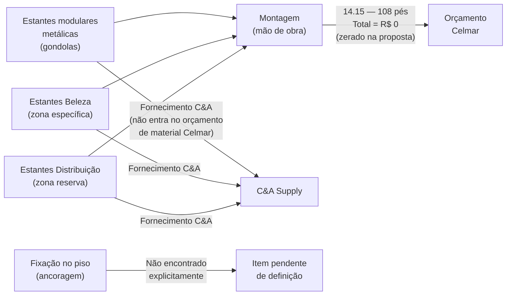
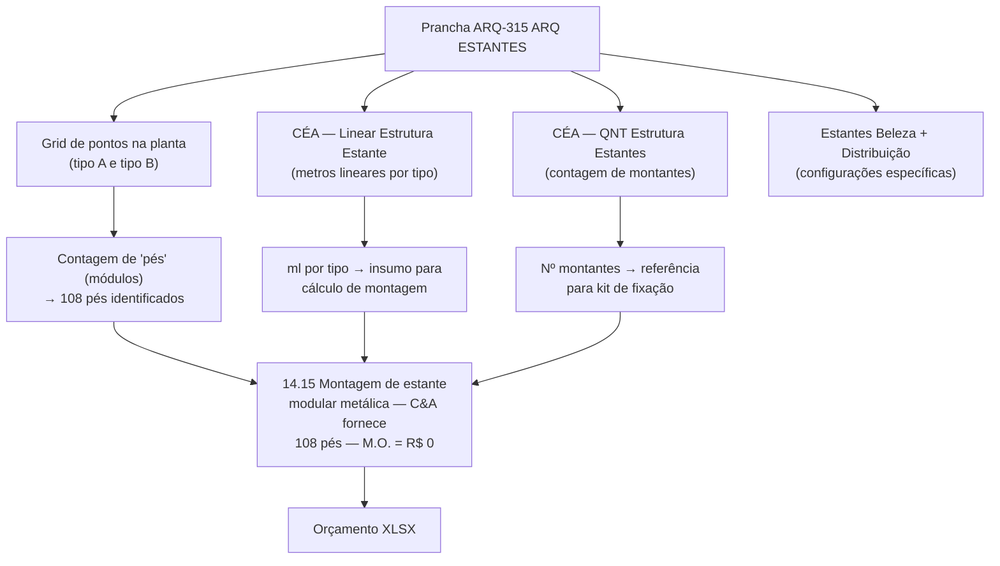
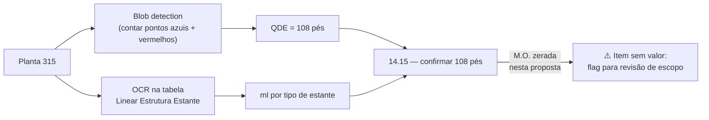

# Estudo: Prancha ARQ-315 (ARQ ESTANTES) → Orçamento CELMAR BLN

## O que a prancha 315 contém

A prancha 315 é uma **planta de layout de equipamentos** — não uma planta de construção civil. Ela documenta a posição e tipologia das estantes modulares metálicas (gondolas/shelving systems) em toda a área de vendas e reserva. O conteúdo é quase inteiramente escopo de equipamento C&A; a presença da Celmar nesta prancha é mínima.

| Elemento | Descrição |
|---|---|
| Planta Baixa 2º Pavimento — ADM (grande) | Layout completo do pavimento com grid de estantes — pontos azuis e vermelhos nas interseções indicam os dois tipos de colunas/montantes |
| 315 — Estantes Beleza | Detalhe em planta da zona "Beleza" com configuração específica de estantes |
| 315 — Estantes Distribuição | Detalhe em planta da zona "Distribuição" com configuração de estantes em L ou U |
| CÉA — Linear Estrutura Estante | Tabela de metros lineares totais por tipo de estante (linha e quantidade) |
| CÉA — QNT Estrutura Estantes | Tabela de quantidade de montantes por tipo (pontos azuis = tipo A, vermelhos = tipo B) |

### O que os pontos coloridos representam

| Símbolo | Tipo | Significado |
|---|---|---|
| Ponto azul | Tipo A (coluna simples) | Montante de extremidade ou gondola standalone |
| Ponto vermelho | Tipo B (coluna dupla/intermediária) | Montante entre dois módulos adjacentes — compartilhado |
| Linha azul | Trecho linear | Módulos em sequência (metro linear) |
| Linha rosa | Parede com tratamento | Acabamento de parede atrás das estantes |

---

## O paradoxo desta prancha: extensa planta, um único item Celmar

---

## Mapeamento: Fonte na imagem → Linha no XLSX

---

## Único item do XLSX vinculado a esta prancha

| Item | Zona | Descrição | Un | QDE | Total (R$) | Status |
|---|---|---|---|---|---|---|
| `14.15` | adm | Montagem de estante modular metálica — fornecido pela C&A | pé | **108** | **R$ 0** | Zerado — M.O. pendente |

### Por que está zerado?

O item `14.15` registra a **quantidade** (108 pés de estante), mas tem MAT e M.O. em branco, resultando em total R$0. Isso indica que:

1. A Celmar reconheceu a existência do serviço de montagem mas **não cotou o valor** nesta proposta
2. Ou o serviço de montagem foi **excluído do escopo** Celmar (C&A monta com equipe própria ou empresa especializada)
3. Ou estava aguardando **definição do modelo exato** da estante para cotar a M.O.

A QDE de **108 pés** vem diretamente da tabela `CÉA — QNT Estrutura Estantes` na prancha (contagem de pontos no grid), confirmável contando os módulos no layout.

---

## Particularidades desta prancha

### 1. Prancha de equipamento, não de obra civil
Esta é a única prancha do conjunto que representa exclusivamente **equipamentos de varejo** (gondolas/estantes), não elementos construtivos. A Celmar não projeta nem fabrica as estantes — recebe o layout para entender a interferência com o piso, paredes e instalações.

### 2. As estantes não geram itens de parede ou piso nesta prancha
As linhas rosas (paredes atrás das estantes) remetem à prancha ARQ DIVISÓRIAS (307) e ao `QNT Paredes` para quantificação. A prancha 315 apenas confirma o posicionamento das estantes em relação às paredes existentes.

### 3. Fixação no piso: item não encontrado explicitamente
Para estantes metálicas de varejo, é comum haver ancoragem no contrapiso (chumbadores, parafusos, calços). Este item **não aparece explicitamente no XLSX** — pode estar:
- Embutido no item `14.15` (se a M.O. fosse cotada)
- Incluído no item `9.2`/`9.1` de base de piso
- Excluído do escopo Celmar (C&A instala com equipe própria)

### 4. "Beleza" e "Distribuição" têm configurações diferentes
As duas zonas em detalhe no canto direito da prancha mostram:
- **Estantes Beleza**: prateleiras em ângulo ou com divisórias verticais específicas para produtos cosméticos (maior densidade de montantes)
- **Estantes Distribuição**: configuração em L/U para área de reserva, provavelmente gondolas mais profundas para estoque

Ambas são fornecimento C&A e não geram itens separados no XLSX — entram na mesma contagem de 108 pés.

### 5. Comparação com prancha 310 (Parede Cremalheiras)
Esta prancha segue o mesmo padrão da ARQ-310 (Cremalheiras): extensa representação gráfica de um sistema de fornecimento C&A, com impacto mínimo no orçamento Celmar. A diferença é que na 310 havia pelo menos m² de parede de suporte para orçar; aqui, as estantes são autoportantes e ficam no meio do salão.

---

## Estratégia de extração automática

| Componente | Técnica | Ferramenta | Confiança |
|---|---|---|---|
| Contagem de "pés" (módulos) | Detecção de pontos no grid (azuis + vermelhos) | OpenCV blob detection | Alta |
| Metros lineares por tipo | OCR na tabela `CÉA — Linear Estrutura Estante` | Tesseract | Alta |
| Identificação de zonas (Beleza, Distribuição) | Segmentação regional + OCR nos labels | PaddleOCR | Alta |
| Identificação "fornecimento C&A" | GPT-4o Vision na nota do item 14.15 | GPT-4o Vision | Alta |
| Fixação no piso (se existir) | GPT-4o Vision nas notas gerais ou detalhes | GPT-4o Vision | Média |

---

*Referências: Prancha CEA-254-BLN-ARQ_R02-315 - ARQ ESTANTES.png · 1ª Proposta CELMAR BLN.xlsx · Loja 254 Shopping Norte Blumenau*
