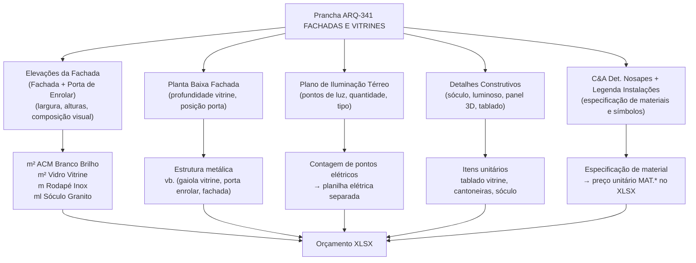
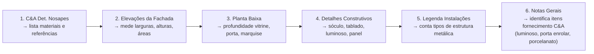

# Estudo: Prancha ARQ-341 (FACHADAS E VITRINES) → Orçamento CELMAR BLN

## O que a prancha 341 contém

A prancha é o documento completo de fachada da loja. Diferentemente da COPA (um ambiente interno simples), a fachada envolve **sistema de revestimento externo, vitrines, sinalização luminosa e estrutura metálica** — e tem itens que são fornecidos diretamente pela C&A (não entram no orçamento civil da Celmar).

A prancha carrega **5 tipos de fontes de informação**:



---

## Mapeamento direto: Fonte na imagem → Linha no XLSX

### 1. Elevações da Fachada (2 vistas cotadas)

A prancha tem duas elevações principais:
- **Fachada - Porta de Enrolar** — mostra o vão da porta de enrolar, logo C&A, panel lateral e dimensões totais.
- **Fachada** — vista completa com composição de ACM, vitrine com vidro, rodapé de inox e sóculo.

Estas elevações são a principal fonte de **quantitativos de área e comprimento**:

| Elemento lido na elevação | Cálculo | Item gerado no XLSX |
|---|---|---|
| Área de ACM Branco Brilho (revestimento externo) | largura × altura do painel − vãos | `23.4` Revestimento ACM Branco Brilho — 55,68 m² |
| Vidro temperado da vitrine | largura × altura do vidro | `19.4` Vidro temperado incolor 10mm — 11,61 m² |
| Rodapé em aço inox escovado 200mm | comprimento horizontal da fachada | `23.9` Rodapé inox escovado — 9,36 ml |
| Sóculo de granito frente vitrine | comprimento da frente de vitrine | `14.7` Sóculo granito frente vitrine 10cm — 7,12 ml |
| Caixilho dos vidros da vitrine | ml de perfil inox | `23.3` Perfil inox escovado 150mm — zerado neste projeto |

### 2. Planta Baixa Fachada

- Fornece: profundidade da vitrine, localização exata da porta de enrolar, limites da área de fachada no piso, posição da marquise.
- Gera no XLSX (seção 8 — Serralheria):

| Elemento lido na planta | Item gerado no XLSX |
|---|---|
| Área de revestimento de fachada (metalon) | `8.6` Estrutura metálica para revestimento de fachada — 1 vb (R$ 14.410) |
| Posição e vão da porta de enrolar | `8.9` Estrutura metálica auxiliar para porta de enrolar — 1 vb (R$ 8.980) |
| Área e posição de vitrine | `8.7` Estrutura metálica gaiola para base/sustentação vitrine — zerada |
| Projeção da marquise | `8.6` Estrutura metálica para marquise — zerada |

### 3. Plano de Iluminação Térreo (341 - Térreo Iluminação Fachada)

Esta planta cobre toda a área de vendas com indicação de cada ponto luminoso (pontos em rosa/vermelho). É uma planta de referência para a equipe elétrica.

- Os pontos de iluminação da fachada e vitrine não geram itens no orçamento civil da Celmar.
- São repassados à **planilha de instalações elétricas** separada (não incluída neste XLSX).
- A planta serve como base para dimensionar o quadro elétrico e a carga de fachada.

### 4. Detalhes Construtivos

| Detalhe na prancha | O que fornece | Item gerado no XLSX |
|---|---|---|
| Det. Sóculo Sem Tablado | Dimensões do sóculo (altura, largura, material) | `14.7` Sóculo granito frente vitrine — ml calculado da elevação |
| Detalhe Luminoso 161×250 (vista frontal, interna e corte) | Dimensões do letreiro luminoso C&A, tipo de fixação | Luminoso = **fornecimento C&A** — não aparece no orçamento civil |
| Det. Panel 3D (C&A com padrão geométrico) | Tipo de painel decorativo, tamanho | Painel = **fornecimento C&A** — instalação somente em M.O. |
| Painel Sem Logo | Variante do painel sem logo | Quantificação da área de painel na fachada |
| Mero P/ Portinhola | Dimensões da portinhola de acesso técnico | Referenciado nas notas — acesso técnico |
| Vitrine: Tablado MDP Branco | Dimensões do tablado e estrutura interna metalon | `23.2` Tablado fixo MDP Branco — 1 unid (R$ 2.770) |

### 5. C&A Det. Nosapes + Legenda Instalações Ferro

- **C&A Det. Nosapes** (tabela no centro superior da prancha): especifica por elemento os materiais, referências e cores — equivalente ao Quadro de Acabamentos da COPA.
  - Define: ACM → "Branco Brilho" → R$ 380/m²
  - Define: Inox → "Escovado" → R$ 256/ml
  - Define: Vidro → "Temperado incolor 10mm" → R$ 432,70/m²

- **Legenda Instalações Ferro**: tabela de símbolos usados nas plantas para diferentes tipos de estrutura metálica (metalon, chapa, tubos). Cada símbolo = um tipo de serviço de serralheria no orçamento.

---

## Fluxo de extração: o que ler e em que ordem



**Por que essa ordem:** a tabela de materiais (Nosapes) define o que vai ser orçado antes das medições; as elevações fornecem as principais áreas (ACM, vidro); a planta adiciona as estruturas; os detalhes fecham as peças específicas; e as Notas Gerais são fundamentais para **excluir corretamente** os itens de fornecimento C&A.

---

## Itens da FACHADA identificados no XLSX

### Seção 8 — Serralheria (estruturas metálicas de fachada)

| Item | Descrição | UN | QDE | MAT (unit) | M.O. (unit) | Total R$ |
|---|---|---|---|---|---|---|
| 8.6 | Estrutura metálica em metalon para revestimento de fachada | vb | 1 | 9.190 | 5.220 | **14.410** |
| 8.6 | Estrutura metálica em metalon para marquise | vb | — | — | — | 0 (excluída) |
| 8.7 | Estrutura metálica gaiola para base/sustentação de vitrine | vb | — | — | — | 0 (excluída) |
| 8.9 | Estrutura metálica auxiliar para porta de enrolar | vb | 1 | 5.000 | 3.980 | **8.980** |

### Seção 14 — Piso (sóculo)

| Item | Descrição | UN | QDE | MAT (unit) | M.O. (unit) | Total R$ |
|---|---|---|---|---|---|---|
| 14.7 | Sóculos granito frente vitrine (largura 10cm) | ml | 7,12 | 237,20 | 87,00 | **2.308** |

### Seção 19 — Vidros

| Item | Descrição | UN | QDE | MAT (unit) | M.O. (unit) | Total R$ |
|---|---|---|---|---|---|---|
| 19.4 | Vidro temperado incolor 10mm para vitrine | m² | 11,61 | 432,70 | 168,90 | **6.984** |

### Seção 23 — Fachadas

| Item | Descrição | UN | QDE | MAT (unit) | M.O. (unit) | Total R$ |
|---|---|---|---|---|---|---|
| 23.1 | Arremates de cantos / Cantoneira alumínio | unid | 2 | 89,00 | 68,30 | **314** |
| 23.2 | Vitrines: Tablado fixo MDP Branco + estrutura metalon | unid | 1 | 1.440 | 1.330 | **2.770** |
| 23.3 | Perfil aço inox escovado caixilho dos vidros 150mm | m | — | — | — | 0 (excluído) |
| 23.4 | Revestimento em ACM Branco Brilho | m² | 55,68 | 380,00 | 259,00 | **35.579** |
| 23.5 | Revestimento em fórmica | m² | — | — | — | 0 (excluído) |
| 23.6 | Revestimento para marquise | m² | — | — | — | 0 (excluído) |
| 23.7 | Porcelanato 1,20×0,60 — fornecido pela C&A | m² | — | — | — | 0 (fornecimento C&A) |
| 23.8 | Argamassa, rejunte e M.O. para porcelanato | m² | — | — | — | 0 (sem material) |
| 23.9 | Rodapé em aço inox escovado 200mm | ml | 9,36 | 256,00 | 119,00 | **3.510** |
| 23.10 | Porta de enrolar — fornecimento C&A | unid | 1 | — | — | 0 (fornecimento C&A) |

**Total seção 23:** R$ 42.174
**Total geral CC 810260 (fachada):** R$ 74.857 (incluindo seções 8, 14, 19, 23)

> **Itens de fornecimento C&A** (não entram no orçamento civil da Celmar):
> - Luminoso com letras/logo C&A → instalação somente
> - Painel decorativo 3D (padrão geométrico) → instalação somente
> - Porcelanato 1,20×0,60 → M.O. somente, quando aplicável
> - Porta de enrolar → fornecimento e instalação C&A

---

## Particularidades desta prancha vs. COPA

A fachada tem complexidades adicionais ausentes na COPA:

1. **Itens de fornecimento C&A**: luminoso, painel, porta de enrolar e porcelanato aparecem na prancha como elementos do projeto, mas não geram custo de material no XLSX — apenas M.O. de instalação quando há. O extrator precisa identificar e separar esses itens via leitura das Notas Gerais.

2. **Duas escalas na mesma prancha**: o plano de iluminação (escala 1:50) cobre toda a loja, enquanto os detalhes (luminoso, panel 3D) estão em escalas maiores (1:10 a 1:20). O extrator deve identificar e converter a escala correta para cada sub-desenho.

3. **Itens zerados ≠ ausentes**: marquise, fórmica e perfil inox aparecem com QDE nula porque não se aplicam a este shopping específico (regras do manual técnico do Shopping Norte Blumenau), mas constam como referência para outros projetos C&A.

---

## Estratégia de extração automática

| Componente | Técnica | Ferramenta | Confiança |
|---|---|---|---|
| C&A Det. Nosapes (tabela de materiais) | OCR em região delimitada do centro superior | GPT-4o Vision / Google Vision API | Alta |
| Cotas nas elevações (largura, altura) | OCR nas linhas de cota das elevações | PaddleOCR / Tesseract com bounding boxes | Média-Alta |
| Área de ACM e vidro | Cálculo pós-OCR: largura × altura − vãos | Python (geometria simples) | Alta |
| Identificação de itens fornecimento C&A | Leitura das Notas Gerais + tags nas elevações | OCR + classificação por responsável | Alta |
| Símbolos da Legenda Instalações Ferro | Detecção de ícones de metalon/chapa/tubo | Template matching (OpenCV) | Média |
| Profundidade vitrine (planta baixa) | OCR nas cotas da planta | Tesseract | Média-Alta |

### Pipeline completo recomendado

```
1. Segmentação da prancha
   Identificar regiões: elevação principal, planta baixa, plano iluminação,
   tabela Nosapes, detalhes (luminoso, sóculo, panel), legenda, notas

2. OCR por região
   - Tabela Nosapes → GPT-4o Vision (tabela estruturada com cores)
   - Cotas das elevações → Tesseract ou PaddleOCR
   - Notas Gerais → OCR + NLP para extrair exclusões e fornecimentos C&A

3. Cálculo geométrico
   - Área ACM = (largura total fachada × altura ACM) − vãos (portal, vitrine)
   - Área vidro = largura vitrine × altura vidro (lida na elevação)
   - ml rodapé = comprimento horizontal da fachada
   - ml sóculo = comprimento da frente de vitrine

4. Classificação de responsabilidade
   - Separar: itens Celmar (orçar MAT + M.O.) vs. itens C&A (orçar M.O. ou zero)
   - Base: Notas Gerais + tags do XLSX (ex: "fornecimento C&A")

5. Montagem do orçamento
   Mapear (material + unidade + zona fachada) → linha do XLSX
   via tabela de referência com CC 810260
```

---

*Referências: Prancha CEA-254-BLN-ARQ_R02-341 - ARQ FACHADAS E VITRINES.png · 1ª Proposta CELMAR BLN.xlsx · Loja 254 Shopping Norte Blumenau*
