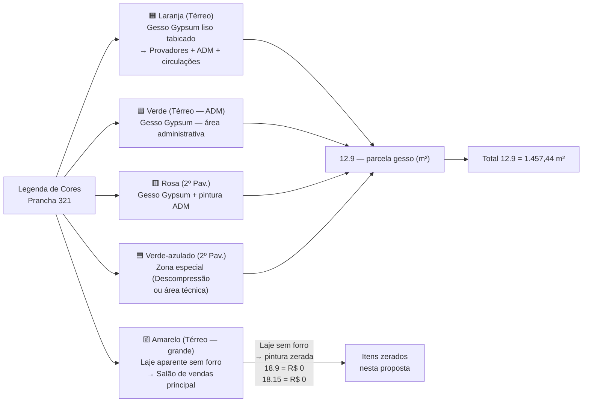
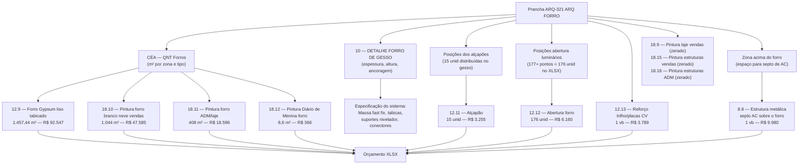
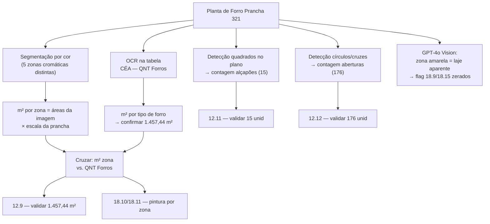

# Estudo: Prancha ARQ-321 (ARQ FORRO) → Orçamento CELMAR BLN

## O que a prancha 321 contém

A prancha 321 é o **documento mestre do sistema de forro** de toda a loja. É a prancha com maior impacto financeiro direto no orçamento civil — o item `12.9` (Forro Gypsum, 1.457,44 m²) sozinho vale R$92.547, e os itens de pintura do forro somam mais R$66.548. Ela governa também os alçapões, as aberturas para luminárias e o reforço estrutural interno.

| Elemento | Descrição |
|---|---|
| Térreo — Planta de Forro (planta superior) | Mapa de zonas de forro em cores: laranja, amarelo, verde — cada cor = tipo de forro diferente |
| Planta de Forro 2º Pavimento — ADM (planta inferior) | Mapa de zonas para o mezanino: rosa e verde-azulado |
| Notas Gerais + Notas — Forros (coluna direita) | Especificações de instalação, tolerâncias, sequência construtiva |
| CÉA — QNT Forros (tabela) | m² por tipo de forro por zona — **fonte direta para o item 12.9** |
| Legenda de cores | 5 tipos de forro identificados por cor |
| 10 — DETALHE — FORRO DE GESSO (base) | 3 cortes construtivos do forro: linear típico, linear ascendente e transversal; tabela de espessuras e alturas |

---

## O mapa de cores: 5 zonas, 5 tratamentos de forro

**O insight mais importante desta prancha:** a zona **amarela** (a maior área do salão de vendas no térreo) **não tem forro de gesso** — é a laje/estrutura aparente. A pintura desta laje exposta (`18.9` e `18.15`) está **zerada** nesta proposta, o que representa uma exclusão de escopo significativa.

---

## Mapeamento: Fonte na imagem → Linha no XLSX

---

## Tabela completa dos itens do XLSX

### Seção 12 — Forro em Gesso (gerado diretamente pela prancha 321)

| Item | Zona | Descrição | Un | QDE | Total (R$) | Status |
|---|---|---|---|---|---|---|
| `12.8` | — | Demolição forro/sancas de gesso existente | m² | — | **0** | Zerado — loja nova, sem demolição |
| `12.9` | — | Forro Gypsum liso tabicado estruturado e rejuntado (c/ pintura branco neve) | m² | **1.457,44** | **92.547** | Ativo — MAT R$25,5/m² + M.O. R$38/m² |
| `12.10` | — | Fechamento gesso para cortina porta de enrolar | m² | — | **0** | Zerado — porta de enrolar sem cortina de gesso |
| `12.11` | — | Alçapão (acesso à plenum) | unid | **15** | **3.255** | Ativo — R$153 MAT + R$64 M.O. cada |
| `12.12` | — | Abertura forro luminários/spots/difusores/grelhas | und | **176** | **6.160** | Ativo — M.O. R$35/unid |
| `12.13` | — | Reforço: placas aéreas cv + trilho vitrine | vb | **1** | **3.789** | Ativo |

### Seção 18 — Pintura de Forro (gerado pelas zonas da prancha 321)

| Item | Zona | Descrição | Un | QDE | Total (R$) | Status |
|---|---|---|---|---|---|---|
| `18.9` | vendas | Pintura latex PVA fosco branco neve — laje aparente vendas | m² | — | **0** | **Zerado — zona amarela sem pintura** |
| `18.10` | vendas | Pintura forro gesso branco neve — área de vendas | m² | **1.044** | **47.585** | Ativo |
| `18.11` | adm | Pintura forro gesso branco neve — laje ADM/reservas | m² | **408** | **18.596** | Ativo |
| `18.12` | adm | Pintura forro cor Diário de Menina | m² | **8,6** | **366** | Ativo — forro accent (sala reuniões ou copa) |
| `18.14` | adm | Pintura latex branco neve — laje ADM | m² | — | **0** | Zerado |
| `18.15` | vendas | Pintura estruturas/infras branco neve forro vendas | m² | — | **0** | **Zerado — estrutura do salão sem pintura** |
| `18.16` | adm | Pintura estruturas/infras cinza claro — laje ADM | m² | — | **0** | Zerado |

### Seção 8 — Estrutura acima do forro (gerado pelo plenum da prancha 321)

| Item | Zona | Descrição | Un | QDE | Total (R$) | Status |
|---|---|---|---|---|---|---|
| `8.8` | estoque | Estrutura metálica septo AC sobre o forro | vb | **1** | **9.980** | Ativo |

---

## Relação entre as zonas de cor e os itens do XLSX

| Cor na prancha | Localização | Tipo de forro | Item XLSX | m² |
|---|---|---|---|---|
| 🟧 Laranja (térreo) | Provadores + circulação + ADM térreo | Gesso Gypsum tabicado | `12.9` + `18.10` | parte do total |
| 🟨 Amarelo (térreo) | Salão de vendas principal | **Laje aparente — sem forro** | `18.9` zerado | — |
| 🟩 Verde (térreo) | ADM back-office térreo | Gesso Gypsum tabicado | `12.9` | parte |
| 🟥 Rosa (2º pav) | ADM + reservas 2º pavimento | Gesso Gypsum tabicado | `12.9` + `18.11` | parte |
| 🟦 Verde-azulado (2º pav) | Decompressão / zona especial | Gesso Gypsum (tipo especial?) | `12.9` parcela ou zerado | parte |

### Verificação dos totais de pintura vs. gesso

| Item | m² | Relação |
|---|---|---|
| `12.9` — Gesso instalado | 1.457,44 | Total de gesso de todas as zonas |
| `18.10` — Pintura vendas | 1.044 | Gesso nas zonas de vendas (laranja + parte verde) |
| `18.11` — Pintura ADM | 408 | Gesso nas zonas ADM + reservas (rosa + verde ADM) |
| Soma pinturas: 1.044 + 408 | = 1.452 | ≈ 1.457 (diferença = 5 m² = forro não pintado ou arredondamento) |

A correspondência quase exata confirma que **todo o forro de gesso instalado é pintado** — a divergência de 5 m² pode ser a zona de Diário de Menina (`18.12` — 8,6 m²) contabilizada separadamente.

---

## Particularidades desta prancha

### 1. A prancha que move mais dinheiro em um único item
O `12.9` com 1.457,44 m² × (R$25,5 + R$38) = **R$92.547** é o maior item unitário do orçamento civil. Todo esse valor é derivado diretamente da soma das zonas coloridas na prancha 321. A `CÉA — QNT Forros` é a tabela que pré-calcula essa soma por tipo.

### 2. A zona amarela: o maior risco de escopo do projeto
A zona amarela (salão de vendas principal, sem forro de gesso) tem a maior área do térreo. Os itens de pintura dessa zona (`18.9`, `18.15`) estão **zerados** — significa que:
- A laje aparente NÃO será pintada nesta proposta
- Ou o shopping exige padrão específico de acabamento e a proposta aguarda definição
- Ou a laje aparente é proposital (tendência industrial/loft do varejo moderno) e a C&A aceita a estrutura exposta sem tratamento

Se essa exclusão for revista, o impacto no orçamento pode ser significativo (dado que a zona amarela parece ser a maior área da loja — potencialmente 500–800 m²).

### 3. Os 15 alçapões: invisíveis visualmente, essenciais para manutenção
`12.11` — 15 alçapões a R$153/unid + R$64 M.O. = R$3.255 total. Cada alçapão é uma abertura quadrada de ~60×60cm no gesso com tampa removível, que permite acesso à plenum acima do forro para manutenção de AC, elétrica e hidráulica. Suas posições são marcadas na planta de forro (prancha 321) — geralmente sobre equipamentos ou em pontos estratégicos.

### 4. O DETALHE 10 é a especificação construtiva — não gera itens mas define o sistema
O detalhe de corte do forro (corte típico, ascendente e transversal) especifica:
- Sistema: Gypsum liso tabicado (não é gesso em placa convencional, é sistema tabicado com tabicas)
- Componentes: Massa fast fix / Tabicas / Suportes nivelador / Conectores
- Essa especificação define exatamente o que entra no custo unitário do `12.9` (R$63,5/m² total)

### 5. A pintura Diário de Menina no forro (8,6 m²)
O item `18.12` (8,6 m² de Diário de Menina no forro) está na zona de ADM — provavelmente a sala de reuniões ou a copa, onde a parede de destaque tem a mesma cor no forro. A prancha 321 permite identificar exatamente qual sub-zona do forro ADM recebe essa cor especial.

---

## Estratégia de extração automática

| Componente | Técnica | Ferramenta | Confiança |
|---|---|---|---|
| m² total gesso (12.9) | OCR tabela CÉA QNT Forros | PaddleOCR | **Muito alta** |
| m² por zona (pintura por cor) | Segmentação por cor da planta | OpenCV color segmentation | Alta |
| Contagem alçapões (12.11) | Detecção quadrados no forro | OpenCV rectangle detection | Alta |
| Contagem aberturas forro (12.12) | Template matching + blob detection | OpenCV | Alta |
| Identificar zona sem forro (amarelo) | Segmentação + legenda | GPT-4o Vision | Alta |
| Validar spec sistema Gypsum | OCR nos detalhes DET-10 | Tesseract | Alta |

---

*Referências: Prancha CEA-254-BLN-ARQ_R03-321 - ARQ FORRO.png · 1ª Proposta CELMAR BLN.xlsx · Loja 254 Shopping Norte Blumenau*
