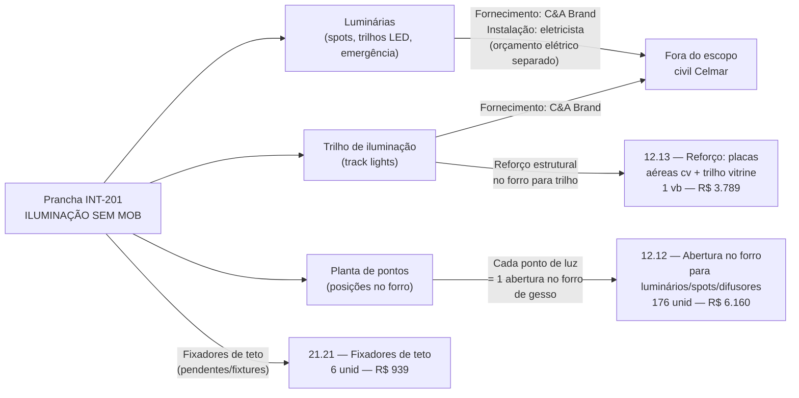
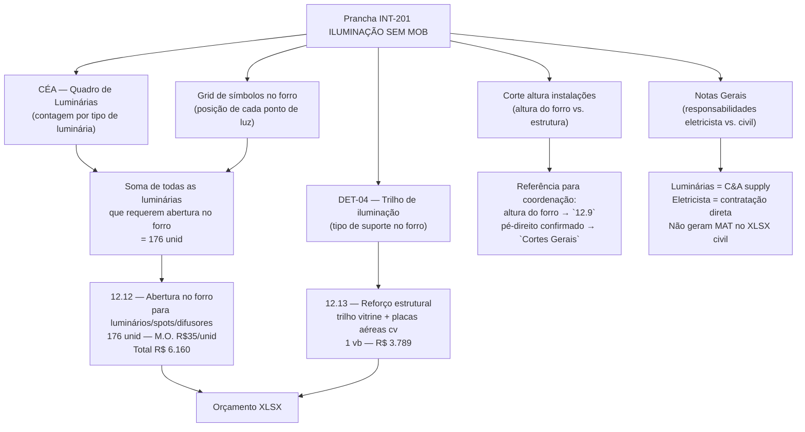
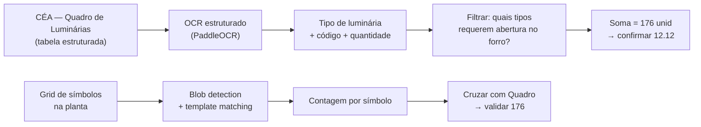

# Estudo: Prancha INT-201 (INT ILUMINAÇÃO SEM MOB) → Orçamento CELMAR BLN

## O que a prancha 201 contém

A prancha 201 é a planta de **iluminação interior sem mobiliário** — uma prancha de instalações (MEP), não de arquitetura civil. Ela documenta o posicionamento, tipo e quantidade de cada luminária em toda a loja. O prefixo "INT" (Interior) a distingue das pranchas "ARQ" (Arquitetura) e "CVS" (Comunicação Visual).

| Elemento | Descrição |
|---|---|
| 201 — Térreo Iluminação (grande planta) | Planta completa do térreo com todos os pontos de luz: spots (cruzes rosa/vermelhas), trilhos LED (retângulos ciano), emergências e outros — denso grid de símbolos sobre o forro |
| 202 — Mezanino SCM Mobília (planta inferior) | Planta do mezanino/2º pavimento com iluminação dos provadores, ADM e circulações |
| CÉA — Quadro de Luminárias (tabela central) | Finish schedule de luminárias: código, descrição, quantidade — **fonte direta para contagem de aberturas no forro** |
| Corte Orientativo Altura Instalações (canto direito) | Corte esquemático mostrando altura de instalação de cada camada: forro, trilho, spot, AC, etc. |
| LUM-01 — DET-01 (detalhe base) | Detalhe de montagem de spot no forro — profundidade de embutimento |
| LJ EX0365007 — DET-02 | Detalhe de luminária específica |
| LUM DET-03 | Detalhe de outro tipo de luminária |
| Ampliação (corte esquemático 1:1) | Ampliação circular — detalhe de rosácea ou spot de superfície |
| LJ R004003728 — DET-04 | Detalhe de trilho de iluminação (track light) |
| Ampliação (planta esquemática) | Vista superior do detalhe de trilho |
| Notas Gerais (coluna direita) | Requisitos de instalação, referências de normas, responsabilidades |
| Dados de projeto | ILUMINÂNCIA SALÃO DE VENDAS: **2.711,66 lux** / MÉDIA: **1.501,85 lux** |

---

## A lógica desta prancha no orçamento civil

**Princípio central:** a Celmar não instala luminárias, mas **faz os buracos** no forro de gesso para elas. Cada símbolo de spot ou grelha na planta de iluminação = 1 unidade do item `12.12`. O Quadro de Luminárias é a fonte de contagem que justifica as **176 unidades** orçadas.

---

## Mapeamento: Fonte na imagem → Linha no XLSX

---

## Itens do XLSX vinculados a esta prancha

| Item | Zona | Descrição | Un | QDE | Total (R$) | Origem no desenho |
|---|---|---|---|---|---|---|
| `12.12` | — | Abertura no forro de gesso para luminários, spots, wall washer, grelhas, difusores e etc | und | **176** | **6.160** | Contagem no Quadro de Luminárias (todos os tipos com embutimento no forro) |
| `12.13` | — | Prever reforço para: placas aéreas cv, **trilho vitrine** | vb | 1 | **3.789** | Detalhe trilho DET-04 — reforço estrutural no forro |
| `21.21` | vendas | Fixadores de teto | unid | **6** | **939** | Pontos de fixação de pendentes ou CV aérea |
| `2.9` | — | Eletricista disponível durante a obra para suporte | vb | 1 | **4.500** | Presença necessária pós-entrega civil para conectar luminárias |

### Itens fora do XLSX civil (escopo separado)

| Categoria | Responsável | Observação |
|---|---|---|
| Fornecimento de luminárias (todos os tipos) | C&A Brand | Especificadas no Quadro de Luminárias mas não orçadas pela Celmar |
| Instalação elétrica (fiação, disjuntores, quadros) | Instaladora elétrica (contratação direta C&A) | Orçamento elétrico separado |
| Trilhos de iluminação (track lights) | C&A Brand | Celmar faz apenas o reforço estrutural no forro |
| Sistemas de emergência | Instaladora | Exigência do shopping — fora do escopo civil |

---

## Particularidades desta prancha

### 1. A prancha mais densa do conjunto — e a que menos gera itens civis
O grid de símbolos no térreo é o mais denso de todo o projeto (centenas de pontos de luz), mas gera apenas **4 itens** no XLSX civil. Toda a engenharia elétrica acontece em orçamentos separados — esta prancha serve ao civil apenas como referência para o item `12.12`.

### 2. O `12.12` é o item mais diretamente derivado desta prancha
"Abertura no forro de gesso para luminários, spots, wall washer, grelhas, difusores e etc" — 176 unidades a R$35/unid (M.O. pura, sem material). Cada tipo de luminária que precisa de abertura no forro gera uma unidade:
- Spots embutidos (a maioria dos símbolos rosa)
- Wall washers (iluminação rasante de parede)
- Grelhas de difusor de ar (compartilhadas com o projeto de AC)
- O número 176 vem da soma no Quadro de Luminárias filtrada pelos tipos que requerem abertura física no gesso

### 3. Luminárias de superfície e pendentes **não** geram abertura
Luminárias de sobrepor ou pendentes (sem embutimento no forro) **não entram** no item `12.12`. Isso explica porque a contagem de 176 é menor que o total de símbolos na planta — alguns pontos de luz são fixados na superfície do forro ou suspensos por cabo, sem abertura.

### 4. Iluminância: dado de projeto, não de orçamento
Os valores de projeto (2.711,66 lux total / 1.501,85 lux médio no salão de vendas) são métricas de qualidade luminosa para aprovação do projeto, não entram no XLSX. São referência para o laudo de luminotecnia da C&A.

### 5. O Corte de Altura é a ponte com os Cortes Gerais (prancha 311)
O "Corte Orientativo Altura Instalações" coordena:
- Altura do forro de gesso (confirmada na prancha 311 — Cortes Gerais)
- Profundidade de embutimento dos spots (dados dos detalhes DET-01 a DET-04)
- Espaço livre acima do forro para passagem de dutos e cabos
Isso é coordenação, não orçamento — mas define se o forro de gesso será tabicado ou rebaixado localmente.

### 6. A planta do mezanino (202) cobre os provadores superiores
O segundo bloco de planta (mezanino SCM) documentada nesta prancha cobre os provadores do 2º pavimento — a iluminação específica das cabines. O item `22.18` (espelho com cava para iluminação — 25 unid) é a interseção entre esta prancha e a seção 22 do XLSX: a cava no espelho é a solução de iluminação *dentro* da cabine, que substitui spots no forro para o ambiente interno da cabine.

---

## Estratégia de extração automática

| Componente | Técnica | Ferramenta | Confiança |
|---|---|---|---|
| Contagem de luminárias por tipo | OCR na tabela Quadro de Luminárias | PaddleOCR | **Muito alta** |
| Contagem de símbolos na planta (validação) | Template matching + blob detection | OpenCV | Alta |
| Filtrar: embutido vs. sobrepor/pendente | GPT-4o Vision nos detalhes DET-01 a DET-04 | GPT-4o Vision | Alta |
| Total para item 12.12 | Soma dos tipos embutidos no forro | Cálculo | Alta |
| Identificar "C&A supply" nas notas | OCR + NLP nos textos das Notas Gerais | GPT-4o Vision | Alta |

---

*Referências: Prancha CEA-254-BLN-ARQ_R03-201 - INT ILUMINAÇÃO SEM MOB.png · 1ª Proposta CELMAR BLN.xlsx · Loja 254 Shopping Norte Blumenau*
