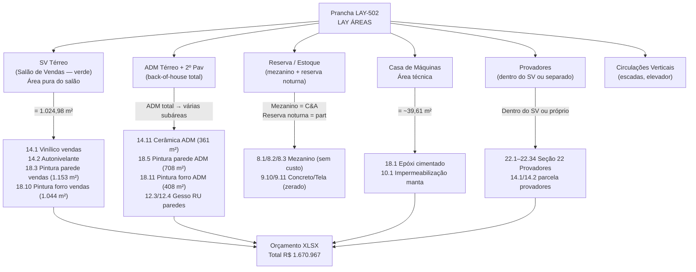
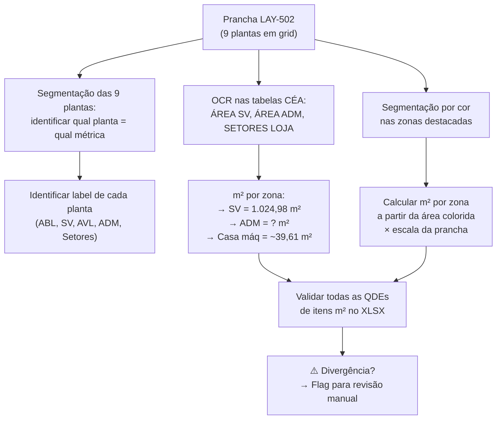

# Estudo: Prancha LAY-502 (LAY ÁREAS) → Orçamento CELMAR BLN

## O que a prancha 502 contém

A prancha 502 é o **documento mestre de áreas** do projeto — ela apresenta o mesmo espaço físico 9 vezes, cada vez com uma métrica diferente destacada. É a referência definitiva para todos os valores de m² usados no XLSX. Enquanto a prancha 501 (Layout) mostra o arranjo comercial, a 502 quantifica e valida cada zona com área exata.

| Planta | Zona Destacada | Métrica | Tabela CÉA associada |
|---|---|---|---|
| ABL Térreo | Todo o térreo | Área Bruta Locável | CÉA — ÁREA ABL |
| ADL 2º Pavimento (Mezanino) | Mezanino | ABL do 2º pavimento | CÉA — ÁREA ADL |
| SV Térreo (verde) | Salão de Vendas | Área de vendas pura | CÉA — ÁREA SALÃO DE VENDAS |
| SV Mezanino 2 | Mezanino SV | Área de vendas do mezanino | — |
| AVL Térreo (rosa) | Zona AVL | Área de vendas alternativa | CÉA — ÁREA AVL |
| ADM Térreo | Back-of-house térreo | Área administrativa | CÉA — ÁREA ADM |
| ADM 2º Pavimento | Back-of-house 2º pav | Área administrativa superior | — |
| Setores Térreo | Reserva noturna, Prov., etc. | Breakdown setorial | — |
| Setores 2º Pavimento | Circ. Vertical, Reserva, Casa Máq. | Setores completos | CÉA — SETORES LOJA |

---

## A prancha como calibrador do orçamento inteiro

---

## As 9 plantas como fontes de validação

### 1. ABL Térreo — área de locação
A **Área Bruta Locável** é o conceito de área que determina o valor do aluguel pago ao shopping. Inclui toda a área do piso do térreo dentro do perímetro da loja. Esta métrica **não gera itens de orçamento** diretamente, mas é o denominador comum que valida a escala do projeto.

### 2. SV Térreo — o número mais importante do orçamento civil
A **área do Salão de Vendas** (verde na planta) é a fonte direta do número **1.024,98 m²** — o valor que aparece em dois dos itens mais caros da seção 14:

| Item | QDE | Total |
|---|---|---|
| `14.1` Vinílico M.O. | 1.024,98 m² | R$ 41.152 |
| `14.2` Autonivelante M.O. | 1.024,98 m² | R$ 14.554 |

A CÉA — ÁREA SALÃO DE VENDAS confirma esse valor com a tabela ÁREA PISO / ADJ / TOTAL.

### 3. ADM Térreo + ADM 2º Pavimento — o ADM dividido em dois
A área ADM é apresentada em dois cortes (térreo e 2º pavimento). A soma das duas plantas define:
- `18.5` Pintura parede ADM branco gelo: **708 m²** (calculado como perímetro × altura das paredes ADM)
- `14.11` Cerâmica Cargo plus white ADM: **361 m²** (área de piso)
- `18.11` Pintura forro ADM: **408 m²**
- `12.3`/`12.4` Gesso RU paredes: 40,84 + 98 m²

### 4. Setores 2º Pavimento — o breakdown mais granular
A planta de Setores do 2º pavimento é a mais analítica: identifica individualmente CIRC. VERTICAL ADM, CIRC. VERTICAL SV, RESERVA, CASA DE MÁQ., PROV. e áreas de serviço. A tabela **CÉA — SETORES LOJA** consolida todas essas subáreas em uma única referência.

---

## Correspondência entre as métricas de área e os totais do XLSX

| Seção XLSX | Descrição | Total R$ | Área de origem (prancha 502) |
|---|---|---|---|
| Forro área de vendas | Gesso + pintura forro + aberturas | **368.106** | SV total (forro) |
| Piso área de vendas | Vinílico + autonivelante + rodapé | **80.102** | SV = 1.024,98 m² |
| Painéis/espelhos provadores | Seção 22 completa | **453.244** | Área provadores |
| ADM mobilização e limpeza | Seção 2 (obra civil geral) | **217.190** | Toda a loja |
| Piso ADM/reserva | Cerâmica + rodapés + outros | **80.165** | ADM total |
| Alvenaria | Paredes e revestimentos | **70.471** | Perímetros ADM |
| **TOTAL GERAL** | | **R$ 1.670.967** | Soma de todas as zonas |

---

## Particularidades desta prancha

### 1. Nove plantas para um único objetivo: validar a consistência das áreas
A repetição do mesmo desenho 9 vezes com zonas diferentes destacadas é uma estratégia de checagem cruzada: cada métrica (ABL, SV, AVL, ADM) é verificada de forma independente, e a soma de todas as partes deve fechar com o ABL total. Esta consistência é o que garante que os m² no XLSX estão corretos.

### 2. SV vs. ABL: a diferença que explica itens zerados
- **ABL** = área bruta total (inclui paredes, prumadas, áreas técnicas)
- **SV** = área líquida de venda (exclui paredes, circulações, serviço)
- A diferença entre ABL e SV representa as "áreas de suporte" — muitas delas com pisos ou acabamentos diferentes (ou zerados por escopo)

### 3. A "Reserva Noturna" no Setor Térreo
O setor "Reserva Noturna" visível na planta de Setores Térreo é uma área dentro do salão de vendas que serve como estoque temporário durante o fechamento da loja. Esta zona recebe o mesmo vinílico do salão (`14.1`) mas pode ter tratamento de segurança diferente — relaciona-se com o gradil metálico `8.11` (zerado).

### 4. Casa de Máquinas como setor delimitado
A "CASA DE MÁQ." aparece como zona bem definida no setor do 2º pavimento. Sua área (~39,61 m²) justifica:
- `10.1` Impermeabilização manta butílica (43,7 m² inclui esta área)
- `18.1` Epóxi sobre cimentado (39,61 m²)
- `18.2` Pintura esmalte amarelo bases (1 vb)

### 5. Complementaridade com a prancha 501
A 501 responde "onde fica cada departamento?"; a 502 responde "quanto de área tem cada zona?". A 502 é a fonte quantitativa que dá precisão ao mapa comercial da 501. Para uma extração automática de orçamento eficiente, as duas pranchas devem ser processadas em conjunto.

---

## Estratégia de extração automática

| Componente | Técnica | Ferramenta | Confiança |
|---|---|---|---|
| m² SV (= 1.024,98) | OCR tabela CÉA ÁREA SALÃO | PaddleOCR | **Muito alta** |
| m² ADM por sub-zona | OCR tabela CÉA SETORES LOJA | PaddleOCR | **Muito alta** |
| m² Casa de Máquinas / área técnica | OCR tabela Setores + segmentação por cor | PaddleOCR + OpenCV | Alta |
| Identificar qual das 9 plantas = qual métrica | OCR nos labels + GPT-4o Vision | GPT-4o Vision | Alta |
| Calcular m² por área colorida (SV verde, ADM etc.) | Segmentação por cor + escala | OpenCV | Alta |
| Cruzar com XLSX: divergências de m² | Comparar tabela prancha vs. XLSX coluna QDE | Python simples | Alta |

---

*Referências: Prancha CEA-254-BLN-ARQ_R03-502 - LAY ÁREAS.png · 1ª Proposta CELMAR BLN.xlsx · Loja 254 Shopping Norte Blumenau*
