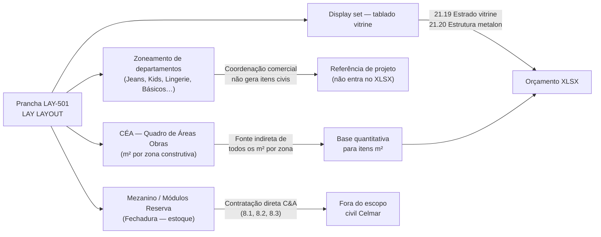
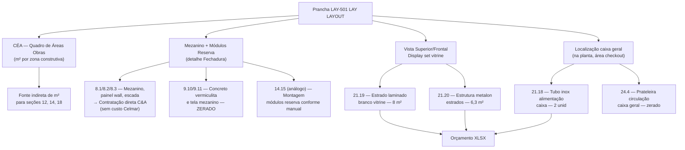
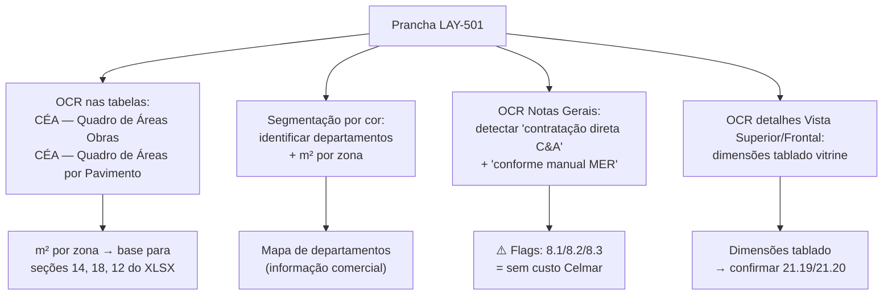

# Estudo: Prancha LAY-501 (LAY LAYOUT) → Orçamento CELMAR BLN

## O que a prancha 501 contém

A prancha 501 é o **layout comercial da loja** — o documento de zoneamento de departamentos. Ela mostra onde cada categoria de produto será exibida no salão de vendas, não o que será construído. É uma prancha de estratégia comercial que serve de referência para o construtor entender a escala e a hierarquia dos espaços, não para derivar itens de custo diretamente.

| Elemento | Descrição |
|---|---|
| Térreo — Planta Layout (planta superior) | Mapa de departamentos em zonas coloridas: Calçados, T.Zone, Malas, Básicos, Jeans Ela, Jeans Ele, Kids/Baby/Boy, Lingerie, Acessórios, Brasiliana, CAPS, Street, Closet House, DIM, SUB/COAST, CASUAL, MOBI, FASHION, BUY — cada zona com sua área em m² |
| Planta Baixa 2º Pavimento (planta inferior) | Layout do mezanino: provadores, ADM, reserva/estoque, corredores e circulações |
| Detalhe "Fechadura" (módulos reserva) | Vista frontal e dimensionamento de módulo de prateleiras para a área de reserva (estoque) — sistema modular C&A |
| Vista Superior + Vista Frontal (display) | Detalhe de display set para vitrine — alinhamento e dimensionamento do tablado de vitrine |
| CÉA — Quadro de Mini-Áreas | m² por departamento/mini-área — tabela de zoneamento comercial |
| CÉA — Quadro de Áreas Obras | m² por zona construtiva (salão, provadores, ADM, reserva) — **fonte indireta das QDEs em m² do XLSX** |
| CÉA — Quadro de Áreas por Pavimento | Breakdown de m² por pavimento (térreo e 2º pav.) |
| Notas Gerais | "ATENÇÃO MONTAGEM MÓDULOS RESERVA: favor executar conforme manual MER. Attach e Nº de prateleiras" |

---

## O perfil desta prancha: a mais estratégica, a menos operacional

---

## O Quadro de Áreas: a fonte de todos os m² do XLSX

O "CÉA — Quadro de Áreas Obras" é o único elemento desta prancha com impacto direto nas QDEs do orçamento. Ele fornece as áreas por zona construtiva que alimentam os totais de m² em todo o XLSX:

| Zona construtiva | m² (aprox. da tabela) | Itens XLSX que usam este número |
|---|---|---|
| Salão de Vendas + Provadores | **1.024,98 m²** | `14.1` vinílico, `14.2` autonivelante, `18.3` pintura parede, `18.10` pintura forro |
| ADM (back-of-house geral) | **~361 m²** | `14.11` cerâmica, parte de `18.5`, `18.11` |
| ADM (salas/circulações) | **~708 m²** | `18.5` pintura parede ADM, `12.3`/`12.4` gesso RU |
| Forro ADM + reserva | **408 m²** | `18.11` pintura forro ADM/laje |
| Área técnica | **~39,61 m²** | `18.1` epóxi cimentado |
| Sanitários molhados | **28,87 m²** | `10.2` impermeabilização |

---

## Mapeamento: Fonte na imagem → Linha no XLSX

---

## Itens do XLSX com conexão a esta prancha

### Mezanino — todo contratação direta C&A

| Item | Zona | Descrição | Status |
|---|---|---|---|
| `8.1` | estoque | Mezanino metálico — contratação direta C&A | Sem custo Celmar |
| `8.2` | estoque | Painel wall para mezanino — contratação direta C&A | Sem custo Celmar |
| `8.3` | estoque | Escada metálica — contratação direta C&A | Sem custo Celmar |
| `8.4` | estoque | Adequação escada/mezanino/guarda corpo existente | R$ 0 (zerado) |
| `9.10` | mezanino | Concreto vermiculita bandejas mezanino Fck30 | R$ 0 (zerado) |
| `9.11` | mezanino | Tela Telcon + Lona preta mezanino | R$ 0 (zerado) |

### Display e vitrine (gerado pelo detalhe Vista Superior/Frontal)

| Item | Zona | Descrição | Un | QDE | Total (R$) |
|---|---|---|---|---|---|
| `21.19` | vendas | Estrado c/ laminado branco para vitrine | m² | **8** | **1.821** |
| `21.20` | vendas | Estrutura metálica metalon para estrados | m² | **6,3** | **8.921** |

### Área do caixa (localizada na planta)

| Item | Zona | Descrição | Un | QDE | Total (R$) |
|---|---|---|---|---|---|
| `21.18` | vendas | Tubo aço inox 2" — alimentação caixa | unid | **2** | **926** |
| `21.5` | vendas | Hot Line — bancada com divisória | cj | — | **0** |
| `24.4` | adm | Prateleira na circulação para caixa geral | unid | — | **0** |

---

## Particularidades desta prancha

### 1. A prancha de maior alcance estratégico — e menor impacto direto no XLSX
O LAY LAYOUT é o documento de visão do projeto — ele mostra o que a loja vai *ser* comercialmente, não como ela vai ser *construída*. Em termos de itens de orçamento civil gerados diretamente, é a prancha mais fraca do conjunto. Seu valor está em ser a referência que todos os outros documentos (especialmente os de piso, forro e pintura) usam para seus m² totais.

### 2. O mezanino é inteiramente C&A — três itens sem custo Celmar
Os itens `8.1`, `8.2` e `8.3` são registrados no XLSX mas sem qualquer valor — são "marcadores de escopo excluído". A nota na prancha ("MÓDULOS RESERVA: executar conforme manual MER") confirma que até a montagem dos módulos segue um manual específico da C&A, não é obra civil livre.

### 3. O Quadro de Mini-Áreas revela a segmentação comercial da loja
Os departamentos visíveis na planta (Kids/Baby/Boy em amarelo, Jeans Ela/Ele em rosa, Lingerie, Básicos, T.Zone, etc.) têm áreas individuais na tabela CÉA — Mini-Áreas. Esta segmentação é usada pela C&A para planejamento de merchandising, e pelo orçamentista para entender qual percentual de parede ou piso pertence a cada departamento (relevante para versões mais detalhadas do orçamento por área).

### 4. O caixa como elemento civil: balcão + tubulação inox
Na planta do térreo, a área de checkout (caixa) é identificada. Dela derivam dois itens civis:
- `21.18` Tubo aço inox 2" para alimentação do caixa (2 unid, R$926) — tubo embutido na parede/piso conectado ao caixa para passagem de cabeamento ou ar
- `21.5` Hot Line (bancada com divisória) — zerado nesta proposta

### 5. O "display set" da vitrine: a Vista Superior/Frontal como detalhe construtivo
O detalhe na parte inferior da prancha (Vista Superior + Vista Frontal do display set) documenta o tablado/estrado da vitrine — que aparece nos itens `21.19` e `21.20`. É um dos raros casos em que uma prancha de layout gera detalhes construtivos próprios.

### 6. A nota RFID: escopo de segurança eletrônica invisível no layout
O item OMISSO `25.1` (Proteção Eletromagnética em Manta Aluminizada RFID — 158 m², R$18.960) protege a loja contra furtos por clonagem de RF dos produtos. Sua área de 158 m² corresponde a uma zona específica do salão de vendas — localizável cruzando o layout de departamentos da prancha 501 com a área de maior concentração de produtos com etiqueta RFID (geralmente caixas e provadores).

---

## Estratégia de extração automática

| Componente | Técnica | Ferramenta | Confiança |
|---|---|---|---|
| m² por zona construtiva | OCR tabela CÉA Áreas Obras | PaddleOCR | **Muito alta** |
| Departamentos por zona (comercial) | Segmentação por cor + OCR labels | OpenCV + Tesseract | Alta |
| Flags "contratação direta C&A" nas notas | OCR + NLP keyword matching | GPT-4o Vision | Alta |
| Dimensões display vitrine (21.19/21.20) | OCR nos valores da Vista Superior | Tesseract | Alta |
| Localização do caixa na planta | GPT-4o Vision + OCR label "CAIXA" | GPT-4o Vision | Alta |
| m² RFID (25.1 — 158 m²) | Cruzar zona de caixa/provador com tabela omissos | GPT-4o Vision | Média |

---

*Referências: Prancha CEA-254-BLN-ARQ_R03-501 - LAY LAYOUT.png · 1ª Proposta CELMAR BLN.xlsx · Loja 254 Shopping Norte Blumenau*
