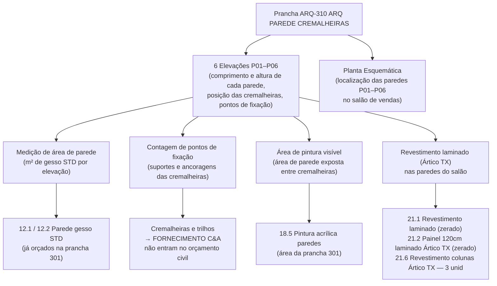

# Estudo: Prancha ARQ-310 (ARQ PAREDE CREMALHEIRAS) → Orçamento CELMAR BLN

## O que a prancha 310 contém

A prancha 310 documenta as **paredes de cremalheiras** do salão de vendas — as paredes perimetrais onde são instalados os trilhos verticais (cremalheiras) que suportam braços, prateleiras e araras de roupas. São 6 elevações (P01 a P06) das principais paredes do salão, mais uma planta esquemática de localização.

| Elemento | Descrição |
|---|---|
| Planta Baixa Nível Loja (esquemática) | Planta miniatura indicando a posição de cada parede P01–P06 no salão |
| PAREDE P01 | Elevação de parede curta — seção lateral do salão |
| PAREDE P02 | Elevação da parede mais longa — parede principal do salão (comprimento total da loja) |
| PAREDE P03 | Elevação de parede longa — parede oposta à P02 |
| PAREDE P04 | Elevação de parede com recorte (porta ou pilar) |
| PAREDE P05 | Elevação de parede menor |
| PAREDE P06 | Elevação de parede média |

Cada elevação mostra:
- O comprimento total da parede com cotas
- As linhas horizontais de cremalheira (faixas laranjas/rosa)
- Os pontos de fixação (quadrados vermelhos) — suportes e ancoragens
- Portas, pilares e aberturas que interrompem o sistema

---

## Natureza do sistema cremalheira: o que é C&A e o que é civil

A prancha 310 é, essencialmente, o documento de layout do **sistema Wall Panel** — o conjunto de trilhos e painéis de parede do salão de vendas. O que a Celmar executa e o que a C&A fornece é bem definido:

---

## Mapeamento: Fonte na imagem → Linha no XLSX

### 1. Elevações P01 a P06 — medição de áreas

As 6 elevações são a principal fonte de **quantitativos de parede** do salão de vendas. Cada parede tem:

| O que se extrai | Cálculo | Item gerado no XLSX |
|---|---|---|
| Comprimento × altura da parede = m² total | Cotas horizontais × cota de pé-direito | `12.1` Gesso STD 1 face — parte dos 672 m² totais |
| Área com revestimento laminado (Ártico TX) | Subtração de aberturas do m² total | `21.1` Revestimento laminado — **zerado** nesta proposta |
| Painel de 120cm com laminado Ártico TX | m² do sistema de painel | `21.2` Painel 120cm laminado Ártico TX — **zerado** |
| Comprimento de réguas de união entre painéis | ml lido nas elevações | `21.4` Réguas para união de painéis — 10 ml (R$ 473) |
| Área de pintura nas paredes (entre painéis/cremalheiras) | m² de parede exposta | `18.5` Pintura acrílica — parte dos 708 m² ADM |

### 2. Pontos de fixação (quadrados vermelhos)

Cada ponto vermelho nas elevações representa um **suporte de ancoragem** da cremalheira na parede de gesso. Esses pontos determinam:
- O número de fixações necessárias → absorvidas no item `12.7` (reforço em cedrinho) e `12.13` (reforço para placas de AC e trilhos)
- As cremalheiras e trilhos metálicos em si → **fornecimento C&A**, não orçados

### 3. Pilares nas elevações (Parede P04)

A parede P04 apresenta pilares/colunas estruturais que interrompem o sistema cremalheira. Cada coluna recebe revestimento laminado padrão Ártico TX:
- `21.6` Revestimento de colunas área vendas Ártico TX → **3 unid** (R$ 12.348) — o único item de laminado com valor orçado nesta seção

---

## Itens do XLSX gerados por esta prancha

### Seção 21 — Marcenaria Área de Vendas

| Item | Descrição | UN | QDE | MAT | M.O. | Total R$ | Status |
|---|---|---|---|---|---|---|---|
| `21.1` | Revestimento em laminado | m² | — | — | — | 0 | Zerado — sistema cremalheira é C&A |
| `21.2` | Painel 120cm laminado Ártico TX | m² | — | — | — | 0 | Zerado — fornecimento C&A |
| `21.4` | Réguas para união de painéis | ml | 10 | 28,50 | 18,87 | **473** | Executado pela Celmar |
| `21.6` | Revestimento de colunas área vendas Ártico TX | unid | **3** | 2.376 | 1.740 | **12.348** | Pilares visíveis nas elevações |
| `21.7` | Rodapé em fórmica | ml | — | — | — | 0 | Zerado |
| `21.8` | Rodateto em fórmica | ml | — | — | — | 0 | Zerado |

### Seção 12 — Paredes de Gesso (base das cremalheiras)

| Item | Descrição | UN | QDE total | Contribuição desta prancha |
|---|---|---|---|---|
| `12.1` | Parede gesso STD 1 face — salão vendas | m² | 672 | ~60–70% vem das paredes P01–P06 |
| `12.2` | Parede gesso STD 2 faces — salão vendas | m² | 274 | Paredes com cremalheira dos dois lados |
| `12.7` | Reforço em cedrinho | vb | 1 | Pontos de ancoragem das cremalheiras |
| `12.13` | Reforço para trilhos e placas de AC | vb | 1 | Suporte dos trilhos no forro |

### Seção 18 — Pintura (paredes expostas entre cremalheiras)

| Item | Contribuição desta prancha |
|---|---|
| `18.5` Pintura acrílica branco gelo — paredes ADM (708 m²) | As paredes do salão de vendas que ficam expostas entre painéis e cremalheiras são pintadas — m² parcial desta seção |

---

## O grande paradoxo desta prancha: muito desenhado, pouco orçado pela Celmar

A prancha 310 é extensa — 6 elevações detalhadas de paredes que somam possivelmente 600–800 m² de superfície. Mas os itens com valor no XLSX são apenas R$ 12.821. A razão é que **o sistema de cremalheiras em si é fornecimento C&A**:

| O que aparece nas elevações | Responsável | Entra no XLSX Celmar? |
|---|---|---|
| Cremalheiras metálicas verticais | C&A | Não |
| Trilhos horizontais e braços | C&A | Não |
| Painéis de laminado Ártico TX (21.1, 21.2) | C&A | Não (zerados) |
| Parede de gesso por trás | Celmar | Sim (12.1, 12.2) |
| Revestimento dos pilares Ártico TX | Celmar | Sim (21.6 — 3 unid) |
| Réguas de união entre painéis | Celmar | Sim (21.4 — 10 ml) |
| Pintura nas áreas expostas | Celmar | Sim (parte de 18.5) |

---

## Particularidades desta prancha

### 1. As elevações servem principalmente como referência de coordenação
As 6 elevações da prancha 310 mostram onde o sistema cremalheira vai ser instalado — mas como o sistema é C&A, o orçamentista civil usa essas elevações principalmente para:
- Calcular a área de gesso por trás (base para o sistema)
- Identificar os pontos de reforço necessários
- Confirmar a área de pintura que ficará exposta

### 2. Painéis Ártico TX zerados: variação de projeto vs. padrão C&A
Os itens `21.1` e `21.2` (revestimento e painel laminado Ártico TX) existem no orçamento padrão C&A mas estão zerados nesta loja. Isso pode indicar que nesta configuração o sistema Wall Panel é diferente do padrão — possivelmente as cremalheiras são instaladas diretamente sobre a parede pintada, sem painel de MDP intermediário.

### 3. Revestimento de pilares é o único item de laminado efetivamente orçado
Das 6 elevações, o único elemento que a Celmar efetivamente aplica em laminado são os **3 pilares/colunas** do salão de vendas (item `21.6` — R$ 12.348). Cada coluna recebe revestimento Ártico TX por conta da Celmar; o resto do laminado nas paredes é C&A.

---

## Estratégia de extração automática

| Componente | Técnica | Ferramenta | Confiança |
|---|---|---|---|
| Comprimento de cada parede (elevações) | OCR nas cotas horizontais | Tesseract / PaddleOCR | Alta |
| Altura do pé-direito (elevações) | OCR nas cotas verticais | Tesseract | Alta |
| m² de parede por elevação | Comprimento × altura − aberturas | Python | Alta |
| Contagem de pilares (elevações P04) | Detecção visual de elementos verticais | GPT-4o Vision | Média-Alta |
| Posição das paredes na loja (planta esquemática) | OCR nos labels + orientação da planta | GPT-4o Vision | Alta |
| Separação C&A vs. Celmar (cremalheiras vs. suporte) | Leitura de Notas / convenção de cor nas elevações | GPT-4o Vision | Média |

---

*Referências: Prancha CEA-254-BLN-ARQ_R02-310 - ARQ PAREDE CREMALHEIRAS.png · 1ª Proposta CELMAR BLN.xlsx · Loja 254 Shopping Norte Blumenau*
