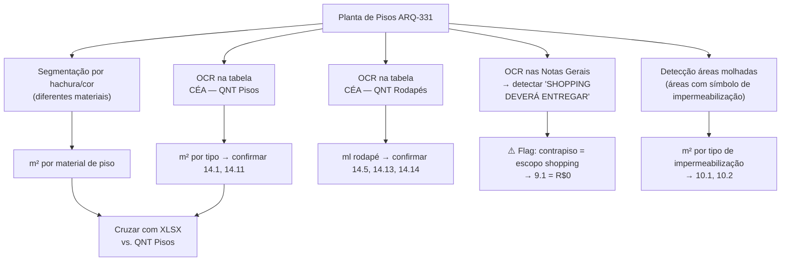

# Estudo: Prancha ARQ-331 (ARQ PISO) → Orçamento CELMAR BLN

## O que a prancha 331 contém

A prancha 331 é o **documento mestre do sistema de piso** — o par simétrico da prancha 321 (ARQ FORRO). Enquanto a 321 governa tudo acima da cabeça, a 331 governa tudo sob os pés. Juntas, elas representam o maior volume de m² orçados no projeto. Esta prancha alimenta diretamente as seções 9 (civil), 10 (impermeabilização), 11 (junta de dilatação) e 14 (revestimento de piso) do XLSX.

| Elemento | Descrição |
|---|---|
| 331 — Planta Baixa Térreo | Mapa de pisos com hachuras e cores por material — salão de vendas, ADM, copa, sanitários, área técnica |
| Planta Baixa 2º Pavimento — ADM | Mapa de pisos do 2º pavimento com cada ambiente rotulado |
| CÉA — QNT Pisos (tabela) | m² por tipo de piso por zona — **fonte direta de todas as QDEs da seção 14** |
| CÉA — QNT Rodapés (tabela) | ml de rodapé por tipo — fonte dos itens 14.5, 14.13, 14.14 |
| Legenda — Pisos | Hachuras e preenchimentos por material |
| Simbologia | Símbolos de instalações no piso (ralos, drenos, pontos) |
| 10 — Impermeabilização Áreas Molhadas (detalhe) | Corte construtivo mostrando as camadas de impermeabilização em áreas molhadas |
| Notas Gerais + Notas — Pisos | Especificações e **nota crítica sobre responsabilidade do shopping** |
| Quadro de Acabamentos | Finish schedule completo |

---

## A nota mais importante do projeto

> **"OBS.: SHOPPING DEVERÁ ENTREGAR CIMENTO SOBRE A LAJE"**

Esta nota, visível na coluna de notas da prancha, é a chave para entender por que o item `9.1` (Enchimento de contrapiso, h=4cm) está **zerado** no XLSX. O shopping (administradora do mall) é contratualmente obrigado a entregar a laje já com o cimento sobre ela — a Celmar não executa o contrapiso, apenas aplica o autonivelante e o piso a partir daí.

---

## Mapa de materiais por zona

```mermaid
flowchart TD
    PRANCHA["Prancha ARQ-331 ARQ PISO"]

    PRANCHA --> SV["Salão de Vendas + Provadores\n(grande área do térreo)"]
    PRANCHA --> ADM_PISO["ADM — Back-of-house\n(2º pavimento + corredor térreo)"]
    PRANCHA --> MOL["Áreas Molhadas\n(sanitários, copa, casa de máquinas)"]
    PRANCHA --> TEC["Área Técnica\n(gerador, transformador)"]
    PRANCHA --> ESC["Circulação + Escadas"]

    SV --> V1["14.1 — Vinílico M.O.\n1.024,98 m² — R$ 41.152"]
    SV --> V2["14.2 — Autonivelante M.O.\n1.024,98 m² — R$ 14.554"]
    SV --> V3["14.5 — Rodapé Primer Tarket 10cm\n130,84 ml — R$ 6.960"]

    ADM_PISO --> A1["14.11 — Cerâmica Cargo plus white Eliane\n361 m² M.O. — R$ 24.548"]
    ADM_PISO --> A2["14.12 — Vinílico ADM — QDE pendente"]
    ADM_PISO --> A3["14.13 — Rodapé madeira h=7cm\n42,5 ml — R$ 2.266"]
    ADM_PISO --> A4["14.14 — Rodapé madeira h=20cm\n140,39 ml — R$ 8.580"]

    MOL --> M1["10.1 — Impermeabilização manta\n43,7 m² — R$ 13.024"]
    MOL --> M2["10.2 — Impermeabilização manta líquida\n28,87 m² — R$ 4.030"]

    TEC --> T1["9.2 — Piso cimentado 5cm — zerado"]
    TEC --> T2["18.1 — Epóxi sobre cimentado\n39,61 m² — R$ 4.174"]

    ESC --> E1["14.6 — Piso tátil escadas — 16 vb"]
    ESC --> E2["14.8 — Soleira granito Branco Cearense\n11,4 ml — R$ 11.514"]
    ESC --> E3["14.19 — Soleira granito Cinza Andorinha\n5,88 ml — R$ 5.696"]

    V1 --> ORC["Orçamento XLSX"]
    A1 --> ORC
    M1 --> ORC
    T2 --> ORC
    E1 --> ORC
```

---

## Tabela completa dos itens do XLSX

### Seção 9 — Civil / Base de Piso

| Item | Zona | Descrição | Un | QDE | Total (R$) | Status |
|---|---|---|---|---|---|---|
| `9.1` | — | Enchimento de contrapiso (h=4cm) | m² | — | **0** | **Zerado — Shopping entrega cimento sobre a laje** |
| `9.2` | área técnica | Piso cimentado 5cm — áreas técnicas | m² | — | **0** | Zerado — sem definição de QDE |
| `9.5` | adm | Alvenaria em tijolo/bloco de concreto | m² | **230** | **25.300** | Ativo — paredes ADM visíveis nas plantas |
| `9.7` | adm | Chapisco e emboço | m² | **460** | **18.386** | Ativo — 2× as paredes (460 = 2 × 230) |
| `9.10` | mezanino | Concreto vermiculita — bandejas mezanino (Fck 30) | m³ | — | **0** | Zerado — mezanino não executado nesta proposta |
| `9.11` | mezanino | Tela Telcon + Lona preta — mezanino | m² | — | **0** | Zerado |
| `9.12` | — | Furação mecânica de lajes (esgoto/tubulações) | vb | **1** | **5.440** | Ativo — pontos visíveis na planta |
| `9.13` | — | Arremates gerais | vb | **1** | **6.390** | Ativo |

### Seção 10 — Impermeabilização

| Item | Zona | Descrição | Un | QDE | Total (R$) | Área de origem |
|---|---|---|---|---|---|---|
| `10.1` | adm | Impermeabilização manta butílica/asfáltica — casa de máquinas + área técnica + cuba refeitório | m² | **43,7** | **13.024** | Detalhe IMPERMEABILIZAÇÃO ÁREAS MOLHADAS |
| `10.2` | adm | Impermeabilização sanitários — manta líquida | m² | **28,87** | **4.030** | Detalhe IMPERMEABILIZAÇÃO ÁREAS MOLHADAS |

### Seção 11 — Junta de Dilatação

| Item | Zona | Descrição | Un | QDE | Total (R$) | Status |
|---|---|---|---|---|---|---|
| `11.1` | — | Enchimento de juntas de dilatação — Vedaflex | ml | — | **0** | Zerado — shopping entrega laje já tratada |

### Seção 14 — Revestimento de Piso (principal)

| Item | Zona | Descrição | Un | QDE | Total (R$) | Nota |
|---|---|---|---|---|---|---|
| `14.1` | vendas | Vinílico vendas/provadores — M.O. (mat. C&A) | m² | **1.024,98** | **41.152** | Área SV + provadores |
| `14.2` | vendas | Autonivelante vendas/provadores — M.O. (mat. C&A) | m² | **1.024,98** | **14.554** | Idem 14.1 |
| `14.3` | vendas | Assentamento porcelanato | m² | — | **0** | Zerado |
| `14.4` | vendas | Argamassa/rejunte para porcelanato | m² | — | **0** | Zerado |
| `14.5` | vendas | Rodapé Primer Tarket 10cm — SV | ml | **130,84** | **6.960** | Perímetro SV + provadores |
| `14.6` | vendas | Piso tátil escada fixa | vb | **16** | **5.920** | Landings das escadas |
| `14.7` | fachada | Sóculos granito frente vitrine (10cm) | ml | **7,12** | **2.308** | Frente da vitrine (vista na planta fachada) |
| `14.8` | vendas | Soleira granito Branco Cearense | ml | **11,4** | **11.514** | Transição salão → exterior/vitrine |
| `14.9` | vendas | Capacho nômade 3M cinza grafite | und | — | **0** | Zerado — entrada da loja |
| `14.10` | vendas | Fita antiderrapante Safety Walk 50mm entrada | vb | — | **0** | Zerado |
| `14.11` | adm | Cerâmica Cargo plus white Eliane (mat. C&A) M.O. | m² | **361** | **24.548** | ADM em geral (corredores, salas, copa) |
| `14.12` | adm | Vinílico ADM M.O. (mat. C&A) — exceto molhadas | m² | **QDE pendente** | **—** | Salas específicas ADM — pendente |
| `14.13` | adm | Rodapé madeira h=7cm | ml | **42,5** | **2.266** | Perímetro de salas ADM menores |
| `14.14` | adm | Rodapé madeira h=20cm | ml | **140,39** | **8.580** | Perímetro principal ADM |
| `14.19` | adm | Soleira granito Cinza Andorinha | ml | **5,88** | **5.696** | Transições ADM (escada, salas) |

### Seção 18 — Pintura de piso técnico

| Item | Zona | Descrição | Un | QDE | Total (R$) | Status |
|---|---|---|---|---|---|---|
| `18.1` | área técnica | Epóxi sobre cimentado — áreas técnicas | m² | **39,61** | **4.174** | Ativo — casa de máquinas + gerador |

---

## Particularidades desta prancha

### 1. A nota da laje: a exclusão mais cara do projeto
"SHOPPING DEVERÁ ENTREGAR CIMENTO SOBRE A LAJE" — se o shopping **não** entregar o cimento, o item `9.1` (contrapiso 4cm) teria que ser executado sobre toda a área da loja (estimada em ~2.000+ m²), ao preço de mercado de R$40–60/m² = potencialmente **R$80–120 mil** adicionais. É o mais alto risco de escopo de toda a obra, e está explicitamente documentado nesta prancha.

### 2. Duas zonas, dois pisos, uma mesma nota "material C&A"
| Zona | Material | QDE | Item XLSX | Valor M.O. |
|---|---|---|---|---|
| Salão vendas + provadores | Vinílico | 1.024,98 m² | `14.1` | R$41.152 |
| ADM back-of-house | Cerâmica Cargo plus white | 361 m² | `14.11` | R$24.548 |

Em ambos os casos, o **material é fornecido pela C&A** — a Celmar cobra apenas a mão de obra de assentamento. O autonivelante (14.2 — R$14.554) é a camada intermediária entre a laje/cimento do shopping e o vinílico.

### 3. Vinílico ADM (14.12): a QDE mais difícil de fechar
O `14.12` não tem QDE preenchida, com nota "(EXCETO RESERVA E ÁREAS MOLHADAS)". Isso indica que na época da proposta, ainda não havia definição exata de quais ambientes ADM do 2º pavimento receberiam vinílico (vs. cerâmica). A prancha 331, com o mapa de hachuras do 2º pavimento, é a chave para resolver esta pendência: cada sala com hachura de vinílico contribui sua área para a QDE do `14.12`.

### 4. O detalhe de impermeabilização: dois sistemas diferentes
A prancha especifica **dois sistemas** de impermeabilização, cada um para um tipo de área:
- **Manta butílica/asfáltica** (`10.1` — R$177,36 MAT + R$120,68 M.O. por m²) → áreas técnicas, casa de máquinas e embaixo da cuba do refeitório — exige membrana mais robusta pois suporta maior carga de umidade e possível contato com equipamentos
- **Manta líquida** (`10.2` — R$87,2 MAT + R$52,4 M.O. por m²) → sanitários — solução mais econômica para banheiros e vestiários padrão

A QDE de 28,87 m² (sanitários) vem da soma das áreas molhadas dos banheiros visíveis no 2º pavimento da prancha 331.

### 5. Rodapé duplo na ADM: h=7cm vs. h=20cm
A presença de dois tamanhos de rodapé de madeira:
- `14.13` h=7cm (42,5 ml) — rodapé padrão para salas menores (sala de reuniões, copa, back office)
- `14.14` h=20cm (140,39 ml) — rodapé alto para os corredores e áreas principais da ADM

O rodapé de 20cm tem custo unitário mais alto (R$43,67 MAT vs. R$35,9) e serve como elemento de design mais robusto. Sua distribuição é legível na planta 331 pelo código de hachura na zona de rodapé.

### 6. Epóxi sobre cimentado (18.1): o único piso que a Celmar fornece integralmente
`18.1` — Epóxi sobre cimentado, 39,61 m², R$4.174 — é o único item de piso em que a Celmar fornece tanto material quanto mão de obra (MAT R$67,2 + M.O. R$38,2). É o tratamento das áreas técnicas (gerador, transformador, casa de máquinas) — onde a resistência química e mecânica do epóxi justifica o material mais caro.

---

## Estratégia de extração automática

| Componente | Técnica | Ferramenta | Confiança |
|---|---|---|---|
| m² por material (14.1, 14.11) | OCR na tabela CÉA QNT Pisos | PaddleOCR | **Muito alta** |
| ml de rodapé por tipo | OCR na tabela CÉA QNT Rodapés | PaddleOCR | **Muito alta** |
| Identificar nota "shopping entrega cimento" | OCR + NLP nas Notas Gerais | GPT-4o Vision | Alta |
| m² impermeabilização por tipo | Detecção de hachura específica + OCR salas | OpenCV + PaddleOCR | Alta |
| Identificar QDE pendente (14.12) | Cruzamento: zona ADM vinílico sem QDE | GPT-4o Vision | Média |
| m² epóxi técnico (18.1) | OCR hachura área técnica + QNT Pisos | PaddleOCR | Alta |

---

*Referências: Prancha CEA-254-BLN-ARQ_R03-331 - ARQ PISO.png · 1ª Proposta CELMAR BLN.xlsx · Loja 254 Shopping Norte Blumenau*
