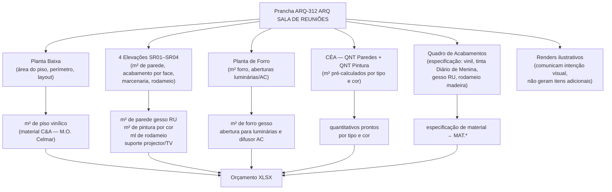

# Estudo: Prancha ARQ-312 (ARQ SALA DE REUNIÕES) → Orçamento CELMAR BLN

## O que a prancha 312 contém

A prancha 312 é o documento mais detalhado de um único ambiente da área ADM — a **Sala de Reuniões**. É uma das poucas pranchas que inclui **imagens fotorrealistas** (renders) além dos desenhos técnicos, comunicando não só o que construir, mas como o ambiente deve parecer ao final.

| Elemento | Descrição |
|---|---|
| Planta Baixa — Sala de Reuniões | Planta com layout de mobiliário, cotas e indicação de acabamento por parede (bordas coloridas) |
| Planta de Piso — Sala de Reuniões | Planta específica do piso com tipo e sentido de assentamento |
| Planta de Forro — Sala de Reuniões | Planta do forro com luminárias, difusor de AC e aberturas |
| 01 — Elevação SR01 | Parede com porta e elemento de destaque |
| 02 — Elevação SR02 | Parede oposta — tratamento acústico ou painel |
| 03 — Elevação SR03 | Terceira parede com acabamento neutro |
| 04 — Elevação SR04 | Parede com elemento vertical em destaque (amarelo) |
| Axonométrica Reuniões | Vista 3D da sala montada com mobiliário e acabamentos |
| Imagem Ilustrativa Genérica (×2) | Renders fotorrealistas mostrando mesa, cadeiras, whiteboard e laptop |
| CÉA — QNT Paredes | Tabela de m² de parede por tipo |
| CÉA — QNT Pintura | Tabela de m² de pintura por cor/tinta |
| CÉA — QNT Nosapes | Especificação de materiais por elemento |
| Quadro de Acabamentos | Finish schedule da sala + MASTER de todo o projeto |
| Notas Gerais | Requisitos de acabamento, acústica e instalações |

---

## Mapeamento: Fonte na imagem → Linha no XLSX

---

## Fontes de informação e o que cada uma gera

### 1. Planta Baixa — layout e área

A planta mostra o ambiente com as bordas coloridas por parede (cada cor = um acabamento diferente em cada face), posição do projetor, mesa, whiteboard e porta.

- Área do piso da sala → contribui para `14.12` Piso vinílico ADM (material C&A, M.O. Celmar — QDE não preenchida na proposta)
- Perímetro → parte dos `14.13` e `14.14` (rodapé de madeira h=7cm e h=20cm — 42,5 ml + 140,39 ml totais na ADM)
- Posição do suporte de projetor → `24.11` Suporte para TV, Projetor e Microondas — **3 unid total** (inclui este ambiente, R$ 1.920)

### 2. Elevações SR01–SR04 (4 vistas cotadas)

| Elevação | O que mostra | Item gerado no XLSX |
|---|---|---|
| SR01 | Parede com porta + possível whiteboard | `20.3` ou `20.2` Porta madeira (já contabilizada na seção 20) |
| SR02 | Parede de fundo — tratamento especial (cor destaque) | `18.8` Pintura Diário de Menina — 15 m² totais ADM (inclui esta parede) |
| SR03 | Parede neutra — pintura branco gelo | `18.5` Pintura acrílica branco gelo ADM — 708 m² totais |
| SR04 | Parede com elemento vertical amarelo/destaque | Possível marcenaria ou laminado — `15.4` Rodameio madeira sala gerente — zerado |
| Todas | m² de parede gesso RU | `12.3`/`12.4` Gesso RU (compartilhado com toda ADM) |

**Cor "Diário de Menina"**: a sala de reuniões é um dos poucos ambientes da ADM com uma parede de cor diferente do branco gelo. O item `18.8` (15 m², R$ 596) cobre esta parede e possivelmente outras zonas ADM com cor de destaque.

### 3. Planta de Forro

- M² de forro da sala → parte do `12.9` total (1.457,44 m²) e da pintura `18.11`/`18.12`
- Difusor de AC e luminárias → contribui para as 176 aberturas do `12.12`
- O forro da sala de reuniões recebe a cor "Diário de Menina" (`18.12` — 8,6 m²) se o forro tiver a mesma cor da parede de destaque

### 4. CÉA — QNT Paredes + QNT Pintura

Tabelas pré-calculadas específicas para a sala de reuniões:
- m² de parede gesso RU (área úmida não — mas padrão ADM interno)
- m² de pintura branco gelo + m² cor Diário de Menina separados

### 5. Quadro de Acabamentos + CÉA — QNT Nosapes

Define os materiais da sala:
- **Piso**: vinílico (fornecimento C&A, instalação Celmar) → `14.12`
- **Paredes**: tinta látex branco gelo + accent Diário de Menina → `18.5`/`18.8`
- **Forro**: gesso Gypsum liso tabicado → `12.9`
- **Rodameio**: madeira h=? → `15.4` (zerado nesta proposta)

### 6. Renders ilustrativos (2 imagens fotorrealistas)

Os renders mostram a intenção visual do ambiente — mesa de reunião, cadeiras ergonômicas, whiteboard, notebook, iluminação indireta. **Não geram itens no orçamento civil** — o mobiliário (mesa, cadeiras, whiteboard) é fornecimento C&A ou da empresa gerenciadora da obra.

---

## Itens do XLSX gerados por esta prancha

A sala de reuniões está dentro da zona ADM — seus itens são compartilhados com toda a área ADM e não têm tags individuais de "sala reuniões" no XLSX. A contribuição da sala é proporcional à sua área no total da ADM.

| Item | Descrição | Situação no XLSX | Contribuição da Sala |
|---|---|---|---|
| `12.3` | Parede gesso RU 1 face — ADM | 40,84 m² total | Parcela da sala (m² de cada parede de 1 face) |
| `12.4` | Parede gesso RU 2 faces — ADM | 98 m² total | Parcela da sala (m² de paredes compartilhadas) |
| `12.9` | Forro gesso Gypsum — toda a loja | 1.457,44 m² | m² da sala de reuniões |
| `12.12` | Abertura forro luminárias/difusores | 176 und | Luminárias + difusor AC da sala |
| `14.12` | Piso vinílico ADM — M.O. | QDE não preenchida | Área do piso da sala |
| `14.13` | Rodapé madeira h=7cm | 42,5 ml total ADM | Perímetro da sala |
| `18.5` | Pintura acrílica branco gelo ADM | 708 m² total | Paredes neutras da sala |
| `18.8` | Pintura Diário de Menina — ADM | **15 m²** | Parede de destaque da sala |
| `18.12` | Pintura Diário de Menina forro | **8,6 m²** | Forro da sala se for colorido |
| `18.11` | Pintura branco neve forro ADM | 408 m² | Resto do forro da sala |
| `24.11` | Suporte para TV, Projetor e Microondas | **3 unid total** (R$ 1.920) | 1 dos 3 suportes é o da sala de reuniões |

### Itens específicos da sala zerados ou pendentes

| Item | Descrição | Status |
|---|---|---|
| `15.4` | Rodameio em madeira — sala de gerente | Zerado nesta proposta |
| `14.12` | Piso vinílico ADM | QDE não preenchida (M.O. a ser definida) |

---

## Particularidades desta prancha

### 1. Única prancha com renders fotorrealistas do projeto
As duas imagens ilustrativas no final da prancha são renders de design de interiores — mostram como o ambiente deve parecer após a conclusão. Isso é incomum no conjunto de pranchas técnicas (as outras têm apenas vistas esquemáticas e axonométricas). Os renders **não geram itens de orçamento** mas comunicam ao construtor o nível de acabamento esperado.

### 2. "Diário de Menina" como único destaque de cor na ADM
A tinta látex "Diário de Menina" (tom pastel — rosa/salmão claro) é o único acabamento de cor diferente do branco em toda a área ADM. Os 15 m² de parede (`18.8`) e 8,6 m² de forro (`18.12`) concentram-se provavelmente nesta sala ou em partes dela. Identificar a exata distribuição requer cruzar esta prancha com o `CÉA - QNT Pintura`.

### 3. Piso vinílico sem QDE — pendência de coordenação
O piso vinílico ADM (`14.12`) aparece no XLSX sem QDE preenchida — significa que na época desta proposta ainda não estava definido quais ambientes da ADM receberiam vinílico (vs. cerâmico, vs. cimentado). A planta de piso desta prancha (`Planta de Piso - Sala de Reuniões`) confirma que a sala recebe vinílico, mas a QDE final depende de consolidar todas as plantas de piso da ADM.

### 4. Mobiliário é C&A — mesa, cadeiras, whiteboard
O mobiliário visível nos renders e na planta (mesa de reunião, cadeiras, whiteboard) é **fornecimento e instalação da C&A** (ou da empresa gerenciadora), não da Celmar. O único item de fixação que entra no orçamento civil é o `24.11` (suporte de projetor/TV).

---

## Estratégia de extração automática

| Componente | Técnica | Ferramenta | Confiança |
|---|---|---|---|
| Área do piso (planta) | OCR nas cotas + cálculo L×A | Tesseract | Alta |
| m² de parede por elevação (SR01–SR04) | OCR cotas + altura (dos cortes ou legenda) | PaddleOCR | Média-Alta |
| Identificação da cor por parede (bordas coloridas) | Classificação de cor das bordas na planta | Visão computacional (OpenCV) | Média |
| m² de Diário de Menina vs. branco gelo | CÉA — QNT Pintura + cores das elevações | GPT-4o Vision | Alta |
| Suporte de projetor (posição na planta) | OCR no label do símbolo de projetor | GPT-4o Vision | Alta |
| Renders (ilustrativos) | **Ignorar para extração** — comunicação visual apenas | — | N/A |

---

*Referências: Prancha CEA-254-BLN-ARQ_R02-312 - ARQ SALA DE REUNIOES.png · 1ª Proposta CELMAR BLN.xlsx · Loja 254 Shopping Norte Blumenau*
