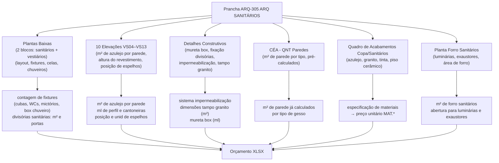

# Estudo: Prancha ARQ-305 (ARQ SANITÁRIOS) → Orçamento CELMAR BLN

## O que a prancha 305 contém

A prancha 305 é o documento mais detalhado de um ambiente interno — são **10 vistas de elevação** dos banheiros (VS04 a VS13), 2 plantas baixas, forro, axonométrica e múltiplos detalhes construtivos. É a prancha com maior número de sub-vistas do projeto.

Cobre os **sanitários e vestiários da área ADM** (2º pavimento): banheiros masculino, feminino e PNE, mais vestiários de funcionários com chuveiros.

| Elemento | Descrição |
|---|---|
| Planta Baixa 2º Pav. ADM — bloco 1 | Planta com WC, lavatório, mictório, box chuveiro (hachura verde) |
| Planta Baixa 2º Pav. ADM — bloco 2 | Planta dos vestiários com chuveiros (hachura rosa) |
| VS04 a VS13 — Vistas Sanitários | 10 elevações cotadas de cada parede dos banheiros |
| Planta Forro Sanitários | Planta do forro com posição de luminárias e exaustores |
| Axonométrica Sanitários | Vista 3D do bloco de sanitários montado |
| Detalhe Mureta Box | Detalhe construtivo da mureta do box de chuveiro |
| Fixação de Divisórias | Detalhe de como as divisórias sanitárias são fixadas |
| PB 012, PB 001 | Detalhes de portas dos banheiros |
| Impermeabilização Áreas Molhadas | Detalhe em corte do sistema de impermeabilização |
| Det. Tampo Granito Sanitários | Detalhe do tampo de granito sobre as bancadas |
| CÉA - QNT Paredes | Tabela de quantitativos de paredes dos sanitários |
| CÉA - Det. Pintura | Tabela de especificação de pintura |
| Quadro de Acabamentos — Copa/Sanitários | Finish schedule específico desta zona |
| Notas Gerais + Notas Sanitários | Notas gerais e específicas do ambiente |

---

## Mapeamento: Fonte na imagem → Linha no XLSX

---

## Fontes de informação e o que cada uma gera

### 1. Plantas Baixas — 2 blocos

- **Bloco 1 (sanitários)**: WC masculino, feminino, PNE. Mostra posição de cada vaso, lavatório, mictório, divisória de cela.
- **Bloco 2 (vestiários)**: Chuveiros com box, vestiários masculino e feminino.
- Geram: contagem de cubas, contagem de celas (= portas de divisória), posição dos box de chuveiro (= porta de vidro/alumínio), área total para piso cerâmico, perímetro para rodapé.

### 2. Elevações VS04 a VS13 (10 vistas)

Esta é a fonte mais rica de quantitativos desta prancha. Cada vista mostra uma parede cotada dos banheiros:

| O que se lê na elevação | Cálculo | Item gerado no XLSX |
|---|---|---|
| Área de azulejo por parede | largura × altura do azulejo − vãos | `15.1` Azulejo branco — 81 m² total (R$ 10.246) |
| Comprimento do perfil alumínio | ml lido na cota horizontal | `15.2` Perfil alumínio branco 1/2" — 23 ml (R$ 1.108) |
| Cantoneira de arremate | ml nas quinas | `15.3` Arremate cantoneira alumínio — 12 ml (R$ 607) |
| Posição e quantidade de espelhos | 1 espelho por cuba | `19.1` Espelho 4mm moldura alumínio — 4 unid (R$ 2.777) |
| Espelhos verticais para vestiários | 1 por vestiário | `19.2` Espelho 4mm vertical — 2 unid (R$ 1.388) |
| Posição das portas | contagem nas vistas | `20.2` Porta 0,72×2,10m — 2 unid · `20.3` Porta 0,82×2,10m — 6 unid |

### 3. Detalhes Construtivos

| Detalhe | O que fornece | Item gerado no XLSX |
|---|---|---|
| Impermeabilização Áreas Molhadas | Sistema manta líquida + primer: m² vem da área dos banheiros | `10.2` Impermeabilização manta líquida — 28,87 m² (R$ 4.030) |
| Det. Tampo Granito Sanitários | Largura e comprimento das bancadas de pia | `16.2` Bancadas granito vestiários — 2,18 m² (R$ 6.572) |
| Detalhe Mureta Box | Altura e espessura da mureta do box de chuveiro | `16.4` Nicho granito nos box — 2 unid (R$ 536) |
| Fixação de Divisórias | Sistema de fixação das divisórias sanitárias ao piso e teto | `13.1` Divisória Divilux — confirma m² e sistema |
| PB 012, PB 001 | Detalhes de portas: folha, marco, ferragem | `20.7` Mola para porta — 2 unid · `20.8` Prendedor de porta — 4 unid |

### 4. CÉA - QNT Paredes

- Tabela pré-calculada com m² de parede por tipo (STD/RU) nos sanitários.
- Como os sanitários são áreas úmidas, usam **gesso RU** (resistente à umidade).
- Os valores desta tabela alimentam diretamente `12.3` e `12.4` da prancha 301.

### 5. Quadro de Acabamentos — Copa/Sanitários

- Finish schedule específico para a zona Copa+Sanitários.
- Define: azulejo branco (referência, fabricante, dimensão) → preço `15.1`
- Define: granito (tipo, espessura) → preço `16.2`, `16.3`, `16.4`
- Define: tinta para paredes e teto dos sanitários → `18.5`, `18.11`
- Define: piso cerâmico (Cargo Plus White Eliane) → `14.11`

### 6. Planta Forro Sanitários

- Mostra a área do forro dos sanitários com posição de luminárias e exaustores.
- Contribui com m² para `12.9` (forro gesso geral) e conta aberturas para `12.12`.

---

## Itens do XLSX gerados por esta prancha

### Divisórias sanitárias — Seção 13

| Item | Descrição | UN | QDE | MAT | M.O. | Total R$ |
|---|---|---|---|---|---|---|
| `13.1` | Divisória Divilux 35 Eucatex — compartimentos | m² | 30 | 118,20 | 87,00 | **6.156** |
| `13.2` | Porta 0,60×1,65 Eucatex — cela sanitária | unid | **10** | 1.068,40 | 144,30 | **12.127** |
| `13.3` | Porta divisória Eucatex alavanca | unid | 3 | 1.382,30 | 232,45 | **4.844** |
| `13.5` | Porta e ferragens vidro/alumínio — box chuveiro | unid | 2 | 989,20 | 165,00 | **2.308** |

> As 10 celas sanitárias (item `13.2`) são o maior grupo de portas de toda a ADM. Cada cela é contada individualmente nas plantas dos dois blocos.

### Impermeabilização — Seção 10

| Item | Descrição | UN | QDE | MAT | M.O. | Total R$ |
|---|---|---|---|---|---|---|
| `10.2` | Impermeabilização manta líquida — sanitários | m² | **28,87** | 87,20 | 52,40 | **4.030** |

### Mármores e Granitos — Seção 16

| Item | Descrição | UN | QDE | MAT | M.O. | Total R$ |
|---|---|---|---|---|---|---|
| `16.2` | Bancadas em granito — vestiários | m² | 2,18 | 1.785 | 1.230 | **6.572** |
| `16.3` | Aparadores para bancada de vestiários | unid | 2 | 190 | 78 | **536** |
| `16.4` | Nicho em granito nos box de chuveiro | unid | 2 | 190 | 78 | **536** |

### Louças e Metais — Seção 17

| Item | Descrição | UN | QDE | MAT | M.O. | Total R$ |
|---|---|---|---|---|---|---|
| `17.2` | Cuba de embutir de louça oval | unid | **4** | 350 | 150 | **2.000** |
| `17.3` | Demais louças e metais — fornecimento e instalação pela Instaladora hidráulica | — | — | — | — | excluído |

> As 4 cubas de louça oval correspondem às 4 cubas de lavatório contadas nas plantas dos 2 blocos. Vasos, mictórios e registros são excluídos do orçamento civil → instaladora hidráulica.

### Revestimentos de Parede — Seção 15

| Item | Descrição | UN | QDE | MAT | M.O. | Total R$ |
|---|---|---|---|---|---|---|
| `15.1` | Azulejo branco junta a prumo | m² | 81 | 89,75 | 36,75 | **10.246** |
| `15.2` | Perfil alumínio branco 1/2" meia altura | ml | 23 | 32,20 | 16,00 | **1.108** |
| `15.3` | Arremate cantoneira alumínio nas quinas h=1,70m | ml | 12 | 32,20 | 18,40 | **607** |

### Vidros e Espelhos — Seção 19

| Item | Descrição | UN | QDE | MAT | M.O. | Total R$ |
|---|---|---|---|---|---|---|
| `19.1` | Espelho 4mm c/ moldura alumínio — sobre bancadas (1/cuba) | unid | 4 | 498,30 | 196,19 | **2.777** |
| `19.2` | Espelho 4mm vertical c/ moldura — vestiários (1,40×0,50m) | unid | 2 | 498,30 | 196,19 | **1.388** |

### Portas — Seção 20

| Item | Descrição | UN | QDE | MAT | M.O. | Total R$ |
|---|---|---|---|---|---|---|
| `20.2` | Porta madeira 0,72×2,10m folhada | unid | 2 | 1.576 | 285 | **3.722** |
| `20.3` | Porta madeira 0,82×2,10m folhada | unid | 6 | 1.776 | 285 | **12.366** |
| `20.7` | Mola para porta | unid | 2 | 325,60 | 95,40 | **842** |
| `20.8` | Prendedor de porta | unid | 4 | 100 | 80 | **720** |
| `20.8` | Barra de apoio — sanitário PNE | unid | — | — | — | 0 (zerado) |

### Enxoval sanitário — Seção 24

| Item | Descrição | UN | QDE | MAT | M.O. | Total R$ |
|---|---|---|---|---|---|---|
| `24.13` | Lixeira para bancada dos sanitários | unid | 2 | 376 | — | **752** |
| `24.14` | Lixeira para vasos sanitários | unid | 6 | 298,30 | — | **1.789** |
| `24.16` | Locker para vestiário | unid | 3 | 560 | 156 | **2.148** |
| `24.17` | Banco para vestiário | unid | — | — | — | 0 |
| `24.17` | Sapateira para vestiário | unid | — | — | — | 0 |

---

## Particularidades desta prancha

### 1. Maior densidade de elevações do projeto
Com 10 vistas (VS04 a VS13), os sanitários têm mais elevações do que qualquer outro ambiente. Isso é necessário porque cada parede tem uma composição diferente: paredes com azulejo até meia altura, paredes com azulejo integral, paredes com espelho e prateleira, parede com box de chuveiro. Cada vista gera um m² diferente de azulejo.

### 2. Separação clara entre escopo civil e hidráulico
A nota `17.3` é explícita: vasos, mictórios, registros, metais e instalação de louças são **fornecimento e instalação da instaladora hidráulica**. O orçamento da Celmar só inclui as cubas de embutir (17.2) e os espelhos/granitos. Esse limite precisa ser lido nas Notas Sanitários para não duplicar itens.

### 3. Lixeiras e lockers — itens de enxoval
Lixeiras de vaso (24.14), lixeiras de bancada (24.13) e lockers de vestiário (24.16) têm suas quantidades contadas diretamente nas plantas: 1 lixeira por vaso sanitário (6 vasos = 6 lixeiras), 1 lixeira por cuba de bancada, 1 locker por vestiário.

---

## Estratégia de extração automática

| Componente | Técnica | Ferramenta | Confiança |
|---|---|---|---|
| Contagem de fixtures (plantas) | Detecção de símbolos: WC, cuba, mictório, chuveiro | Template matching (OpenCV) | Média-Alta |
| m² de azulejo (10 elevações) | OCR cotas + cálculo área − vãos por elevação | PaddleOCR + Python | Média-Alta |
| Quantidade de celas/portas | Contagem de vãos nas elevações + plantas | OCR + detecção de vão | Alta |
| Posição e quantidade de espelhos | OCR labels nas elevações | GPT-4o Vision | Alta |
| m² granito bancadas (detalhe) | OCR dimensões no Det. Tampo Granito | Tesseract | Alta |
| Sistema impermeabilização | OCR no detalhe de impermeabilização | GPT-4o Vision | Alta |
| CÉA - QNT Paredes (tabela) | OCR tabular | Tesseract | Alta |
| Separação civil × hidráulico | Leitura das Notas Sanitários + classificação | OCR + NLP | Alta |

---

*Referências: Prancha CEA-254-BLN-ARQ_R02-305 - ARQ SANITARIOS.png · 1ª Proposta CELMAR BLN.xlsx · Loja 254 Shopping Norte Blumenau*
