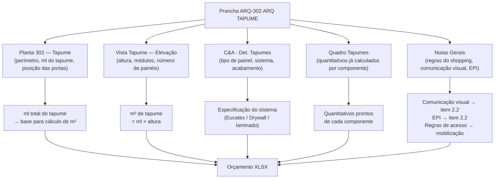

# Estudo: Prancha ARQ-302 (ARQ TAPUME) → Orçamento CELMAR BLN

## O que a prancha 302 contém

A prancha 302 documenta o **tapume de obra** — a barreira temporária que separa o canteiro de obras do corredor do shopping durante toda a fase de construção. É um documento de **fase inicial de obra**, não de acabamento. Contém:

| Elemento | Descrição |
|---|---|
| 302 - Tapume (planta) | Planta baixa com posicionamento do tapume no perímetro da loja |
| Vista Tapume (elevação) | Elevação frontal do tapume com módulos, alturas e divisões |
| C&A - Det. Tapumes | Tabela de especificação de material (tipo de painel, acabamento) |
| Quadro Tapumes | Tabela de quantitativos pré-calculados de componentes |
| Notas Gerais | Exigências do shopping para instalação, comunicação visual e segurança |

---

## Mapeamento: Fonte na imagem → Linha no XLSX



---

## Fontes de informação e o que cada uma gera

### 1. Planta 302 — Tapume

- Mostra o perímetro da loja com a linha do tapume marcada ao longo da fachada e laterais.
- Permite medir o **comprimento linear (ml)** do tapume a ser instalado.
- Indica a posição de portas de acesso (pelo menos 1 porta de obra visível na planta).
- Também mostra a situação do entorno — corredor do shopping e limite do piso existente.

### 2. Vista Tapume — Elevação

- Elevação frontal mostrando a face do tapume voltada para o corredor do shopping.
- Informa a **altura do tapume** (essencial para calcular m² = ml × altura).
- Mostra os módulos de painel com suas divisões verticais — cada módulo é uma unidade de montagem.
- O acabamento aparece liso/branco, sem logo ou comunicação visual aparente nesta vista (pode ser definido nas Notas).

### 3. C&A - Det. Tapumes (tabela de especificação)

- Especifica o sistema construtivo do tapume: tipo de painel, estrutura de pontaletes, acabamento.
- Sistema referenciado: **placas de divisória tipo Eucatex, estruturado com pontaletes 3"×3", cor branco** — exatamente o que aparece no item `2.1` do XLSX.
- A tabela detalha componentes: laminato, primer, acabamento.

### 4. Quadro Tapumes (quantitativos)

- Tabela embutida na prancha com os componentes já separados por tipo e quantidade:
  - Betapack Laminat 35GL (material de acabamento)
  - Divisória Drywall Parede Estruturada (m²)
  - Altrob Pix — Primer Girl (demão de fundo)
  - Acabamento com laminados

### 5. Notas Gerais

- Regras impostas pelo Shopping Norte Blumenau para tapumes de obra.
- Exigências de **comunicação visual** sobre o tapume (informes de obra, logotipo C&A).
- Exigências de **EPI** e segurança no canteiro.
- Regras de acesso: horários de entrega, uso de elevadores de carga.

---

## Situação dos itens no XLSX

### Item principal: zerado nesta proposta

| Item | Descrição | UN | QDE | Total R$ | Situação |
|---|---|---|---|---|---|
| `2.1` | Tapume em placas de divisória tipo Eucatex, pontaletes 3"×3", cor branco | m² | — | **R$ 0** | Zerado — QDE não preenchida |

O tapume está com **QDE nula e valor zero** nesta proposta. Isso é comum em propostas iniciais quando:
- O shopping ainda não confirmou as exigências finais de tapume
- A metragem depende de medição in loco (o tapume cobre o perímetro real, que pode variar até a obra começar)
- O item foi deslocado para negociação separada com o shopping

### Itens relacionados ao tapume que estão orçados (Seção A — Custos Indiretos)

| Item | Descrição | UN | QDE | Total R$ |
|---|---|---|---|---|
| `2.2` | Equipamentos de proteção individual (EPI), comunicação visual | vb | 1 | **3.500** |
| `3.1` | Lona proteção — piso, marcenaria, equipamentos em geral | vb | 1 | **4.580** |
| `3.2` | Lona transparente proteção equipamentos | vb | 1 | **4.200** |
| `3.3` | Retirada periódica de entulhos e caçamba | mês | 3 | **24.600** |
| `4.4` | Mobilização e desmobilização | vb | 1 | **28.000** |
| `5.1` | Limpeza final de obra | vb | 1 | **9.000** |

> O item `2.2` (EPI + comunicação visual) deriva diretamente das Notas Gerais desta prancha, que exigem comunicação visual no tapume e uso de EPI no canteiro. Quando o tapume (`2.1`) for orçado, o m² será calculado pela planta + elevação desta prancha.

---

## Como calcular o m² do tapume a partir desta prancha

```
ml do tapume = perímetro da frente + laterais (lido na planta 302)
altura do tapume = lida na Vista Tapume (elevação)
m² total = ml × altura

Descontar: vão de porta(s) de acesso (dimensões na planta)
```

Esse m² alimenta diretamente o item `2.1`, e de forma proporcional o item `2.2` (comunicação visual é proporcional à área exposta do tapume).

---

## Particularidade: tapume é o primeiro e o último elemento da obra

| Fase | Evento |
|---|---|
| Início da obra | Tapume é instalado antes de qualquer outra atividade |
| Durante a obra | Tapume define o limite do canteiro — impacta todos os outros itens de Custos Indiretos |
| Fim da obra | Tapume é removido na limpeza final — custo embutido na `4.4` (desmobilização) e `5.1` (limpeza) |

Por isso, o m² do tapume, embora zerado no XLSX, é um **dado de entrada crítico** para toda a seção A (Custos Indiretos): a área do canteiro delimitada pelo tapume determina diretamente os custos de administração, vigilância e limpeza.

---

## Estratégia de extração automática

| Componente | Técnica | Ferramenta | Confiança |
|---|---|---|---|
| ml do tapume (planta) | OCR nas cotas do perímetro do tapume | Tesseract / PaddleOCR | Média-Alta |
| Altura do tapume (elevação) | OCR nas cotas verticais da Vista Tapume | Tesseract | Alta |
| m² calculado | ml × altura — pós-OCR | Python | Alta |
| Especificação de material (Det. Tapumes) | OCR na tabela de especificação | GPT-4o Vision | Alta |
| Quantitativos (Quadro Tapumes) | OCR na tabela de quantitativos | Tesseract / GPT-4o Vision | Alta |
| Regras do shopping (Notas Gerais) | OCR + NLP para extrair restrições | GPT-4o / NLP | Média |

---

*Referências: Prancha CEA-254-BLN-ARQ_R02-302 - ARQ TAPUME.png · 1ª Proposta CELMAR BLN.xlsx · Loja 254 Shopping Norte Blumenau*
