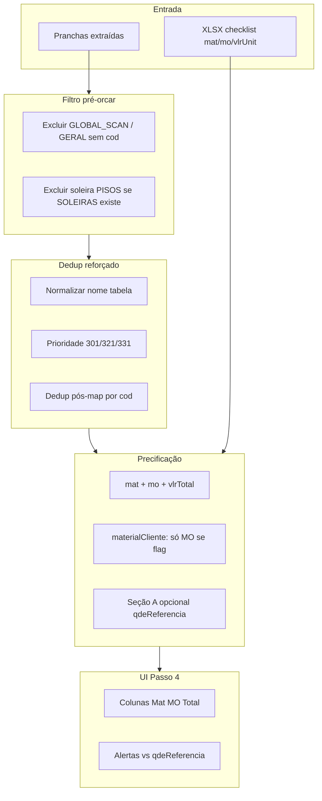

# Plano: Passo 4 Orçamento BLN — quantidades, mat/MO e cobertura

## Diagnóstico (estado atual)

Resultado observado: **35 itens**, **R$ 919.296**, com preços unitários corretos (`vlrUnit` do checklist), mas:

| Problema | Exemplo | Causa provável |
|---|---|---|
| Supercontagem pintura | 18.5 = 3.228 m² (gab 708) | Tabela PINTURA repetida em 301/305/309/312 — dedup não elimina todas |
| Supercontagem forro | 18.10 = 2.869 m² (gab 1.044) | Forro + acartonado agregados de várias pranchas |
| Soleira duplicada | 14.19 = 7,37 ml (gab 5,88) | Linha em **PISOS** (1,49 m²) + **SOLEIRAS** (5,88 ml) somam no map |
| Portas/alçapão ×2 | 12.11 = 28 un (gab 15) | QUADRO DE PORTAS em 301 + 306 |
| Só 35/160 itens | Sem Seção A | Custos indiretos nunca entram no pipeline |
| Categoria "Outro" | Todos os itens | `secao: 14` passada como `categoria` em [`StepIA.tsx`](app/orcamento-construtora/components/StepIA.tsx) L422 |
| Mat/MO invisível | UI só mostra Vlr Unit | Checklist tem `mat`/`mo` mas não propagam ao orçamento |

**Mat/MO já existem** em [`xlsx-checklist-bln.ts`](lib/orcamento-construtora/xlsx-checklist-bln.ts) (`vlrUnit = mat + mo`). Não falta configurar preço — falta **propagar, exibir e aplicar regras** (`materialCliente`).

---

## Arquitetura alvo (Passo 4)



---

## Fase 1 — Corrigir supercontagem (prioridade máxima)

### 1.1 Filtro de entrada em `/orcar-tabelas`

Arquivo: [`app/orcamento-construtora/components/StepIA.tsx`](app/orcamento-construtora/components/StepIA.tsx) (~L346)

Hoje: `filter((it) => it.tabela)` — inclui **GLOBAL_SCAN** e lixo.

**Mudança:** enviar só itens com tabela em allowlist:

```typescript
const TABELAS_ORCAMENTO = /^(PAREDES|PINTURA|FORROS|PISOS|RODAPES|SOLEIRAS|TAPUMES|CERÂMICA|RFID_|QNT_|LINEAR_|QNTD_)/i;
// Excluir: GLOBAL_SCAN, GERAL (portas já mapeadas ok, mas alçapão duplica — ver 1.3)
```

Alternativa mais segura: filtrar no Python em [`extractor_service.py`](extractor_service.py) `/orcar-tabelas` antes do dedup.

### 1.2 Normalizar `tabela` no dedup

Arquivo: [`extractors/table_dedup.py`](extractors/table_dedup.py)

- Função `_normalize_tabela_key(tabela, descricao)`:
  - `QNT_PINTURA`, `PINTURA`, `*PINTURA*` → `PINTURA`
  - `QNT_PAREDES`, `PAREDES` → `PAREDES`
  - `FORROS`, `*FORRO*` → `FORROS`
  - `QUADRO DE PORTAS` / itens `tab: GERAL` com código PM/PD → `PORTAS`
- Usar chave normalizada no agrupamento de `dedup_by_fingerprint` (não só string bruta).

### 1.3 Dedup pós-mapeamento por `cod`

Após `map_rows_to_xlsx`, nova função `dedup_mapped_by_cod(mapped, checklist)`:

- Para cada `cod`, se quantidade agregada > `qdeReferencia × 1.15` (tolerância 15%):
  - Reagregar **só** itens cuja `fonte_pranchas` contém prancha prioritária (301 pintura/paredes, 321 forros, 331 pisos)
  - Log warning em `dedup_log`
- Códigos-alvo BLN: **18.3, 18.5, 18.10, 18.11, 15.1, 13.1, 12.11, 14.19**

### 1.4 Soleira duplicada PISOS vs SOLEIRAS

Arquivo: [`extractors/pdf_extractor.py`](extractors/pdf_extractor.py) seção PISOS (~L1030)

- Não emitir linha `SOLEIRA*` na seção **PISOS** se a mesma prancha já tem seção **SOLEIRAS** parseada
- Ou: em `map_rows_to_xlsx`, ignorar descrições `SOLEIRA*` com `unidade=m2` quando existir entrada `ml` para 14.8/14.19

**Meta:** 14.19 = **5,88 ml**, 14.8 conforme regra de negócio (não 7,37 ml).

### 1.5 Portas / alçapão — fonte única

- Preferir **R03-301** (QUADRO DE PORTAS embutido) sobre **R02-306** para códigos 13.2, 13.3, 12.11, 20.x, 21.15
- Implementar via `_normalize_tabela_key` → `PORTAS` + prioridade 301 no dedup pós-map

---

## Fase 2 — Mat / MO / materialCliente

### 2.1 Propagar mat e mo no backend

Arquivo: [`extractor_service.py`](extractor_service.py) `/orcar-tabelas` (~L554)

Estender resposta de cada item:

```python
mat = float(xl.get("mat", 0) or 0)
mo  = float(xl.get("mo", 0) or 0)
material_cliente = bool(xl.get("materialCliente", False))
vlr_total_mat = round(qty * mat, 2)
vlr_total_mo  = round(qty * mo, 2)
```

Passar `mat`, `mo`, `vlrMat`, `vlrMo`, `materialCliente` no JSON.

### 2.2 Regra `materialCliente` no cálculo

Arquivo: [`lib/orcamento-construtora/calcular.ts`](lib/orcamento-construtora/calcular.ts)

```typescript
// Se materialCliente: total orçável = qty × mo (mat = 0 no total construtora)
// Ex.: 14.1 vinílico — mat já é 0 no checklist; regra garante consistência
```

Atualizar `ItemOrcado` em [`types.ts`](lib/orcamento-construtora/types.ts):

```typescript
mat?: number;
mo?: number;
vlrMat?: number;
vlrMo?: number;
materialCliente?: boolean;
```

### 2.3 UI Passo 4

Arquivo: [`StepOrcamento.tsx`](app/orcamento-construtora/components/StepOrcamento.tsx)

- Colunas: **Mat unit | MO unit | Vlr Total** (ou Mat total | MO total)
- Badge "Mat. C&A" quando `materialCliente`
- TSV export incluir mat/mo
- Totais no header: **Total Mat | Total MO | Total Geral**

### 2.4 Checklist enviado ao Python

[`StepIA.tsx`](app/orcamento-construtora/components/StepIA.tsx) (~L352): incluir `mat` e `mo` no `fullChecklist` (hoje só `vlrUnit`).

---

## Fase 3 — Cobertura e categorias

### 3.1 Mapear categoria correta (grupo XLSX → Categoria UI)

Em `mapRawItem` / montagem da folha, usar `xlsxItem.grupo` (G1–G6) ou mapa `secao → categoria`:

| Grupo | Categoria UI |
|---|---|
| G1 | civil / fachada |
| G2 | civil |
| G3 | pintura |
| G4 | revestimento |
| G5 | marcenaria |
| G6 | marcenaria / vidros |

Arquivo: novo helper em [`lib/orcamento-construtora/calcular.ts`](lib/orcamento-construtora/calcular.ts) ou `grupo-categoria.ts`.

### 3.2 Seção A — custos indiretos (sem PDF)

Itens da Seção A **não vêm do PDF** — usar `qdeReferencia` da planilha.

**Abordagem recomendada:** toggle na UI do Passo 3/4:

> "Incluir custos indiretos (Seção A) da planilha Celmar"

Quando ativo, `/orcar-tabelas` ou pós-processamento TS adiciona itens `secao === 'A'` com `quantidade = qdeReferencia`, `fonte: 'planilha'`, `status: 'planilha'`.

Explicando a pergunta anterior: a **Seção A** são linhas como ART, seguro, engenheiro residente (~20 itens, ~R$ 200k+) que **nunca** aparecem nas pranchas — só na planilha Excel.

### 3.3 Painel residual no Passo 4

Mostrar contagem **residual** retornada por `/orcar-tabelas` (códigos do checklist sem quantidade PDF) — já existe no JSON, falta UI.

---

## Fase 4 — Validação vs gabarito

### 4.1 Alertas de divergência

Após orçamento, comparar cada item com `qdeReferencia` do checklist:

- Verde: ±5%
- Amarelo: 5–15%
- Vermelho: >15% ou ausente

Reutilizar lógica de [`compare_pdf_gabarito_bln.py`](compare_pdf_gabarito_bln.py).

### 4.2 Testes

Estender [`tests/test_bln_extraction.py`](tests/test_bln_extraction.py):

- `test_dedup_pintura_single_source` — 3 pranchas PINTURA → qty ≈ gab 301
- `test_soleira_no_double_count`
- `test_material_cliente_mo_only_total`

---

## Ordem de execução

1. **Fase 1.1–1.2** — filtro entrada + normalizar tabela no dedup
2. **Fase 1.3–1.5** — dedup pós-map + soleira + portas
3. **Fase 2** — mat/MO backend + calcular + UI
4. **Fase 3.1** — categorias corretas
5. **Fase 3.2–3.3** — Seção A toggle + residual UI
6. **Fase 4** — alertas + testes

## Critérios de sucesso (BLN)

| Métrica | Hoje | Meta |
|---|---|---|
| 18.5 pintura ADM | 3.228 m² | **708 ±5%** |
| 18.10 forro vendas | 2.869 m² | **1.044 ±5%** |
| 14.19 soleira | 7,37 ml | **5,88 ml** |
| 12.11 alçapão | 28 un | **15 un** |
| Itens orçados | 35 | **50+** (com Seção A: **70+**) |
| UI mat/MO | ausente | colunas visíveis |
| Categoria "Outro" | 100% | **<10%** |

## Fora do escopo desta fase

- Generalização BLK (depois)
- IA vision para pranchas vazias
- Export XLSX idêntico ao formato Celmar (pode ser fase 7)
