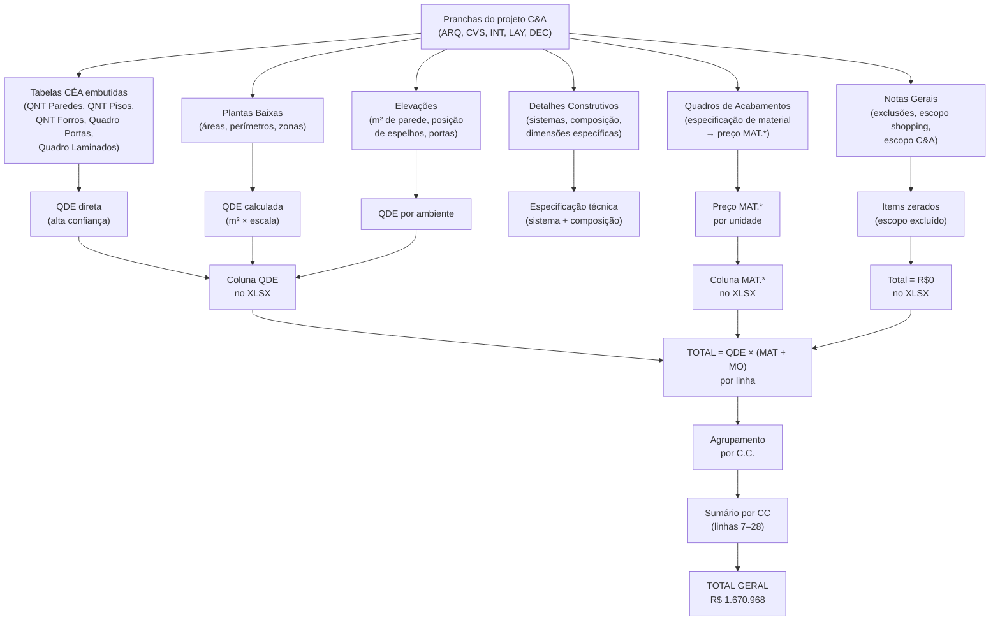

# Planilha de Precificação — 1ª Proposta CELMAR BLN
## Loja 254 · Shopping Norte Blumenau · Loja Nova Full

> Este documento explica a estrutura completa da planilha `1ª Proposta CELMAR BLN.xlsx`, como ela é organizada, qual nomenclatura é usada, e como cada linha se origina a partir das pranchas de projeto.

---

## 1. Identidade da Planilha

A linha de cabeçalho da aba `1ª Proposta` identifica:

| Campo | Valor |
|---|---|
| Cidade | BLN (Blumenau) |
| Nº da Loja | 254 |
| Shopping | SHOPPING NORTE BLUMENAU |
| Tipo | LOJA NOVA |
| Tamanho | FULL |
| Razão social | CELMAR CONSTRUÇÕES E INCORPORAÇÕES LTDA. |
| CNPJ | 17.208.502/0001-05 |

A planilha cobre toda a obra civil de montagem e adaptação da loja, com **344 linhas** e **12 colunas** (`A` a `L`).

---

## 2. Estrutura Geral da Planilha

A planilha tem **duas camadas de leitura**:

### 2.1 Sumário por Centro de Custo (linhas 7–28)

A parte superior é um **resumo consolidado por CC (Centro de Custo)**, onde cada linha representa uma disciplina ou grupo de serviços:

| CC | Descrição | Total (R$) |
|---|---|---|
| 810002 | Levantamento Topográfico | 2.420 |
| 810020 | Adaptação e Reforma do Prédio | 32.810 |
| 810021 | Escadas/Estruturas Metálicas Aux | 17.688 |
| 810022 | Mezaninos com Escada de Acesso | 0 |
| 810030 | Alvenaria (Paredes Divisórias, etc.) | 70.472 |
| 810031 | Esquadrias e Vidros Área ADM | 36.487 |
| 810040 | Revestimentos de Parede | 24.039 |
| 810041 | Pinturas de Forro/Paredes | 66.086 |
| 810051 | Piso da Área ADM/Reserva | 80.166 |
| 810080 | Administração, Mobilização e Limpeza | 217.190 |
| 810082 | Impermeabilização / Canteiro | 0 |
| 810100 | Ligação Provisória Instalações Elétricas | 11.400 |
| 810162 | Móveis e Equipamentos Área ADM | 30.699 |
| 810210 | Painéis e Ferragens | 41.678 |
| 810213 | Painéis, Ferragens e Espelhos Provadores | 453.244 |
| 810230 | Forro Área de Vendas | 368.107 |
| 810250 | Piso Área de Vendas | 80.102 |
| 810260 | Fachadas / Entrada Loja / Vitrine | 74.857 |
| 810321 | Serviços Gerais (Cópias, etc.) | 3.400 |
| — | Omissos | 60.121 |
| **TOTAL** | | **R$ 1.670.968** |

> **Como usar**: o CC é o primeiro campo de cada linha de detalhe — permite agrupar itens por centro de custo sem ler a planilha por seção.

### 2.2 Detalhamento por Seção (linhas 30–325)

O corpo da planilha organiza todos os serviços em **26 seções numeradas** (A, 1 a 25), cada uma com seus itens numerados hierarquicamente.

---

## 3. Estrutura de Colunas

Cada linha de item do orçamento tem a seguinte estrutura:

| Coluna | Conteúdo | Exemplo |
|---|---|---|
| A | Código CC (Centro de Custo) | `810230` |
| B | Zona / Ambiente | `vendas` |
| C | Item | `12.9` |
| D | Descrição completa do serviço | `EXECUÇÃO DE FORRO DE GESSO FORRO GYPSUM...` |
| E | Unidade (UN) | `m²` |
| F | Quantidade (QDE) | `1457.44` |
| G | Preço unitário de material (MAT.*) | `25.5` |
| H | Preço unitário de mão de obra (M.OBRA) | `38` |
| I | Total (R$) | `92547.44` |
| J, K, L | Colunas reservadas (vazias na proposta) | — |

### A coluna MAT.* e o asterisco

O asterisco em `MAT.*` sinaliza que o **material pode ser fornecido pela C&A** (nesse caso a coluna fica em branco e somente M.OBRA é preenchida). Exemplos:

- `14.1` Piso vinílico — M.OBRA = R$40,15/m² · MAT = em branco → material fornecido pela C&A
- `14.11` Cerâmica Cargo Plus White — M.OBRA = R$68/m² · MAT = em branco → material fornecido pela C&A
- `12.9` Forro gesso — MAT = R$25,5/m² · M.OBRA = R$38/m² → material fornecido pela Celmar

---

## 4. Sistema de Nomenclatura

### 4.1 Zonas (coluna B)

As linhas são classificadas por zona/ambiente:

| Tag na planilha | Significado | Exemplos de itens |
|---|---|---|
| `vendas` | Salão de vendas (térreo) | Piso vinílico, pintura paredes, gesso STD, ACM fachada |
| `adm` | Área administrativa (back-of-house, térreo + 2º pav.) | Cerâmica, gesso RU, granito, portas madeira |
| `fachada` | Fachada e vitrines externas | ACM, vidro vitrine, estrutura metálica, rodapé inox |
| `estoque` | Mezanino e reserva (2º pavimento) | Mezanino metálico, guarda corpo, septo AC |
| `provador` | Área de provadores | Laminado Fórmica, espelhos, portas cabine, colunas |
| `área técnica` | Casa de máquinas, gerador, transformador | Epóxi, gesso RF, bases concreto, porta corta-fogo |
| `mezanino` | Estrutura do mezanino | Concreto vermiculita, tela Telcon (zerados) |

### 4.2 Numeração de Itens (coluna C)

Os itens seguem um sistema de dois níveis:

```
SEÇÃO.ITEM
  └── Seção = grupo temático (7, 8, 9... 25 ou A)
      └── Item = sequencial dentro da seção (1, 2, 3...)
```

Exemplos:
- `A` = Custos Indiretos (seção A)
- `1.1` a `5.1` = sub-itens da seção de Custos Indiretos
- `8.5` = Serralheria, item 5 (Guarda corpo ferro)
- `12.9` = Paredes e Forros em Gesso, item 9 (Forro Gypsum)
- `25.1` = Omissos, item 1 (RFID)

### 4.3 Seções Numeradas

| Seção | Nome | Total R$ |
|---|---|---|
| A | Custos Indiretos | 234.410 |
| 7 | Adaptação de Shell | 10.000 |
| 8 | Serralheria | 61.738 |
| 9 | Civil | 59.715 |
| 10 | Impermeabilização | 17.055 |
| 11 | Tratamento de Junta de Dilatação | 0 |
| 12 | Paredes e Forros em Gesso | 255.529 |
| 13 | Divisórias | 25.436 |
| 14 | Revestimento de Piso | 142.673 |
| 15 | Revestimento de Parede | 11.962 |
| 16 | Mármores e Granitos | 12.077 |
| 17 | Louças e Metais | 3.150 |
| 18 | Pintura | 178.665 |
| 19 | Vidros e Espelhos | 11.152 |
| 20 | Portas em Madeira | ~22.640 |
| 21 | Marcenaria Área de Vendas | ~41.678 |
| 22 | Provadores | 453.244 |
| 23 | Fachadas | 42.174 |
| 24 | Marcenaria e Enxoval — Estoque e ADM | 26.321 |
| 25 | Omissos | 60.121 |

### 4.4 Itens Zerados vs. Itens com Valor

Muitos itens aparecem na planilha com QDE vazia e total R$0. Isso não é erro — tem um significado específico em cada caso:

| Padrão | Significado | Exemplo |
|---|---|---|
| QDE em branco, sem nota | Quantidade ainda não definida (pendência de projeto) | `14.12` Vinílico ADM |
| QDE = 0 explícito | Item inaplicável nesta loja (configuração específica do shopping) | `8.10` Guarda corpo inox |
| Nota "contratação direta C&A" | Fornecimento e instalação integralmente pela C&A | `8.1` Mezanino metálico |
| Nota "fornecimento C&A" | Material fornecido pela C&A; Celmar faz apenas a M.O. quando aplicável | `23.10` Porta de enrolar |
| MAT em branco, M.OBRA preenchida | Material fornecido pela C&A; Celmar cobra só a instalação | `14.1` Piso vinílico |

### 4.5 Seção 25 — OMISSOS

A seção 25 registra **mudanças de especificação detectadas após a proposta inicial**. O CC dos itens omissos é a palavra `OMISSOS` (não um código numérico). Exemplos:

- `25.1` RFID — proteção eletromagnética que não estava no escopo original
- `25.3` e `25.4` — substituição de ardósia por granito Branco Cearense na Escada Provadores
- `25.5` — rodapé MDP Branco (complemento)
- `25.7` — grama sintética sala descompressão

---

## 5. Mapeamento Prancha → Seção do XLSX

### 5.1 Lógica Geral

Cada prancha do projeto C&A gera itens em seções específicas do XLSX. A tabela abaixo mostra o cruzamento:

| Prancha | Código | Seções geradas |
|---|---|---|
| ARQ CIVIL | 301 | 9, 10, 12, 13, 25 |
| ARQ TAPUME | 302 | A (2.1, 2.2) |
| ÁREA TÉCNICA | 303 | 8, 9, 10, 12, 18 |
| ARQ COPA | 304 | 10, 15, 16, 17, 24 |
| ARQ SANITÁRIOS | 305 | 10, 13, 15, 16, 17, 19, 20, 24 |
| ARQ CAIXILHOS | 306 | 8, 20 |
| ARQ DIVISÓRIAS | 307 | 13 |
| ARQ CORREIO PNEUMÁTICO | 308 | 9 (via 9.12), 24 |
| ARQ DESCOMPRESSÃO | 309 | 14, 18, 21 |
| ARQ PAREDE CREMALHEIRAS | 310 | 12, 18, 21 |
| ARQ CORTES GERAIS | 311 | 8, 12, 14, 18 (validação) |
| ARQ SALA DE REUNIÕES | 312 | 12, 14, 18, 24 |
| ARQ ELEVADORES | 313 | 8, 14, 15, 18, 25 |
| ARQ ESTANTES | 315 | 14 |
| ARQ FORRO | 321 | 8, 12, 18 |
| ARQ PISO | 331 | 9, 10, 11, 14, 18 |
| ARQ FACHADAS E VITRINES | 341 | 8, 14, 19, 23 |
| ARQ ESCADA FIXA | 351 | 8, 14, 18, 19, 25 |
| INT ILUMINAÇÃO SEM MOB | 201 | 12, 21 |
| INT AXONOMÉTRICAS | 203 | (validação — não gera itens) |
| LAY LAYOUT | 501 | 8, 14, 18, 21 (indireto) |
| LAY ÁREAS | 502 | 14, 18, 12 (validação) |
| DEC PROVADORES | 131 + 132 | 14, 22 |
| CVS COM. VISUAL E SINALIZAÇÃO | 601 | 2, 12, 21 |
| CVS VINHETES | 602 | 12, 23 |

### 5.2 As Tabelas CÉA nas Pranchas

Pranchas que contêm tabelas **CÉA** (prefixo padrão C&A para quantitativos pré-calculados pelo projetista) eliminam a necessidade de medir manualmente. São fontes de alta confiança:

| Tabela CÉA | Prancha de origem | Alimenta os itens |
|---|---|---|
| CÉA — QNT Paredes | 301, 303, 305, 307, 309, 312 | `12.1`–`12.6` |
| CÉA — QNT Paredes RFID | 301 | `25.1` |
| CÉA — Quadro de Portas | 301, 306 | Seção 20 e partes da 8 |
| CÉA — QNT Pintura | 301, 309, 312, 313 | Seção 18 |
| CÉA — QNT Pisos | 331, 313 | Seção 14 |
| CÉA — QNT Rodapés | 331, 131 | `14.5`, `14.13`, `14.14`, `22.14`, `22.15` |
| CÉA — QNT Forros | 321 | `12.9`, `18.10`, `18.11` |
| CÉA — Quadro de Laminados Provador | 131 | `22.1`–`22.5` |
| CÉA — QNT Estrutura Estantes | 315 | `14.15` |
| CÉA — Quadro Piso Podotátil | 351 | `14.6`, `14.17` |
| CÉA — Linear Estrutura Estante | 315 | (referência ml) |
| CÉA — COMUNICAÇÃO VISUAL | 601 | `12.13`, `21.21` |
| CÉA — Quadro de Áreas Obras | 501, 503 | base de todos os m² |
| CÉA — SETORES LOJA | 502 | validação de m² por zona |

---

## 6. Os Quadros de Acabamentos e os Preços Unitários MAT.*

O preço unitário de cada material (coluna G — MAT.*) é determinado pelos **Quadros de Acabamentos** presentes nas pranchas. Há uma hierarquia:

1. **Quadro de Acabamentos MASTER** (prancha 311 — Cortes Gerais) → fonte de verdade definitiva
2. **Quadro de Acabamentos da prancha 301** (ARQ CIVIL) → cobre todas as zonas, segundo nível
3. **Quadro de Acabamentos por ambiente** (pranchas 304, 305, 309, 312 etc.) → cobre apenas o ambiente específico

Em caso de conflito entre quadros, a prancha 311 tem precedência.

### Exemplos de especificação → preço

| Material especificado no quadro | Item XLSX | MAT.* (R$/unit) |
|---|---|---|
| Fórmica Ártico L166 TX | `22.1` | R$378,10/m² |
| Fórmica Branco L120TX | `22.3` | R$378,10/m² |
| Fórmica Prattan L151 TX | `22.5` | R$498,10/m² |
| ACM Branco Brilho | `23.4` | R$380,00/m² |
| Vidro temperado incolor 10mm | `19.4` | R$432,70/m² |
| Gesso STD (Gypsum) 1 face | `12.1` | R$75,80/m² |
| Gesso RU 1 face | `12.3` | R$90,20/m² |
| Gesso RF 2 faces | `12.6` | R$104,20/m² |
| Cerâmica Cargo Plus White Eliane | `14.11` | fornecido pela C&A |
| Vinílico vendas (Tarket) | `14.1` | fornecido pela C&A |
| Granito Branco Cearense | `14.8` | R$650,00/ml |
| Granito Cinza Andorinha | `14.19` | R$635,60/ml |
| Azulejo branco junta a prumo | `15.1` | R$89,75/m² |
| Tinta Diário de Menina (parede) | `18.8` | R$23,88/m² |
| Tinta Branco Gelo (parede) | `18.3` | R$30,68/m² |
| Rodapé Primer Tarket 10cm | `14.5` | R$20,00/ml |
| Inox escovado 200mm (rodapé fachada) | `23.9` | R$256,00/ml |
| Epóxi sobre cimentado | `18.1` | R$67,20/m² |
| Impermeabilização manta butílica | `10.1` | R$177,36/m² |
| Impermeabilização manta líquida | `10.2` | R$87,20/m² |

---

## 7. Seção A — Custos Indiretos (R$ 234.410)

Os custos indiretos não derivam de nenhuma prancha específica, mas são totalmente provisionados na proposta. Estrutura:

| Sub-grupo | Itens | Descrição |
|---|---|---|
| 1 | 1.1 a 1.3 | ART + seguro de obra + topografia |
| 2 | 2.1 a 2.9 | Tapume, EPI/CV, vigilância, escritório de obra, elétrica provisória, eletricista |
| 3 | 3.1 a 3.5 | Lonas, entulho (3 meses × R$8.200/mês), equipamentos, transporte |
| 4 | 4.1 a 4.5 | Equipe (engenheiro R$10.500/mês, técnico segurança, estadias, mobilização, limpeza permanente) |
| 5 | 5.1 | Limpeza final de obra |

O único item zerado é `2.1` (tapume Eucatex) — aguarda definição do ml com o shopping.

---

## 8. Seção 8 — Serralheria (R$ 61.738)

Agrupa todas as estruturas e esquadrias metálicas:

| Sub-grupo | Itens | Origem |
|---|---|---|
| Mezanino e escada | 8.1–8.5 | C&A (8.1/8.2/8.3) + prancha 351 (8.5 guarda corpo 19ml) |
| Estrutura auxiliar | 8.6–8.9 | Prancha 341 (fachada/vitrine/porta enrolar) + prancha 321 (septo AC) |
| Guarda corpo inox | 8.10 | Zerado — não se aplica |
| Gradil / Elevador | 8.11 | Prancha 313 (elevador) |
| Esquadrias especiais | 8.12–8.20 | Prancha 306 (caixilhos) + prancha 303 (área técnica) |

---

## 9. Seções 9–18 — Civil, Gesso e Pinturas

### Seção 12 — Paredes e Forros em Gesso (R$ 255.529) — a maior seção de material civil

Os tipos de placa de gesso seguem uma classificação por zona/uso:

| Tipo | Aplicação | Zona |
|---|---|---|
| STD (Standard) | Paredes secas — salão de vendas | `vendas` |
| RU (Resistente à Umidade) | ADM, copa, sanitários | `adm` |
| RF (Resistente ao Fogo) | Casa de máquinas, área técnica | `área técnica` |

O item mais caro de toda a planilha é o `12.9` — Forro Gypsum liso tabicado: **1.457,44 m² × R$63,50 = R$92.547**.

### Seção 18 — Pintura (R$ 178.665)

Sub-dividida em três grupos com itens separados por zona:

| Sub-grupo | Cor principal | Itens | m² |
|---|---|---|---|
| Pintura de piso | Epóxi amarelo / Esmalte | 18.1, 18.2 | 39,61 + vb |
| Pintura de parede | Branco Gelo (vendas + ADM) | 18.3, 18.4, 18.5 | 1.153 + 60 + 708 |
| Pintura de parede | Diário de Menina (accent ADM) | 18.8 | 15 |
| Pintura de forro | Branco Neve (forro gesso vendas) | 18.10 | 1.044 |
| Pintura de forro | Branco Neve (forro ADM/laje) | 18.11 | 408 |
| Pintura de forro | Diário de Menina (accent forro) | 18.12 | 8,6 |
| Pintura de serralheria | Epóxi amarelo (corrimão) | 18.18 | 39,9 ml |
| Zerados | Laje aparente vendas, estruturas | 18.9, 18.15, 18.16 | — |

---

## 10. Seção 22 — Provadores (R$ 453.244) — maior seção da planilha

A seção 22 é inteiramente originada pelas pranchas DEC-131 e DEC-132. Sub-grupos:

| Sub-grupo | Itens | Fonte |
|---|---|---|
| Laminado Fórmica (5 cores) | 22.1–22.5 | CÉA — Quadro de Laminados (prancha 131) |
| Sistema estrutural da cabine | 22.7–22.13 | Det. Fixação de Painel (prancha 131) |
| Rodapés e rodateto | 22.14–22.16 | CÉA — QNT Rodapés (prancha 131) |
| Espelhos | 22.17–22.19 | Elevações PV01–PV08 (prancha 131) |
| Portas (5 tipos) | 22.20–22.26 | Elevações 05–16 (prancha 132) |
| Acessórios PNE e serralheria | 22.28–22.34 | Prancha 132 |

As 5 cores de laminado no XLSX correspondem aos 5 códigos de fórmica do sistema padronizado C&A:

| Cor | Código Fórmica | m² | Total R$ |
|---|---|---|---|
| Ártico | L166 TX | 42 | 26.254 |
| Gelo | L106 TX | 25 | 15.628 |
| Branco | L120TX | 243 | 151.899 |
| Cobalto | L118 TX | 9 | 6.076 |
| Prattan | L151 TX | 30 | 22.353 |

---

## 11. Seção 23 — Fachadas (R$ 42.174)

Todos os itens têm zona `fachada` e CC `810260`. Materiais-chave:

| Item | Material | QDE | Total R$ |
|---|---|---|---|
| `23.4` | ACM Branco Brilho (substrato fachada) | 55,68 m² | 35.580 |
| `23.9` | Rodapé inox escovado 200mm | 9,36 ml | 3.510 |
| `23.2` | Tablado vitrine MDP Branco | 1 unid | 2.770 |
| `23.1` | Cantoneira alumínio arremates | 2 unid | 315 |
| `23.10` | Porta de enrolar (fornecimento C&A) | 1 unid | 0 |

Os itens `23.3` (perfil inox caixilho), `23.5` (fórmica), `23.6` (marquise), `23.7` (porcelanato C&A) e `23.8` (argamassa porcelanato) estão zerados por inaplicabilidade ao Shopping Norte Blumenau.

---

## 12. Seção 25 — Omissos (R$ 60.121)

Os omissos têm CC = `OMISSOS` (literal) e foram adicionados após a proposta inicial:

| Item | Descrição | Origem | Total R$ |
|---|---|---|---|
| `25.1` | Proteção RFID manta aluminizada 158 m² | Prancha 301 (QNT RFID) | 18.960 |
| `25.2` | Alvenaria bloco celular 10 m² | Prancha 301 | 948 |
| `25.3` | Granito Branco Cearense escada (degrau+espelho) 10,73 m² | Prancha 351 (mudança de spec) | 12.340 |
| `25.4` | Rodapé granito Branco Cearense escada 16,21 ml | Prancha 351 (mudança de spec) | 18.301 |
| `25.5` | Rodapé MDP Branco 5,05 ml | Complemento | 2.671 |
| `25.7` | Grama sintética sala descompressão 10 m² | Prancha 309 | 6.901 |

---

## 13. Tabela de Mão de Obra (parte inferior)

A planilha termina (linhas 332–344) com uma tabela de referência de **Homem/Hora** para cada categoria profissional:

| Função | Hora Normal | Hora 60% | Hora 100% | Adicional Noturno |
|---|---|---|---|---|
| Engenheiro | R$10.500/mês | — | — | — |
| Mestre | R$95/h | R$151,98/h | R$189,98/h | R$113,99/h |
| Encarregado | R$75,35/h | R$120,56/h | R$150,70/h | R$90,42/h |
| Servente | R$56,83/h | R$90,93/h | R$113,67/h | R$68,20/h |
| Pedreiro | R$63,76/h | R$102,01/h | R$127,51/h | R$76,51/h |
| Carpinteiro | R$63,76/h | R$102,01/h | R$127,51/h | R$76,51/h |

Esses valores informam os M.OBRA unitários de cada linha — o M.OBRA de cada serviço é calculado multiplicando a hora da categoria pelo tempo unitário estimado.

---

## 14. Itens de Responsabilidade C&A (não entram no custo da Celmar)

A planilha registra os seguintes itens como **escopo C&A**, com total = R$0 ou sem material:

| Item | Descrição | Razão do zero |
|---|---|---|
| `8.1` | Mezanino metálico | Contratação direta C&A |
| `8.2` | Painel wall para mezanino | Contratação direta C&A |
| `8.3` | Escada metálica | Contratação direta C&A |
| `14.1` | Piso vinílico vendas | Material fornecido pela C&A |
| `14.2` | Autonivelante vendas | Material fornecido pela C&A |
| `14.11` | Cerâmica ADM | Material fornecido pela C&A |
| `14.12` | Vinílico ADM | Material fornecido pela C&A |
| `14.15` | Montagem estante modular | Material fornecido pela C&A; M.O. zerada |
| `17.3` | Louças e metais (vasos, mictórios) | Instaladora hidráulica |
| `23.7` | Porcelanato fachada | Material fornecido pela C&A |
| `23.10` | Porta de enrolar | Fornecimento C&A |
| `9.1` | Contrapiso h=4cm | Shopping entrega cimento sobre a laje |
| `11.1` | Juntas de dilatação | Shopping entrega laje tratada |

---

## 15. Resumo: Como Ler uma Linha da Planilha

```
Exemplo de linha completa:
R128: 810230 | (sem zona) | 12.9 | EXECUÇÃO DE FORRO DE GESSO FORRO GYPSUM LISO
      TABICADO ESTRUTURADO E REJUNTADO... | m² | 1457.44 | 25.5 | 38 | 92547.44

Leitura:
┌─ CC 810230 → grupo "Forro Área de Vendas"
├─ Zona: (em branco) → toda a loja
├─ Item 12.9 → Seção 12 (Paredes e Forros em Gesso), subitem 9
├─ UN = m² → medido em metros quadrados
├─ QDE = 1.457,44 m² → vem da tabela CÉA — QNT Forros na Prancha 321
├─ MAT.* = R$25,50/m² → Gypsum tabicado (componentes + massa)
├─ M.OBRA = R$38,00/m² → instalação, arremate e rejunte
└─ TOTAL = 1.457,44 × (25,50 + 38,00) = R$92.547
```

---

## 16. Fluxo Completo: Prancha → Extração → Planilha



---

*Referências: 1ª Proposta CELMAR BLN.xlsx · Pranchas CEA-254-BLN-ARQ/INT/LAY/DEC/CVS · Loja 254 Shopping Norte Blumenau*
